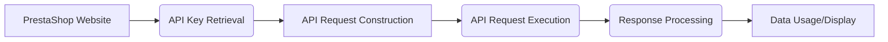

# <input code>

```markdown
# Managing PrestaShop Websites

This `README` file explains the structure and usage of your PrestaShop websites, as well as the storage and use of API keys.

## Websites

Your PrestaShop websites:
1. [e-cat.co.il](https://e-cat.co.il)
2. [emil-design.com](https://emil-design.com)
3. [sergey.mymaster.co.il](https://sergey.mymaster.co.il)

Each of these websites uses APIs to interact with various parameters and functions.

## Storing API Keys

API keys for each website are stored in the `credentials.kdbx` file. This file is a secure password database and contains the following data for each website:
- Website URL
- API Key
- Additional metadata (if necessary)

To work with the keys from the file, use a password manager that supports the `.kdbx` format, such as [KeePass](https://keepass.info/) or [KeePassXC](https://keepassxc.org/).

## Example API Usage

To connect to the API of one of your websites, follow the template below:

### API Request Example

**API Request Template:**
```bash
curl -X GET 'https://<SITE_URL>/api/<endpoint>' \
-H 'Authorization: Basic <base64(API_KEY)>'
```

**Parameter Explanation:**
- `<SITE_URL>` — the website address, e.g., `e-cat.co.il`.
- `<endpoint>` — the API endpoint (e.g., `products`, `customers`).
- `<API_KEY>` — the API key, encoded in Base64.

### Example API Call
To fetch a list of products from `e-cat.co.il`:
```bash
curl -X GET 'https://e-cat.co.il/api/products' \
-H 'Authorization: Basic <base64(API_KEY)>'
```

## Security Recommendations

- Never share the `credentials.kdbx` file with others.
- Ensure the file is stored in a secure location accessible only to you.
- Regularly update your API keys and database passwords.

## Additional Resources

If you encounter any issues or have questions about connecting to the API, refer to the [official PrestaShop API documentation](https://devdocs.prestashop.com/), which provides information on available endpoints and how to interact with them.
```

# <algorithm>

This code doesn't contain executable code, but rather documentation for interacting with PrestaShop websites using their APIs.  It explains how to structure API requests using curl, and where to find the API keys. No steps or algorithms can be visualized as there's no program to execute.  

The algorithm is essentially:

1. **Identify the website:**  Choose the desired PrestaShop website (e.g., e-cat.co.il).
2. **Retrieve API key:**  Locate the API key for the selected website from the `credentials.kdbx` file using a password manager.
3. **Construct API request:** Formulate a `curl` command with the website URL, API endpoint, and encoded API key.
4. **Execute request:** Run the `curl` command to send the request to the PrestaShop API.
5. **Process response:**  Handle the response from the PrestaShop API according to the documentation.


# <mermaid>



**Explanation of Dependencies and Links:**

The provided `README` doesn't have direct dependencies on other files or code modules within a larger project. It's focused on documentation and instructions for interacting with PrestaShop websites using external tools like `curl`. The only implied dependence is on the `credentials.kdbx` file containing the API keys and possibly external `curl` command-line tool.  There's no code to analyze for direct dependencies to other parts of a project.

# <explanation>

This file is a `README` describing how to interact with PrestaShop websites using their APIs. It's not actual code, so there are no imports, classes, functions, or variables in the traditional sense.  

- **Documentation Focus:** The main purpose is to guide users on accessing and utilizing the PrestaShop APIs.  This is crucial documentation for any developer or user interacting with the application.

- **API Key Management:**  It instructs how to securely store and retrieve API keys from the `credentials.kdbx` file using a password manager.  This is vital for security, as API keys should never be hardcoded or shared openly.

- **API Request Examples:**  It gives examples of `curl` commands needed to perform different API calls. This makes it very practical for developers and end users seeking to make calls against the PrestaShop APIs.

- **No Errors/Improvements:** Because it's documentation, there are no potential errors or improvements in the conventional coding sense. The suggestions for secure API key management are best practices.


- **External Tools:**  The file heavily relies on external tools (e.g., `curl`) that are not part of the file itself.  This is expected documentation as it focuses on how to use external commands to communicate with the APIs.


- **Project Relationships:** The documentation relies on the existence of the PrestaShop websites and their APIs.  It doesn't directly refer to any other code components within a larger project but depends on the existence of the APIs and  `credentials.kdbx` for the instructions to be effective.