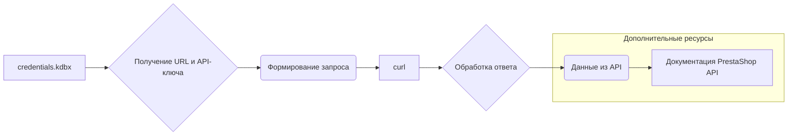

```MD
# Управление сайтами на PrestaShop

## <input code>

```
# Управление сайтами на PrestaShop

Данный `README` файл описывает структуру и способ работы с сайтами на платформе PrestaShop, а также хранение и использование ключей API.

## Сайты

Ваши сайты, работающие на PrestaShop:
1. [e-cat.co.il](https://e-cat.co.il)
2. [emil-design.com](https://emil-design.com)
3. [sergey.mymaster.co.il](https://sergey.mymaster.co.il)

Каждый из этих сайтов использует API для взаимодействия с различными параметрами и функциями.

## Хранение ключей API

Ключи API для каждого сайта хранятся в файле `credentials.kdbx`. Этот файл является защищенной базой данных паролей и содержит следующие данные для каждого сайта:
- URL сайта
- Ключ API
- Дополнительные метаданные (если необходимо)

Для работы с ключами из файла используйте менеджер паролей, поддерживающий формат `.kdbx`, например, [KeePass](https://keepass.info/) или [KeePassXC](https://keepassxc.org/).

## Пример использования API

Чтобы подключиться к API одного из сайтов, следуйте следующему шаблону:

### Запрос данных через API

**Шаблон API-запроса:**
```bash
curl -X GET 'https://<URL_сайта>/api/<endpoint>' \
-H 'Authorization: Basic <base64(API_KEY)>'
```

**Объяснение параметров:**
- `<URL_сайта>` — адрес сайта, например, `e-cat.co.il`.
- `<endpoint>` — конечная точка API (например, `products`, `customers`).
- `<API_KEY>` — ключ API, закодированный в формате Base64.

### Пример вызова API
Для получения списка продуктов на сайте `e-cat.co.il`:
```bash
curl -X GET 'https://e-cat.co.il/api/products' \
-H 'Authorization: Basic <base64(API_KEY)>'
```

## Рекомендации по безопасности

- Никогда не передавайте файл `credentials.kdbx` третьим лицам.
- Убедитесь, что файл находится в защищенном месте, доступном только вам.
- Регулярно обновляйте ключи API и пароли для базы данных.

## Дополнительно

Если у вас возникли вопросы или трудности с подключением, ознакомьтесь с [официальной документацией PrestaShop API](https://devdocs.prestashop.com/), где представлена информация о доступных конечных точках и способах работы с ними.
```

## <algorithm>

Данный `README` файл описывает способ взаимодействия с сайтами на PrestaShop через их API. Алгоритм взаимодействия следующий:

1. **Получение URL сайта и ключа API:** Из файла `credentials.kdbx` (защищенная база данных паролей) извлекается необходимая информация.
2. **Формирование запроса к API:** Используя URL сайта и ключ API, формируется запрос в формате `curl`.
3. **Выполнение запроса:** С помощью `curl` осуществляется запрос к API.
4. **Обработка ответа:** При успешном запросе, обрабатываются полученные данные.

```
+-----------------+
| Получение данных|
+-----------------+
|   из credentials.kdbx |
|  URL сайта  |  Ключ API |
+-----------------+
         |
         V
+-----------------+
| Формирование     |
+-----------------+
|   запроса к API |
+-----------------+
         |
         V
+-----------------+
| Выполнение      |
+-----------------+
|    запроса curl |
+-----------------+
         |
         V
+-----------------+
| Обработка       |
+-----------------+
|  полученных данных|
+-----------------+
```

Пример: Для получения списка продуктов на сайте `e-cat.co.il` необходимо выполнить шаги 1-4.


## <mermaid>



**Объяснение диаграммы:**

* `credentials.kdbx`: Файл, содержащий ключи API и информацию о сайтах.
* `Получение URL и API-ключа`: Извлечение данных из файла `credentials.kdbx`.
* `Формирование запроса`: Составление запроса к API сайта на основе полученных данных.
* `curl`: Утилита для выполнения HTTP-запросов.
* `Обработка ответа`: Обработка результата запроса к API.
* `Данные из API`: Результат запроса к API сайта.
* `Документация PrestaShop API`: Ссылка на дополнительную документацию для работы с API PrestaShop.

Взаимосвязи: Файл `credentials.kdbx` является источником данных для формирования запросов к API.  `curl` отвечает за отправку запросов и получение ответов от различных API. Документация PrestaShop API необходима для понимания конечных точек (endpoints) и работы с ними.

## <explanation>

**Импорты:**

Нет импортов. Это `README` файл, который описывает процесс, а не код программы.

**Классы:**

Нет классов.

**Функции:**

Нет функций.

**Переменные:**

Нет переменных.

**Возможные ошибки или области для улучшений:**

* Отсутствие кода реализации.  `README` файл не содержит функционального кода, а только описывает процесс и шаги.
* Не указаны типы данных для ключей API.
* Не описан формат файла `credentials.kdbx`.  Важно указать формат данных для корректной работы с ним.
* Необходимо предоставить больше информации о структуре хранения ключей в `credentials.kdbx` для детального анализа и понимания.


**Цепочка взаимосвязей:**

Файл `credentials.kdbx` является центральным ресурсом, содержащим данные для работы с различными API Престашоп.  Для работы с API необходимо знать URL сайта и ключ, хранящиеся в `credentials.kdbx`.