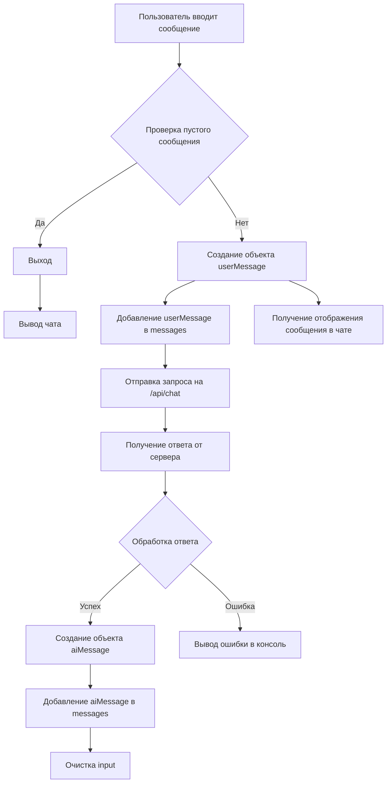

# Анализ кода приложения чат-бота

## <input code>

```javascript
function App() {
  const [input, setInput] = React.useState("");
  const [messages, setMessages] = React.useState([]);

  const sendMessage = async () => {
    if (input.trim() === "") return;

    const userMessage = { role: "user", content: input };
    setMessages([...messages, userMessage]);

    try {
      const response = await fetch("http://localhost:8000/api/chat", {
        method: "POST",
        headers: {
          "Content-Type": "application/json"
        },
        body: JSON.stringify({ prompt: input })
      });

      const data = await response.json();
      const aiMessage = { role: "assistant", content: data.response };
      setMessages([...messages, userMessage, aiMessage]);
    } catch (error) {
      console.error("Error:", error);
    }

    setInput("");
  };

  return (
    <div>
      <div className="chat-box" style={{ height: '400px', overflowY: 'scroll', border: '1px solid #ccc', padding: '10px' }}>
        {messages.map((msg, index) => (
          <div key={index} className={msg.role === "user" ? "text-right" : "text-left"}>
            <strong>{msg.role === "user" ? "You" : "AI"}:</strong> {msg.content}
          </div>
        ))}
      </div>
      <div className="input-group mt-3">
        <input
          type="text"
          className="form-control"
          placeholder="Type your message..."
          value={input}
          onChange={(e) => setInput(e.target.value)}
          onKeyDown={(e) => e.key === "Enter" ? sendMessage() : null}
        />
        <button className="btn btn-primary" onClick={sendMessage}>Send</button>
      </div>
    </div>
  );
}

ReactDOM.render(<App />, document.getElementById('chat-app'));
```

## <algorithm>



Пример: Пользователь вводит "Привет".
1. Пользователь вводит "Привет".
2. Проверка на пустое сообщение (false).
3. Создаётся объект `userMessage` со свойством `content = "Привет"`.
4. `userMessage` добавляется в массив `messages`.
5. Отправляется POST запрос на `/api/chat` с телом `{ prompt: "Привет" }`.
6. Сервер возвращает ответ `{ response: "Привет, как дела?" }`.
7. Создаётся объект `aiMessage` со свойством `content = "Привет, как дела?"`.
8. `userMessage` и `aiMessage` добавляются в `messages`.
9. `input` очищается.
10. Вывод чата с отображением сообщений.


## <mermaid>

```mermaid
graph LR
    A[App] --> B(useState input);
    A --> C(useState messages);
    A --> D[sendMessage];
    D --> E[fetch('/api/chat')];
    E --> F(Обработка ответа);
    F --> G[setMessages];
    G --> H[setInput('')];
    A --> I(return JSX);
    I --> J[JSX чата];
    J --> K[Map сообщений];
    K --> L(Отображение сообщений);
    E -.-> M[Ошибка];
    M --> N(console.error);
    subgraph React
        B --> O[input];
        C --> P[messages];
        D -.-> Q[Кнопка отправки];
    end
```

## <explanation>

**Импорты:**  Код использует `React` и `ReactDOM`.  `React` — библиотека для создания пользовательских интерфейсов, а `ReactDOM` — мост для рендеринга React-компонентов в DOM.  Предполагается, что эти импорты происходят из `src` и являются частью проекта.

**Классы:**  Приложение имеет один класс функциональный компонент `App`.

**Функции:**
* **`App()`:**  Функциональный компонент, представляющий приложение чат-бота.
* **`sendMessage()`:**  Асинхронная функция для отправки сообщения на сервер (`http://localhost:8000/api/chat`).  Принимает текст сообщения как аргумент. Возвращает промис, который выполняется при успешном ответе сервера или отбрасывает ошибку.

**Переменные:**
* **`input`:**  `string`, хранит введённое пользователем сообщение.
* **`messages`:**  `array`, хранит историю сообщений.

**Возможные ошибки и улучшения:**
* **Обработка ошибок:** Обработка ошибок (`try...catch`) в `sendMessage` — хороший пример, но желательно добавить больше деталей в сообщения об ошибках (например, тип ошибки, код состояния ответа сервера).
* **Валидация входных данных:** Проверка входных данных на пустоту, недопустимые символы или специфичные для чат-бота запросы может повысить надежность.
* **Отображение ошибок:** Если сервер вернул ошибку, нужно сообщить пользователю об этом (например, вывести сообщение об ошибке в интерфейсе).
* **Загрузка:** Если запрос к серверу долго выполняется, можно добавить индикатор загрузки или обработку ситуаций с временными ошибками (например, таймаут).
* **Управление состоянием:**  Для более сложных приложений, таких как чат-боты, рекомендуется использовать  `useReducer` вместо `useState` для управления состоянием.

**Связь с другими частями проекта:** `sendMessage` делает POST-запрос на `/api/chat` на сервер.  Это указывает на то, что существует backend (серверная часть), отвечающая за обработку запросов и взаимодействие с чат-ботом.  Необходимы дальнейшие детали о структуре проекта (например, какие файлы находятся в директории `hypotez/src/fast_api/gemini/` и какая роль они играют).