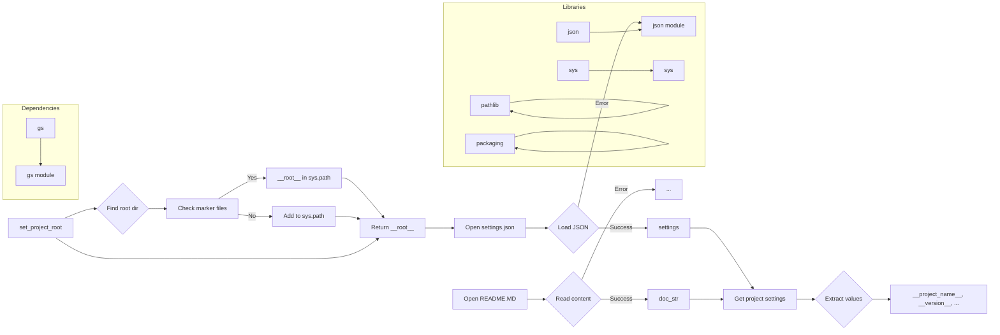

# <input code>

```python
## \file hypotez/src/fast_api/header.py
# -*- coding: utf-8 -*-

#! venv/bin/python/python3.12

"""
.. module: src.fast_api 
	:platform: Windows, Unix
	:synopsis:

"""


import sys
import json
from packaging.version import Version

from pathlib import Path
def set_project_root(marker_files=('__root__','.git')) -> Path:
    """
    Finds the root directory of the project starting from the current file's directory,
    searching upwards and stopping at the first directory containing any of the marker files.

    Args:
        marker_files (tuple): Filenames or directory names to identify the project root.
    
    Returns:
        Path: Path to the root directory if found, otherwise the directory where the script is located.
    """
    __root__:Path
    current_path:Path = Path(__file__).resolve().parent
    __root__ = current_path
    for parent in [current_path] + list(current_path.parents):
        if any((parent / marker).exists() for marker in marker_files):
            __root__ = parent
            break
    if __root__ not in sys.path:
        sys.path.insert(0, str(__root__))
    return __root__


# Get the root directory of the project
__root__ = set_project_root()
"""__root__ (Path): Path to the root directory of the project"""

from src import gs

settings:dict = None
try:
    with open(gs.path.root / 'src' / 'settings.json', 'r') as settings_file:
        settings = json.load(settings_file)
except (FileNotFoundError, json.JSONDecodeError):
    ...

doc_str:str = None
try:
    with open(gs.path.root / 'src' / 'README.MD', 'r') as settings_file:
        doc_str = settings_file.read()
except (FileNotFoundError, json.JSONDecodeError):
    ...


__project_name__ = settings.get("project_name", 'hypotez') if settings  else 'hypotez'
__version__: str = settings.get("version", '')  if settings  else ''
__doc__: str = doc_str if doc_str else ''
__details__: str = ''
__author__: str = settings.get("author", '')  if settings  else ''
__copyright__: str = settings.get("copyrihgnt", '')  if settings  else ''
__cofee__: str = settings.get("cofee", "Treat the developer to a cup of coffee for boosting enthusiasm in development: https://boosty.to/hypo69")  if settings else "Treat the developer to a cup of coffee for boosting enthusiasm in development: https://boosty.to/hypo69"
```

# <algorithm>

**Алгоритм работы кода:**

1. **Найти корневую директорию проекта (set_project_root):**
   - Начинает поиск от текущей директории файла.
   - Перебирает родительские директории, пока не найдет директорию, содержащую один из файлов из `marker_files` (например, `pyproject.toml`, `requirements.txt`, `.git`).
   - Если корневая директория не найдена в текущем пути, добавляет ее в `sys.path`.
   - Возвращает найденную корневую директорию.

2. **Получить настройки из файла settings.json:**
   - Использует модуль `gs` для получения пути к файлу `settings.json` относительно корня проекта.
   - Открывает файл и загружает данные в формате JSON в переменную `settings`.
   - Обрабатывает возможные ошибки (`FileNotFoundError`, `json.JSONDecodeError`).

3. **Получить содержимое файла README.MD:**
   - Использует модуль `gs` для получения пути к файлу `README.MD` относительно корня проекта.
   - Читает содержимое файла в переменную `doc_str`.
   - Обрабатывает возможные ошибки (`FileNotFoundError`, `json.JSONDecodeError`).

4. **Получить значения настроек проекта:**
   - Извлекает значения из словаря `settings` для таких ключей, как "project_name", "version", "author", "copyrihgnt", "cofee".
   - Присваивает значения соответствующим переменным, например, `__project_name__`, `__version__`.
   - Устанавливает значения по умолчанию, если ключи не найдены или `settings` равно `None`.

**Пример:**

Если файл `settings.json` содержит:
```json
{
  "project_name": "MyProject",
  "version": "1.0.0",
  "author": "John Doe"
}
```
То код заполнит следующие переменные:
```
__project_name__ = "MyProject"
__version__ = "1.0.0"
__author__ = "John Doe"
```

**Передача данных:**

- `set_project_root` возвращает `Path` объекта, представляющего корень проекта.
- Эта информация используется для формирования путей к файлам настроек и документации.
- Данные из `settings.json` загружаются в словарь `settings`, который используется для извлечения значений параметров проекта.


# <mermaid>



**Описание диаграммы:**

Диаграмма показывает основные функции и зависимости в коде.

- `set_project_root`: Находит корень проекта, используя `Path` и `sys.path`.
- `gs`: Модуль, который, вероятно, содержит функции работы с путями проекта.
- `json`: Модуль для работы с JSON данными.
- `pathlib`: Модуль для работы с путями.
- `sys`: Модуль для доступа к системным переменным, включая `sys.path`.
- `packaging`: Модуль для работы с версиями пакетов.

# <explanation>

**Импорты:**

- `sys`: Модуль для доступа к системным переменным, в данном случае используется для добавления пути к проекту в `sys.path`.
- `json`: Модуль для работы с JSON данными. Используется для чтения и записи настроек проекта из файла `settings.json`.
- `packaging.version`: Модуль для работы с версиями пакетов. Возможно используется для проверки версий, но в данном примере не используется.
- `pathlib`: Модуль для работы с путями. Используется для работы с файлами и директориями.
- `gs`: Возможно собственный модуль для работы с файлами проекта (нужен контекст для более точного определения).

**Классы:**

В коде нет классов.

**Функции:**

- `set_project_root(marker_files=...)`:  Ищет корневую директорию проекта, начиная с текущей директории. Аргумент `marker_files` позволяет указывать файлы, которые должны быть в корне проекта.  Возвращает `Path` объекта, представляющего корневую директорию.


**Переменные:**

- `MODE`: Строковая переменная, вероятно, для обозначения режима работы (например, `dev`, `prod`).
- `__root__`: Переменная типа `Path`, содержащая путь к корню проекта.
- `settings`: Словарь (dict), содержащий настройки проекта, загруженные из файла `settings.json`.
- `doc_str`: Строка, содержащая содержимое файла `README.MD`.
- `__project_name__`, `__version__`, `__doc__`, `__details__`, `__author__`, `__copyright__`, `__cofee__`: Переменные, содержащие различные свойства проекта, полученные из `settings`.


**Возможные ошибки и улучшения:**

- **Обработка ошибок:** Обработка `FileNotFoundError` и `json.JSONDecodeError` является хорошей практикой, но можно было бы добавить более подробные сообщения об ошибках для лучшей диагностики.
- **`gs`:** Непонятно, как реализован `gs`. Необходимы дополнительные сведения о коде модуля. Важно проверить, что `gs` обрабатывает возможные ошибки и возвращает корректные значения.
- **Типизация:** Использование типов данных (например, `Path`) улучшает читаемость и позволяет статическим анализаторам выявлять потенциальные ошибки.
- **Использование `try...except` блоков:** Необходимо тщательно проверить корректность работы блоков `try...except`. Возможно, следует добавить более подробные логи, чтобы проследить за тем, как обрабатываются ошибки.

**Связь с другими частями проекта:**

- Модуль `gs`, вероятно, содержит функции для доступа к файлам и каталогам в проекте, включая построение путей относительно корня проекта.
- Файл `settings.json` содержит конфигурацию проекта, используемую другими частями кода.
- Файл `README.MD` содержит описание проекта и используется для документации.
- Возможно, существует еще несколько модулей, использующих данные из `settings.json` или `README.MD`.