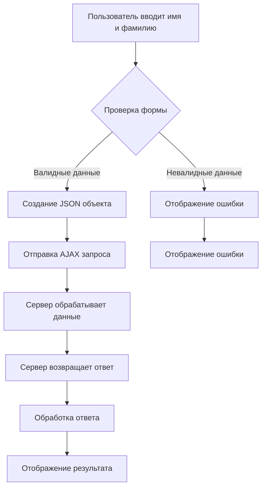
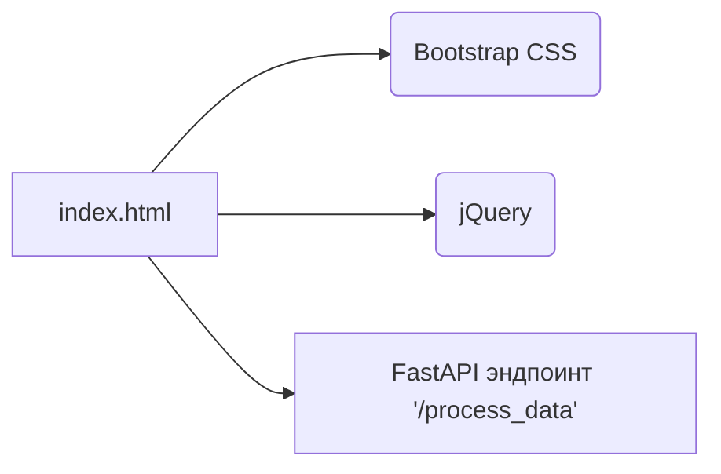

# <input code>

```html
## \file hypotez/src/fast_api/html/index.html
# -*- coding: utf-8 -*-
#! venv/Scripts/python.exe

""" module: src.fast_api.html """
MODE = 'debug'
<!DOCTYPE html>
<html lang="en">
<head>
    <meta charset="UTF-8">
    <meta name="viewport" content="width=device-width, initial-scale=1.0">
    <title>Форма для отправки данных</title>
    <!-- Подключаем Bootstrap CSS -->
    <link rel="stylesheet" href="https://maxcdn.bootstrapcdn.com/bootstrap/4.5.2/css/bootstrap.min.css">
</head>
<body>

    <div class="container">
        <h2>Форма для отправки данных</h2>
        <!-- Форма для ввода данных -->
        <form id="dataForm">
            <div class="form-group">
                <label for="firstName">Имя:</label>
                <input type="text" class="form-control" id="firstName" placeholder="Введите имя" required>
            </div>
            <div class="form-group">
                <label for="lastName">Фамилия:</label>
                <input type="text" class="form-control" id="lastName" placeholder="Введите фамилию" required>
            </div>
            <button type="submit" class="btn btn-primary">Отправить</button>
        </form>
    </div>

    <!-- Подключаем jQuery -->
    <script src="https://ajax.googleapis.com/ajax/libs/jquery/3.5.1/jquery.min.js"></script>

    <script>
        // Обработчик события отправки формы
        $('#dataForm').submit(function(event) {
            // Предотвращаем стандартное поведение формы
            event.preventDefault();

            // Получаем данные из полей ввода
            var firstName = $('#firstName').val();
            var lastName = $('#lastName').val();

            // Отправляем данные на сервер
            $.ajax({
                type: 'POST',
                url: '/process_data',  // Замените '/process_data' на URL вашего FastAPI эндпоинта
                contentType: 'application/json',
                data: JSON.stringify({first_name: firstName, last_name: lastName}), // Преобразуем данные в формат JSON
                success: function(response) {
                    // Обработка успешного ответа от сервера
                    console.log('Ответ от сервера:', response);
                    // Дополнительные действия по необходимости
                },
                error: function(xhr, status, error) {
                    // Обработка ошибки
                    console.error('Ошибка при отправке данных:', error);
                }
            });
        });
    </script>

</body>
</html>
```

# <algorithm>



**Пример:**

Пользователь вводит "Иван" в поле "Имя" и "Иванов" в поле "Фамилия".
Форма валидна.
Создается JSON объект: `{first_name: "Иван", last_name: "Иванов"}`.
Отправляется AJAX запрос на `/process_data` с этим объектом.
Сервер обрабатывает запрос и возвращает ответ (например, "Данные успешно отправлены").
Обработка ответа: вывод ответа в консоль.
Отображение результата (например, сообщение об успехе).


# <mermaid>



**Объяснение зависимости:**

* `index.html` -  это HTML-шаблон, который использует Bootstrap CSS и jQuery для отображения формы и отправки данных на сервер.
* `Bootstrap CSS` - используется для стилизации элементов формы.
* `jQuery` - используется для отправки AJAX запросов на сервер.
* `FastAPI эндпоинт '/process_data'` -  представляет собой серверную логику, которая получает данные из HTML формы и обрабатывает их.


# <explanation>

**Импорты:**

Код не содержит импортов модулей из Python. Он использует внешние ресурсы (Bootstrap CSS и jQuery), которые подключаются с помощью тегов `<link>` и `<script>`.

**Классы:**

Код не содержит классов.  Он использует JavaScript для обработки событий отправки формы.

**Функции:**

Код не содержит функций в Python, но содержит JavaScript функцию `submit`  для обработки событий отправки формы и функцию обработки  `$.ajax`.


**Переменные:**

`MODE = 'debug'`:  Строковая переменная, которая определяет режим работы (в данном случае, `debug`).
`firstName`, `lastName`:  Переменные в JavaScript, содержащие значения из полей ввода.

**Возможные ошибки и улучшения:**

* **Обработка ошибок:** В коде присутствует обработка ошибок при AJAX запросе (`error` функция), но не реализована проверка валидности ввода в форме.  Добавление проверки на валидность ввода (например, поля не должны быть пустыми) улучшит надежность.
* **Типы данных:**  Можно добавить проверку типов данных в JavaScript для полей ввода.
* **Улучшенная обратная связь:** Добавление сообщений об ошибках или успехе отправки данных на странице (например, с использованием Bootstrap alert) сделает взаимодействие более удобным для пользователя.

**Взаимосвязи с другими частями проекта:**

`index.html` взаимодействует с эндпоинтом `/process_data` в FastAPI.  Это предполагает, что существует серверная часть, которая обрабатывает полученные данные, находящаяся в другом файле (или папке).  Данные передаются в формате JSON.