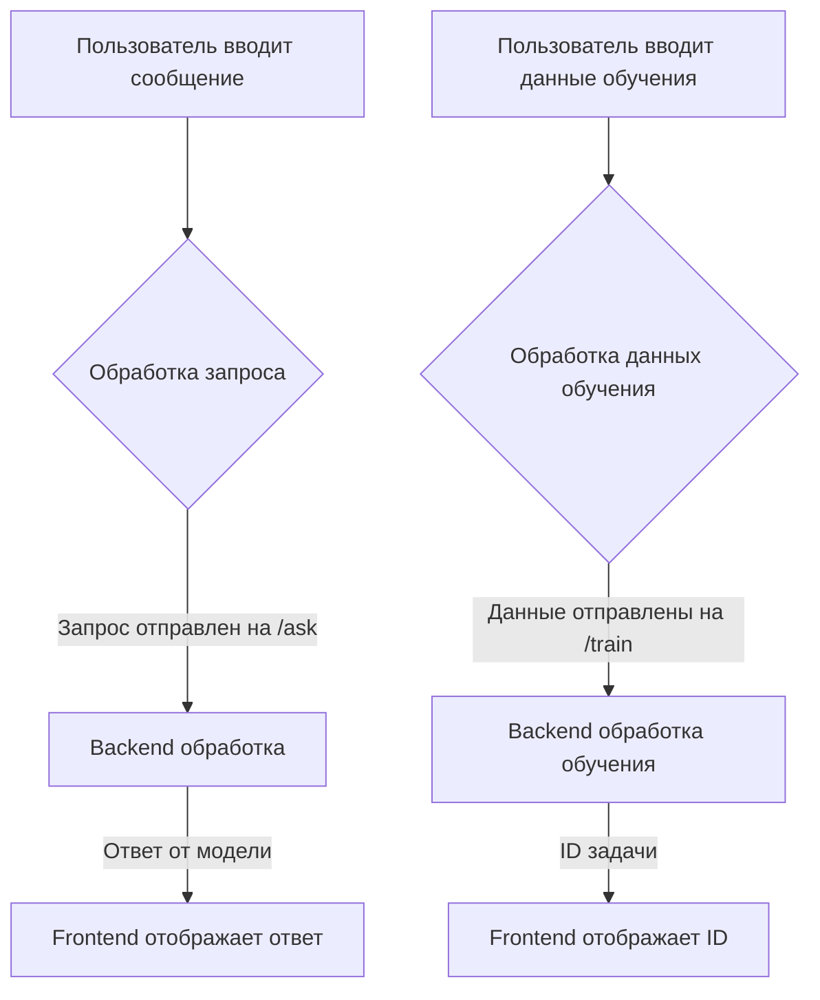

```MD
# Анализ кода HTML страницы для взаимодействия с моделью OpenAI

**1. <input code>**

```html
<!-- Код HTML страницы -->
```

**2. <algorithm>**



**Пример:**

Пользователь вводит сообщение "Привет, как дела?" (A).  Frontend отправляет запрос на backend (`/ask`) с этим сообщением (B). Backend обрабатывает запрос и отправляет ответ от модели OpenAI (C). Frontend отображает ответ на странице (D). Аналогично, при вводе данных для обучения (E), данные отправляются на `/train` (F), backend обрабатывает обучение (G) и отправляет ID задачи (H) на frontend для отображения.

**3. <mermaid>**

```mermaid
graph LR
    subgraph Frontend
        A[index.html] --> B(askModel);
        B --> C{$http.post('/ask')};
        C --> D[Backend];
        D --> E(response);
        E --> F[Отображение ответа];
        B -- error --> G(Error Handling);
        G --> F;

        H[index.html] --> I(trainModel);
        I --> J{$http.post('/train')};
        J --> D;
        J --> K[Backend - Train Model];
        K --> L(job_id);
        L --> M[Отображение ID задачи];
        I -- error --> G;
    end
    subgraph Backend
        D --> O[Обработка запроса];
        O --> P[Модель OpenAI];
        P --> Q[Ответ модели];
        Q --> D;

        K --> R[Обучение модели];
        R --> S[Сохранение результатов];
        S --> L;
    end
```

**Объяснение диаграммы:**

* **Frontend (index.html):** Обрабатывает пользовательские вводы (сообщения, данные обучения) и отправляет их на backend.  Обрабатывает ответы и отображает их на странице.  Существуют функции `askModel` и `trainModel` для отправки соответствующих запросов.  `$http` используется для HTTP-запросов.
* **Backend:** Получает запросы от frontend.  Обрабатывает их (включая взаимодействие с моделью OpenAI) и возвращает результаты.  Не показан код backend, но подразумевается, что существуют соответствующие API-эндпоинты (`/ask` и `/train`).
* **Зависимости:** Frontend использует библиотеку AngularJS для управления DOM и `$http` для отправки запросов на backend. Bootstrap используется для стилизации страницы.  `jquery`, `popper.js` и `bootstrap.min.js` – для работы Bootstrap.


**4. <explanation>**

* **Импорты:** Страница использует AngularJS, Bootstrap (через CDN) для функциональности и стилей.  Не существует импортов из собственных модулей проекта `src`.
* **Классы:**  Код использует AngularJS контроллер `MainController`.  Этот контроллер управляет логикой взаимодействия с пользователем и отображением данных.
* **Функции:** `askModel` и `trainModel` – это методы контроллера, обрабатывающие запросы к API `/ask` и `/train` соответственно.
* **Переменные:** `message`, `systemInstruction`, `trainingData`, `response`, `jobId` – это переменные контроллера, содержащие значения, используемые для взаимодействия.
* **Возможные ошибки/улучшения:**
    * Нет валидации пользовательского ввода (например, пустые строки).
    * Не обрабатываются все возможные ошибки backend API (например, 404).
    * Отсутствует кэширование (если это нужно).
    * Отсутствие логгирования.
    * Необходимо добавить дополнительную валидацию входных данных для модели OpenAI (например, проверка на корректность формата данных обучения).
    * Необходимо обеспечить безопасность.  Пользовательские данные не должны храниться в браузере.  API-интерфейс должен обрабатывать возможные ошибки, связанные с взаимодействием с моделью OpenAI.


**Цепочка взаимосвязей с другими частями проекта:**

Страница `index.html` напрямую взаимодействует с backend API `/ask` и `/train`.  Эти API, вероятно, реализованы в других модулях проекта (например, `src/fast_api/routes.py`).  Также существуют зависимости от библиотек для работы с AngularJS, Bootstrap.

```
index.html (frontend) <--> /ask, /train (backend) <--> OpenAI model
```