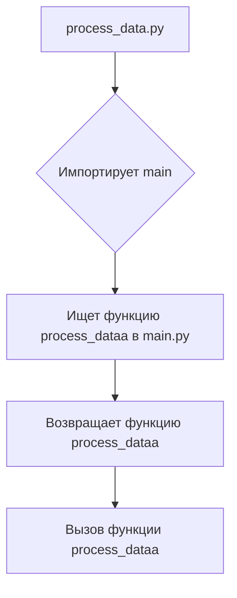
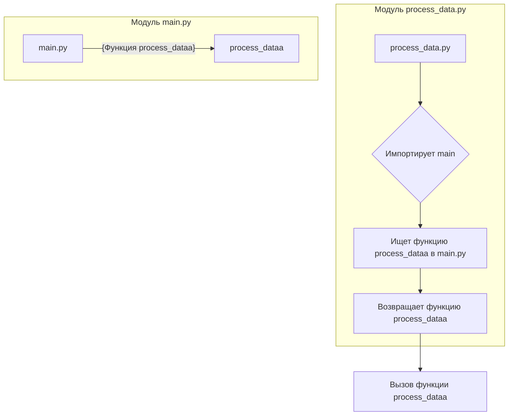

# <input code>

```python
## \file hypotez/src/fast_api/html/process_data.py
# -*- coding: utf-8 -*-
#! venv/Scripts/python.exe
#! venv/bin/python/python3.12

"""
.. module:: src.fast_api.html 
	:platform: Windows, Unix
	:synopsis:

"""
MODE = 'dev'

"""
	:platform: Windows, Unix
	:synopsis:

"""

"""
	:platform: Windows, Unix
	:synopsis:

"""


"""
  :platform: Windows, Unix

"""
"""
  :platform: Windows, Unix
  :platform: Windows, Unix
  :synopsis:
"""MODE = 'dev'
  
""" module: src.fast_api.html """


""" @namespace src.fast_api.html """
from .. import main
from main import process_dataa
```

# <algorithm>

Этот код импортирует модуль `main` из родительского пакета `..`.  В рамках `main` он, по всей видимости, ищет функцию `process_dataa`.  В связи с отсутствием тела функции `process_dataa` алгоритм дальнейшей работы не определяем.  На данном этапе можно только представить предполагаемую блок-схему взаимодействия между файлами `process_data.py` и `main.py`.



# <mermaid>



# <explanation>

**Импорты:**

* `from .. import main`: Импортирует модуль `main` из родительского каталога.  `..` указывает на поднятие на уровень выше текущего каталога.  Это предположение, исходя из соглашения об импорте в Python.  Важно убедиться, что модуль `main.py` находится в папке `src/fast_api/`.
* `from main import process_dataa`: Импортирует функцию `process_dataa` из модуля `main`.  Предполагается, что эта функция определена в `main.py`.

**Классы:**

В коде нет определений классов.

**Функции:**

* `process_dataa`:  Функция `process_dataa` импортируется из модуля `main`, но ее тело не показано.  Таким образом, нельзя сказать, какие данные она принимает в качестве аргументов, какие операции выполняет или какие значения возвращает.  Это ключевое упущение, и без определения кода функции `process_dataa` мы не можем определить ее работу.

**Переменные:**

* `MODE`: Строковая переменная, вероятно, хранящая режим работы (например, 'dev', 'prod').  Без контекста кода `main` сложно судить о ее значении.

**Возможные ошибки и улучшения:**

* **Отсутствие тела функции `process_dataa`**: Без определения тела функции `process_dataa`, мы не можем понять ее логику и функциональность.  Это самая существенная проблема.  Необходимо предоставить код функции `process_dataa` для детального анализа.
* **Непонятные комментарии**: Комментарии вида `""" :platform: Windows, Unix"""` являются избыточными и не несут смысловой нагрузки в данном контексте.  Их рекомендуется удалить.
* **Неявная зависимость от main.py**: Код сильно зависит от `main.py`.  Нужно более точно понимать структуру и назначение модуля `main` для лучшего понимания функций.


**Цепочка взаимосвязей:**

Файл `process_data.py` использует функции и переменные из модуля `main.py`.  Связь однонаправленная.  Необходимо понять функциональность `main.py`, чтобы оценить, как `process_data.py` интегрируется в более широкую систему.