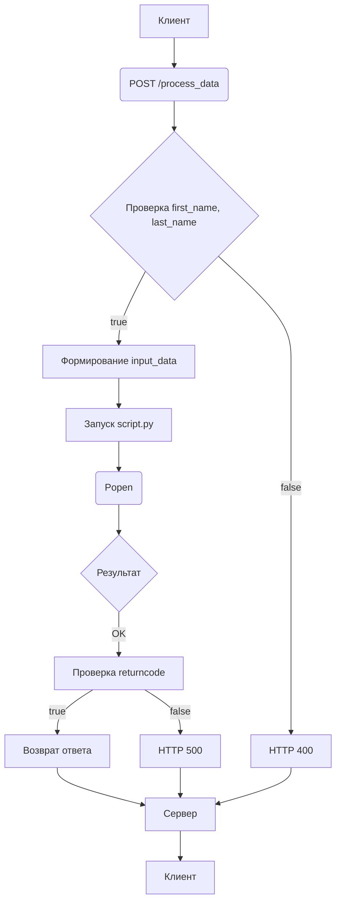

```MD
# Анализ кода hypotez/src/fast_api/main.first_version.py

## <input code>

```python
# -*- coding: utf-8 -*-\
#! venv/Scripts/python.exe
#! venv/bin/python/python3.12

"""
.. module: src.fast_api 
	:platform: Windows, Unix
	:synopsis:

"""


"""
	:platform: Windows, Unix
	:synopsis:

"""


"""
	:platform: Windows, Unix
	:synopsis:

"""


"""
  :platform: Windows, Unix

"""
"""
  :platform: Windows, Unix
  :platform: Windows, Unix
  :synopsis:
"""

""" module: src.fast_api """


""" Start FastAPI 
uvicorn main:app --reload
"""


import os
import subprocess
import webbrowser
from pathlib import Path
from fastapi import FastAPI, Form, Request, HTTPException
from subprocess import Popen, PIPE
from fastapi.staticfiles import StaticFiles

app = FastAPI()

# Mount the 'html' folder as static files
app.mount("/", StaticFiles(directory="html"), name="html")

webbrowser.open("http://localhost:8000/html/index.html")

# Endpoint to process data from HTML form
@app.post("/process_data")
async def process_data(request: Request, first_name: str = Form(...), last_name: str = Form(...)):
    # Check if first name and last name are provided
    if not first_name or not last_name:
        raise HTTPException(status_code=400, detail="First name and last name must be provided")
    
    # Formulate the input data string
    input_data = f"{first_name} {last_name}"
    
    # Execute the script with the input data and get the result
    script_path = Path(__file__).resolve().parent.parent / 'script.py'
    process = Popen(['python', str(script_path)], stdin=PIPE, stdout=PIPE, stderr=PIPE)
    stdout, stderr = process.communicate(input=input_data.encode())
    
    # Check for errors during script execution
    if process.returncode != 0:
        raise HTTPException(status_code=500, detail=f"Error executing the script: {stderr.decode()}")
    
    return {"output": stdout.decode()}

# Endpoint to open index.html in the browser
@app.get("/")
async def open_index():
    # Redirect to index.html
    return {"message": "Redirecting to index.html..."}

# @app.get("/index.html")
# async def open_index_html():
#     # Open index.html in the browser
#     try:
#         webbrowser.open("http://localhost:8000/index.html")
#     except Exception as e:
#         return {"error": f"Error opening file: {e}"}
#     return {"message": "Opening index.html in the browser..."}}
```

## <algorithm>

**Шаг 1:** Клиент отправляет POST запрос на `/process_data` с данными из формы (first_name, last_name).

**Шаг 2:**  Сервер проверяет наличие first_name и last_name. Если данные отсутствуют, возвращает ошибку 400.

**Шаг 3:** Сервер формирует строку input_data из переданных имен.

**Шаг 4:** Сервер запускает процесс `script.py` с помощью `subprocess.Popen` и передает input_data в качестве входных данных.

**Шаг 5:** Сервер получает результат из stdout и stderr.

**Шаг 6:** Сервер проверяет код возврата `process.returncode`. Если код не равен 0, значит произошла ошибка.  Возвращает ошибку 500 с подробным сообщением об ошибке.

**Шаг 7:** Сервер возвращает ответ в формате JSON с результатом `stdout.decode()`.


**Примеры:**

* **Входные данные:** first_name = "John", last_name = "Doe"
* **input_data:** "John Doe"
* **stdout:** "Привет, John Doe!"
* **Ответ:** {"output": "Привет, John Doe!"}


* **Ошибка во время выполнения script.py:**
* **stderr:** "Ошибка в script.py"
* **Ответ:** HTTPException (код 500) с сообщением "Error executing the script: Ошибка в script.py"


## <mermaid>



## <explanation>

**Импорты:**

* `os`, `subprocess`, `webbrowser`: стандартные библиотеки Python для работы с операционной системой, запуском внешних команд и открытием браузера.
* `pathlib`: для работы с путями к файлам.
* `fastapi`: пакет для создания API сервера.  `FastAPI`, `Form`, `Request`, `HTTPException`: классы и функции для работы с FastAPI.
* `subprocess`: для запуска внешних процессов, `Popen`, `PIPE`: классы для запуска `script.py` и работы со стандартным вводом/выводом.
* `fastapi.staticfiles`: для обработки статических файлов.

**Классы:**

* `FastAPI`: основной класс для создания FastAPI приложения. `app` – экземпляр этого класса. `app.mount("/", StaticFiles(directory="html"), name="html")`: устанавливает "html" папку как статические файлы, доступные через корневой путь.
* `Request`: обрабатывает запросы.
* `HTTPException`: класс для создания исключений с кодами HTTP ошибок.

**Функции:**

* `process_data(request: Request, first_name: str = Form(...), last_name: str = Form(...)`): обрабатывает POST-запросы на `/process_data`, получает данные first_name и last_name из формы, вызывает `script.py`, обрабатывает ошибки и возвращает результат.
* `open_index()`: обрабатывает GET-запросы на корневой путь `/`, перенаправляет на `/html/index.html`.


**Переменные:**

* `MODE`: строковая переменная, хранящая режим работы.
* `input_data`: строка, содержащая данные, переданные в `script.py`.
* `script_path`: путь к файлу `script.py`.

**Возможные ошибки и улучшения:**

* Нет обработки случаев, когда `script.py` вообще не отвечает.  Необходимо добавить таймауты и логирование для  `subprocess.Popen`.
* В коде есть `#` комментарии, которые могут быть улучшены, чтобы быть более понятными.
* Отсутствует обработка ошибок, например, если `script.py` не найден или не запустился.
* Неясно, какое поведение ожидается, если `script.py` выдает ошибку в stdout, а не stderr.


**Взаимосвязи с другими частями проекта:**

Код полагается на существование файла `script.py` в каталоге, расположенном на два уровня выше (`Path(__file__).resolve().parent.parent / 'script.py'`).  `script.py` выполняет логику обработки данных, полученных из `main.first_version.py`. Связь прямая: данные передаются в `script.py` и результат возвращается обратно в `main.first_version.py`.