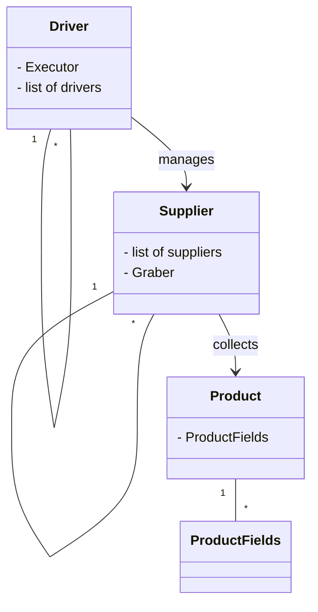

```MD
# Анализ структуры проекта (hypotez/src)

## <input code>

```
1. `Driver`
    - `Executor`
    - list of drivers (`Chrome`,`Firefox`,...)
2. `Supplier`
    - list of suppliers (`Amazon`, `Aliewxpress`,`Morlevi`,...)
    - `Graber`
3. `Product`
    - `ProductFields` 
```

## <algorithm>

Из представленного списка типов данных неясно, как они взаимодействуют.  Для построения блок-схемы и алгоритма необходимо больше информации о коде, например, о методах классов и функциях.  Неясно, есть ли реализации `Driver`, `Supplier`, `Product` и так далее, или это лишь описание структуры.  Поэтому я не могу построить блок-схему или пример взаимодействия данных.


## <mermaid>



**Описание диаграммы:**

Эта диаграмма описывает предполагаемые связи между классами.  `Driver` управляет списком драйверов (например, браузеров). `Supplier` содержит список поставщиков (сайтов) и `Graber`, который, вероятно, собирает данные с сайтов. `Product` содержит поля продукта. Стрелки показывают возможные взаимодействия.  Необходимо больше деталей кода, чтобы точно отразить функциональность, но эта диаграмма - отправная точка для понимания структуры.


## <explanation>

**Импорты:**

Код не содержит импортов. Это только структура, поэтому нет импортированных модулей.

**Классы:**

* **`Driver`:** Предполагаемый класс для управления веб-драйверами (например, Chrome, Firefox).  `Executor` возможно, отвечает за выполнение действий, связанных с драйверами. Список драйверов позволяет гибко выбирать между разными типами.
* **`Supplier`:** Класс для работы с поставщиками данных (веб-сайтами). Список поставщиков позволяет работать с несколькими источниками. `Graber` вероятно, отвечает за сбор данных с конкретного поставщика.
* **`Product`:** Класс, представляющий продукт.  `ProductFields` — вероятно, класс или структура, содержащая поля продукта (название, цена, описание и т.д.).

**Функции:**

Нет описаний функций.  Для понимания функциональности необходимы определения методов классов.

**Переменные:**

Переменные также не описаны.  Для понимания типов данных и использования переменных необходимы исходники кода.

**Возможные ошибки и улучшения:**

* Недостаточно информации для глубокого анализа.  Требуется код реализации классов и функций, чтобы увидеть работу в действии.
* Необходимо прояснить, как классы взаимодействуют.  Например, как `Driver` использует `Supplier` и `Product`.
*  Недостаточно информации о `Executor` и `Graber` —  что они представляют из себя и что делают.


**Взаимосвязи с другими частями проекта:**

Без кода невозможно определить взаимосвязи с другими частями проекта.  Однако можно предположить, что `Driver` и `Supplier` будут использоваться в других частях проекта для сбора и обработки данных о продуктах.