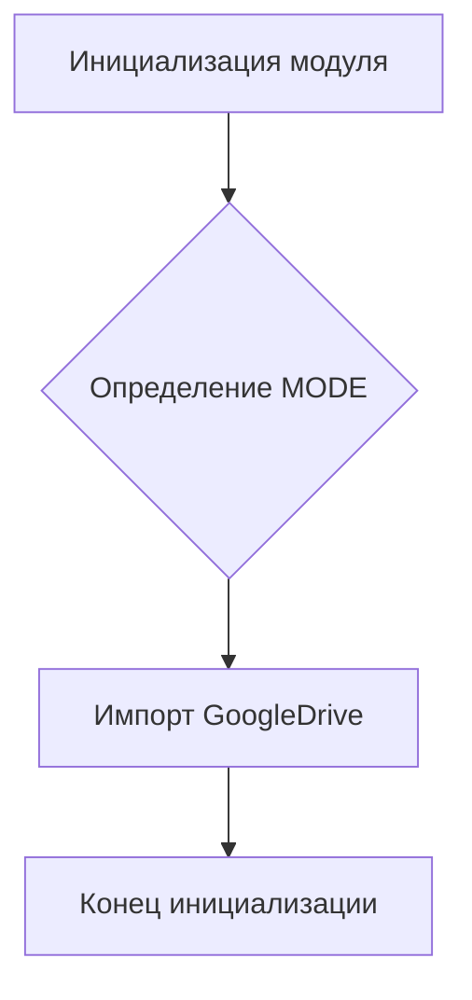

```MD
# Анализ файла hypotez/src/goog/drive/__init__.py

## <input code>

```python
## \file hypotez/src/goog/drive/__init__.py
# -*- coding: utf-8 -*-\
#! venv/Scripts/python.exe
#! venv/bin/python/python3.12

"""
.. module:: src.goog.drive 
	:platform: Windows, Unix
	:synopsis:

"""
MODE = 'dev'


from .drive import GoogleDrive
```

## <algorithm>

Этот файл является модулем инициализации для пакета `goog.drive`.  Он не содержит сложной логики, а скорее определяет константу `MODE` и импортирует класс `GoogleDrive` из подпапки `drive`.

**Блок-схема:**



**Пример:**

При импорте модуля `hypotez.src.goog.drive` в другом месте проекта, интерпретатор Python сначала выполнит код этого файла.  Это определит `MODE` как 'dev' и импортирует класс `GoogleDrive`, подготавливая его для использования.


## <mermaid>


**Объяснение диаграммы:**

Диаграмма показывает, что файл `drive/__init__.py` импортирует класс `GoogleDrive` из своего подкаталога.  В свою очередь, файл `goog/drive/__init__.py` импортирует `drive/__init__.py`.  Это стандартная иерархическая структура модулей в Python для организации кода.

## <explanation>

**Импорты:**

- `from .drive import GoogleDrive`: Этот импорт подключает класс `GoogleDrive` из модуля `drive.py`, который находится в той же директории (`goog/drive/`).  `.` в начале импорта означает, что мы ищем модуль внутри текущего каталога.  Это типичный подход к импорту в Python для организации кода по пакетам и модулям.

**Классы:**

- `GoogleDrive`:  Назначение этого класса остается неясным, так как его исходный код не предоставлен. Мы можем предположить, что он отвечает за работу с Google Drive API (или другой облачной системой хранения).  В дальнейшем анализе необходим сам класс `GoogleDrive`.

**Функции:**

- Нет функций в этом файле.

**Переменные:**

- `MODE = 'dev'`:  Эта строковая константа, скорее всего, используется для определения режима работы программы (например, `'dev'` для разработки, `'prod'` для производства).  Значение может использоваться в другом коде проекта.

**Возможные ошибки или области для улучшений:**

- Отсутствует информация о `GoogleDrive` и его методах, что затрудняет оценку правильности работы и потенциала ошибок. Для более детального анализа необходим исходный код класса.
- Нет описания `venv`.  Должны быть приведены объяснения используемых виртуальных окружений.
- Комментарии `#!` в начале файла, специфические для оболочек Linux и Windows, зачастую не нужны и могут быть излишними.


**Взаимосвязи с другими частями проекта:**

Данный файл инициализирует подпапку `goog/drive`.  В дальнейшем, это позволит использовать компоненты этой подпапки (класс `GoogleDrive`) в других частях проекта.  Для установления полной картины необходимо рассмотреть другие файлы в папке `goog/drive`.