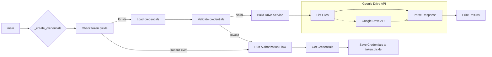

# <input code>

```python
## \file hypotez/src/goog/drive/drive.py
# -*- coding: utf-8 -*-\

#! venv/bin/python/python3.12

"""
.. module:: src.goog.drive 
	:platform: Windows, Unix
	:synopsis:

"""


"""
	:platform: Windows, Unix
	:synopsis:

"""


"""
	:platform: Windows, Unix
	:synopsis:

"""


"""
  :platform: Windows, Unix

"""
"""
  :platform: Windows, Unix
  :platform: Windows, Unix
  :synopsis:
"""
  
""" module: src.goog.drive """


""" Minimal library for working with Google Drive.

@code
# Example usage of the class
if __name__ == "__main__":
    from pathlib import Path

    file_path = Path('/mnt/data/google_extracted/sample_file.txt')  # Replace with your actual file path
    folder_name = 'My Drive Folder'  # Replace with the target folder name in Google Drive

    google_drive_handler = GoogleDriveHandler(
        folder_name=folder_name,
    )
    google_drive_handler.upload_file(file_path)
@endcode
"""


import pickle
import os
from pathlib import Path
from googleapiclient.discovery import build
from google_auth_httplib2 import AuthorizedHttpTransport
from google.auth.transport.requests import Request
from google.oauth2.credentials import Credentials
from google_auth_oauthlib.flow import InstalledAppFlow

import header
from src import gs
from src.utils.printer import pprint
from src.logger import logger

import pickle
from pathlib import Path
from googleapiclient.discovery import build
from google_auth_httplib2 import AuthorizedHttpTransport
from google.auth.transport.requests import Request
from google.oauth2.credentials import Credentials
from google_auth_oauthlib.flow import InstalledAppFlow

# Import statements for unused modules can be removed


class GoogleDriveHandler:
    """Handles interaction with Google Drive."""


    def __init__(self, folder_name: str):
        self.folder_name = folder_name
        self.creds = self._create_credentials()

    def _create_credentials(self):
        """Gets valid user credentials from storage."""
        creds_file: Path = gs.path.secrets / 'hypo69-c32c8736ca62.json'
        SCOPES: list = ['https://www.googleapis.com/auth/drive']
        creds = None
        if os.path.exists('token.pickle'):
            with open('token.pickle', 'rb') as token:
                creds = pickle.load(token)

        if not creds or not creds.valid:
            if creds and creds.expired and creds.refresh_token:
                creds.refresh(Request())
            else:
                flow = InstalledAppFlow.from_client_secrets_file(
                    self.creds_file, self.SCOPES)
                creds = flow.run_local_server(port=0)
            with open('token.pickle', 'wb') as token:
                pickle.dump(creds, token)

        return creds


    def upload_file(self, file_path: Path):
        # Implement logic to upload the file to the specified folder using the service object
        # ...


def main():
    """Shows basic usage of the Drive v3 API."""
    creds = GoogleDriveHandler()._create_credentials()  # Use the class method
    service = build('drive', 'v3', credentials=creds)

    # Call the Drive v3 API
    results = service.files().list(
        pageSize=10, fields="nextPageToken, files(id, name)").execute()
    items = results.get('files', [])

    if not items:
        print('No files found.')
    else:
        print('Files:')
        for item in items:
            print('{0} ({1})'.format(item['name'], item['id']))


if __name__ == '__main__':
    main()
```

# <algorithm>

1. **Initialization (main):**  Creates an instance of `GoogleDriveHandler` and calls its `_create_credentials` method to get authentication credentials.
2. **Authentication (`_create_credentials`):**
   - Checks if a `token.pickle` file exists. If yes, it loads the credentials from it.
   - If no credentials are found or they are invalid:
     - Attempts to refresh existing credentials if they have expired and a refresh token is available.
     - If no valid credentials are found, it initiates an authorization flow, obtains new credentials using a local server, and saves them in `token.pickle`.
3. **Drive API Interaction (main):**
   - Builds a Google Drive API service object using the obtained credentials.
   - Makes a request to list files in the user's Google Drive.
   - Parses the response to extract file names and IDs.
4. **Output (main):**
   - Prints "No files found" if no files are listed.
   - Otherwise, prints a list of file names and IDs.


# <mermaid>



**Explanation of Dependencies:**

- `googleapiclient`: Provides the client library for interacting with the Google APIs.
- `google_auth_httplib2`: Handles HTTP interactions.
- `google.auth.transport.requests`: Provides authentication using HTTP requests.
- `google.oauth2.credentials`: Manages OAuth 2.0 credentials.
- `google_auth_oauthlib.flow`: Facilitates the OAuth 2.0 flow.
- `pathlib`: Used for handling file paths.  This is a standard Python library.
- `pickle`: Used for serializing and deserializing the credentials. This is a standard Python library.

Other imports (`header`, `gs`, `pprint`, `logger`) are likely internal to the project, and their roles depend on the particular structure and functionality of the project.


# <explanation>

- **Imports:** The code imports necessary libraries for interacting with the Google Drive API and for handling file paths and credentials.  The `header`, `gs`, `pprint`, and `logger` imports suggest these are internal components, likely within the larger `hypotez` project, for managing specific aspects of the program (e.g., configuration, file systems, logging).


- **Classes:**
    - `GoogleDriveHandler`: This class encapsulates the logic for interacting with Google Drive.
        - `__init__(self, folder_name: str)`: Initializes the handler with the target folder name and retrieves credentials.
        - `_create_credentials(self)`:  This method is crucial. It fetches or creates credentials for accessing the Google Drive API.  Critically, it handles the OAuth 2.0 flow (creating or refreshing credentials), which is the standard way to authenticate with Google APIs. This method persists credentials in `token.pickle`, ensuring the application doesn't need to re-authorize on subsequent runs.
        - `upload_file(self, file_path: Path)`: This method is a placeholder; it needs implementation to perform the actual file upload to Google Drive.


- **Functions:**
    - `main()`: This function demonStartes how to use the `GoogleDriveHandler` class. It creates a handler object, fetches credentials, interacts with the Google Drive API to list files, and prints the results.


- **Variables:**
    - `MODE`, `SCOPES`, `creds`, `creds_file`, `service`, `results`, `items`:  These variables hold values related to the application's configuration, authentication status, API interaction results, and extracted files.


- **Possible Errors/Improvements:**
    - The `upload_file` method is currently empty.  You need to implement the actual file upload logic using the Google Drive API client (`service`) and the provided `file_path`.
    - Error handling is missing.  Adding `try...except` blocks around API calls and file operations will make the code more robust. For example, handle potential `FileNotFoundError` if `token.pickle` doesn't exist, or if an error arises during API interaction.
    - The hardcoded `file_path` and `folder_name` should be replaced with more flexible input mechanisms in a production environment.


- **Inter-project Relationships:** The code is part of a larger project (`hypotez`) as evidenced by the `src` directory.  The usage of `gs.path.secrets` indicates `gs` (likely a Google Storage/Services handler) is also within the `hypotez` project.  The relationships are deeply intertwined, and understanding the `gs` module is crucial to comprehend the full functionality.

The code provides a solid foundation for interacting with Google Drive. Completing the `upload_file` method, adding proper error handling, and making parameters configurable will greatly improve its practicality.