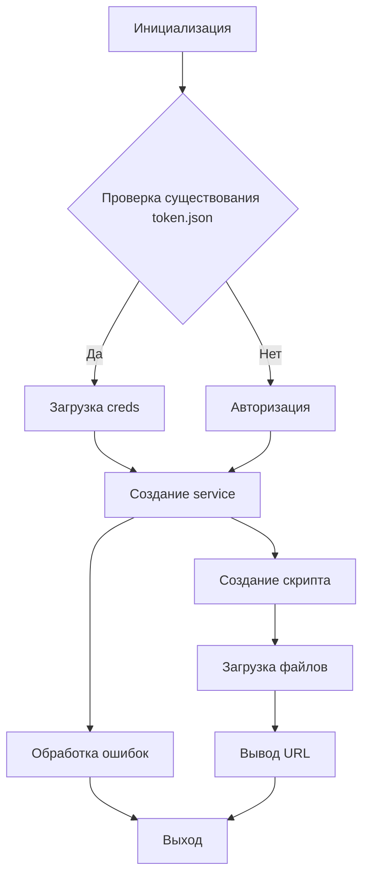

# <input code>

```python
## \file hypotez/src/goog/quickstart.py
# -*- coding: utf-8 -*-

#! venv/bin/python/python3.12

"""
.. module: src.goog 
	:platform: Windows, Unix
	:synopsis:

"""


"""
Shows basic usage of the Apps Script API.
Call the Apps Script API to create a new script project, upload a file to the
project, and log the script's URL to the user.

https://developers.google.com/apps-script/api/quickstart/python
"""


from pathlib import Path

from google.auth.transport.requests import Request
from google.oauth2.credentials import Credentials
from google_auth_oauthlib.flow import InstalledAppFlow
from googleapiclient import errors
from googleapiclient.discovery import build

import header
from src import gs

# If modifying these scopes, delete the file token.json.
SCOPES = ['https://www.googleapis.com/auth/script.projects']

SAMPLE_CODE = """
function helloWorld() {
  console.log("Hello, world!");
}
""".strip()

SAMPLE_MANIFEST = """
{
  "timeZone": "America/New_York",
  "exceptionLogging": "CLOUD"
}
""".strip()


def main():
    """Calls the Apps Script API."""
    creds = None
    # The file token.json stores the user's access and refresh tokens, and is
    # created automatically when the authorization flow completes for the first
    # time.
    token_path = gs.path.tmp / 'e-cat-346312-137284f4419e.json'
    if token_path.exists():
        creds = Credentials.from_authorized_user_file(token_path, SCOPES)
    # If there are no (valid) credentials available, let the user log in.
    if not creds or not creds.valid:
        if creds and creds.expired and creds.refresh_token:
            creds.refresh(Request())
        else:
            flow = InstalledAppFlow.from_client_secrets_file(
                'credentials.json', SCOPES)
            creds = flow.run_local_server(port=0)
        # Save the credentials for the next run
        with Path('token.json').open('w') as token:
            token.write(creds.to_json())

    try:
        service = build('script', 'v1', credentials=creds)

        # Call the Apps Script API
        # Create a new project
        request = {'title': 'My Script'}
        response = service.projects().create(body=request).execute()

        # Upload two files to the project
        request = {
            'files': [{
                'name': 'hello',
                'type': 'SERVER_JS',
                'source': SAMPLE_CODE
            }, {
                'name': 'appsscript',
                'type': 'JSON',
                'source': SAMPLE_MANIFEST
            }]
        }
        response = service.projects().updateContent(
            body=request,
            scriptId=response['scriptId']).execute()
        print('https://script.google.com/d/' + response['scriptId'] + '/edit')
    except errors.HttpError as error:
        # The API encountered a problem.
        print(error.content)


if __name__ == '__main__':
    main()
```

# <algorithm>

**Шаг 1:** Инициализация переменных.
    - `creds = None`: Переменная `creds` инициализируется как `None`, хранящая данные аутентификации.
    - `token_path`:  Путь к файлу `token.json` для сохранения токенов доступа.
**Шаг 2:** Проверка наличия токенов.
    - `if token_path.exists():`: Проверка существования файла `token.json`.
    - `creds = Credentials.from_authorized_user_file(...)`: Если файл существует, загружаются данные аутентификации из него.
**Шаг 3:** Авторизация (если токенов нет или они просрочены).
    - `if not creds or not creds.valid`: Если токенов нет или они недействительны, запускается процесс авторизации.
    - `creds.refresh(...)`: Если токен просрочен, но есть токен обновления, происходит его обновление.
    - `flow = InstalledAppFlow(...)`: Создается поток авторизации.
    - `creds = flow.run_local_server(...)`: Запускается локальный сервер для авторизации пользователя.
    - `token.write(creds.to_json())`: Сохраняются обновленные данные аутентификации в `token.json`.
**Шаг 4:** Обращение к API Google Apps Script.
    - `service = build(...)`: Создается клиентское соединение с API.
    - `request = {'title': 'My Script'}`: Формируется запрос на создание нового скрипта.
    - `response = service.projects().create(...)`: Создается новый скрипт и возвращается его идентификатор `scriptId`.
    - `request = {...}`: Формируется запрос на загрузку файлов в скрипт.
    - `response = service.projects().updateContent(...)`: Загружаются примерные файлы в скрипт.
**Шаг 5:** Вывод результата.
    - `print(...)`: Выводится URL нового скрипта в Google Apps Script.
**Шаг 6:** Обработка ошибок.
    - `try...except`: Обработка возможных ошибок при обращении к API.


# <mermaid>



**Объяснение диаграммы:**

* **Инициализация:** Начало выполнения программы, инициализация переменных.
* **Проверка существования token.json:** Проверяется, есть ли уже сохраненный файл с токенами доступа.
* **Загрузка creds:** Если файл существует, из него загружаются данные аутентификации.
* **Авторизация:** Если файла нет или токен недействителен, выполняется процесс авторизации пользователя.
* **Создание service:** Создается клиентское соединение с API Google Apps Script.
* **Создание скрипта:** Создается новый скрипт.
* **Загрузка файлов:** Загружаются примерные файлы кода и манифеста в созданный скрипт.
* **Вывод URL:** Выводится ссылка на созданный скрипт в Google Apps Script.
* **Обработка ошибок:** Обработка возможных ошибок при взаимодействии с API.
* **Выход:** Завершение программы.


# <explanation>

**Импорты:**

- `from pathlib import Path`: Импортирует класс `Path` для работы с путями к файлам, что позволяет более удобно работать с файловой системой.
- `from google.auth.transport.requests import Request`: Импортирует класс `Request` для работы с запросами к API Google.
- `from google.oauth2.credentials import Credentials`: Импортирует класс `Credentials` для работы с учетными данными доступа к API Google.
- `from google_auth_oauthlib.flow import InstalledAppFlow`: Импортирует класс `InstalledAppFlow` для автоматического процесса авторизации.
- `from googleapiclient import errors`: Импортирует класс `errors` для обработки ошибок, возвращаемых API.
- `from googleapiclient.discovery import build`: Импортирует функцию `build` для создания клиента API.
- `import header`: Импортирует модуль `header`, но его содержимое в данном случае не используется.
- `from src import gs`: Импортирует модуль `gs` из пакета `src`.  Это указывает на то, что данный скрипт использует вспомогательные функции или классы из модуля `gs` для работы с файловой системой или другими ресурсами.

**Классы:**

- `Path`:  Класс из модуля `pathlib`, предоставляющий удобный способ работы с путями к файлам.
- `Credentials`: Представляет данные авторизации, включая токен доступа и т.д.
- `Request`: Используется для выполнения запросов.
- `InstalledAppFlow`: Обрабатывает процесс авторизации, позволяя пользователю войти в систему и получить необходимые токен.

**Функции:**

- `main()`: Главный метод, содержащий логику работы скрипта. Занимается авторизацией, созданием проекта и загрузкой файлов в него.
- `build()`: Строит клиентское соединение с API, принимая тип сервиса, его версию и данные аутентификации.

**Переменные:**

- `SCOPES`: Список требуемых областей доступа к API.
- `SAMPLE_CODE`, `SAMPLE_MANIFEST`:  Примерный код и манифест скрипта, которые загружаются в проект Google Apps Script.
- `creds`: Содержит данные авторизации для доступа к API.
- `token_path`: Путь к файлу `token.json` для сохранения токенов.
- `service`: Представляет клиент API Google Apps Script.
- `response`: Хранит ответ от API.

**Возможные ошибки или улучшения:**

- Отсутствует обработка случая, когда `credentials.json` не найден.
- Добавьте возможность указания пути к `credentials.json` для гибкости.
- Улучшите обработку ошибок, предоставляя более подробную информацию о проблеме.
- Добавьте логирование для отладки.
- Вместо жестко заданных `SAMPLE_CODE` и `SAMPLE_MANIFEST`, рассмотрите возможность получения кода из внешних источников или конфигурационных файлов.

**Взаимосвязи с другими частями проекта:**

Код напрямую зависит от модуля `gs`, который, вероятно, предоставляет функции для работы с временными директориями и файлами.  Модуль `header` не используется в данном фрагменте. `credentials.json` содержит данные для авторизации в Google Apps Script API.  Этот код предполагает, что в проекте есть файл `credentials.json` с данными для аутентификации.