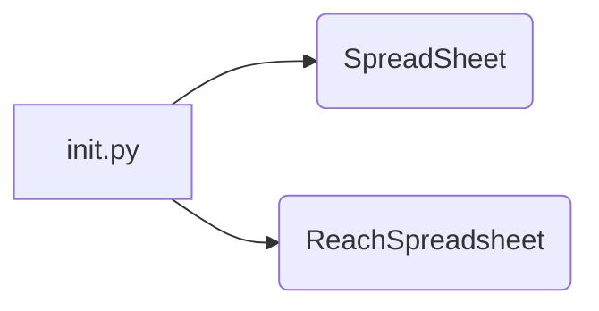
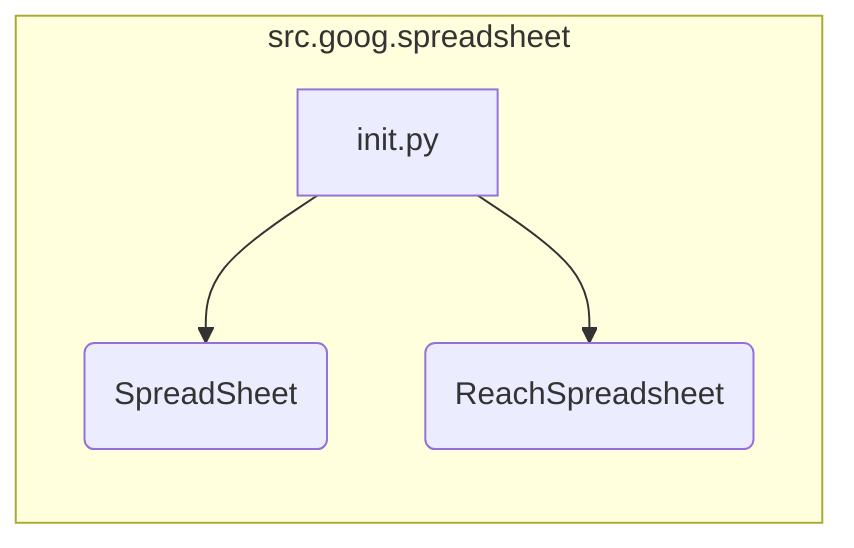

```MD
# Анализ кода hypotez/src/goog/spreadsheet/__init__.py

## <input code>

```python
# -*- coding: utf-8 -*-\n
#! venv/Scripts/python.exe\n
#! venv/bin/python/python3.12\n

"""
.. module:: src.goog.spreadsheet 
	:platform: Windows, Unix
	:synopsis:

"""
MODE = 'dev'


from .spreadsheet import SpreadSheet
from .reach_spreadsheet import ReachSpreadsheet
```

## <algorithm>

Этот файл является инициализационным модулем для пакета `src.goog.spreadsheet`.  Он не содержит логики выполнения, а лишь импортирует классы из других модулей.  Блок-схема простая:



В данном случае импорты `SpreadSheet` и `ReachSpreadsheet` подготавливают эти классы к использованию в других частях проекта.  Данные не перемещаются между функциями/классами внутри этого файла.

## <mermaid>



Эта диаграмма отображает импорты из файла `__init__.py`.  Нет зависимостей от внешних библиотек (кроме стандартных Python библиотек, используемых для импортирования).

## <explanation>

**Импорты:**

- `from .spreadsheet import SpreadSheet`: Импортирует класс `SpreadSheet` из подмодуля `spreadsheet` текущего пакета (`src.goog.spreadsheet`). Это означает, что `SpreadSheet` доступен для использования в других модулях этого же пакета.
- `from .reach_spreadsheet import ReachSpreadsheet`:  Аналогично импортирует класс `ReachSpreadsheet` из подмодуля `reach_spreadsheet` текущего пакета.

**Классы (не определены в данном файле, но используются):**

- `SpreadSheet`: Предположительно, класс, представляющий объект для работы со спредшитом Google.  Его подробности содержатся в файле `.spreadsheet`.
- `ReachSpreadsheet`: Вероятно, класс, связанный с доступом или взаимодействием с Google SpreadSheet (возможно, реализующий какую-то стратегию взаимодействия).

**Функции (нет):**

В файле `__init__.py` отсутствуют функции.

**Переменные:**

- `MODE = 'dev'`: Глобальная переменная, вероятно, задающая режим работы (например, `dev` или `prod`).  Это полезно для конфигурации.


**Возможные ошибки или улучшения:**

- Отсутствие документации (документирующих строк) для переменной `MODE` или файлов-источников.


**Связь с другими частями проекта:**

Файл `__init__.py` служит точкой входа для использования классов `SpreadSheet` и `ReachSpreadsheet` в других частях проекта, например, в скриптах или других модулях.  Он указывает на существование данных классов в данном подпакете и позволяет использовать их в других модулях, организовывая их логику.


**Пример использования (гипотетический):**

```python
from hypotez.src.goog.spreadsheet import SpreadSheet

# ... (в другом модуле)
sheet = SpreadSheet()
# ... (взаимодействие с листом)
```

```