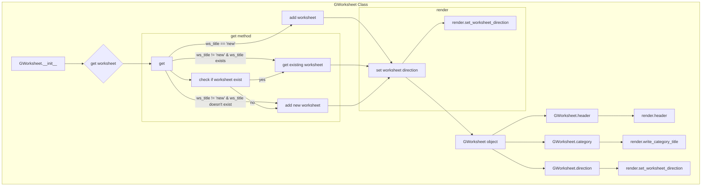

# <input code>

```python
## \file hypotez/src/goog/spreadsheet/bberyakov/gworksheets.py
# -*- coding: utf-8 -*-\
#! venv/Scripts/python.exe
#! venv/bin/python/python3.12

"""
.. module:: src.goog.spreadsheet.bberyakov 
	:platform: Windows, Unix
	:synopsis:

"""


from global_settingspread import Spreadsheet, Worksheet
#from goog.gspreadsheet import GSpreadsheet
from goog.grender import GSRender
#from global_settings import GSpreadsheet, GSRender

from typing import Union


class GWorksheet (Worksheet):
    """
     [Class's description]

    ## Inheritances : 
        - Implements Worksheet : [description]

    """
    sh = None
    ws: Worksheet = None
    render: GSRender = GSRender()
    
    def __init__(self, sh, ws_title: str = 'new', rows = None, cols = None, direcion = 'rtl', wipe_if_exist: bool = True, *args, **kwards) -> None:
        """
         [Function's description]

        Parameters : 
             self : [description]
             sh : [description]
             ws_title : str = 'new' : [description]
             rows = None : [description]
             cols = None : [description]
             direcion = 'rtl' : [description]
             wipe_if_exist : bool = True : [description]
             *args : [description]
             **kwards : [description]
        Returns : 
             None : [description]

        """
         self.sh = sh
         self.get(self.sh, ws_title)
         ...

    def get (self, sh, ws_title: str = 'new', rows: int = 100, cols: int = 100, direction: str = 'rtl', wipe_if_exist: bool = True) :
        """
         [Function's description]

        Parameters : 
             self : [description]
             sh : [description]
             ws_title : str = 'new' : [description]
             rows : int = 100 : [description]
             cols : int = 100 : [description]
             direction : str = 'rtl' : [description]
             wipe_if_exist : bool = True : [description]

        """
            """
            Создаю новую таблицу в книге, если ws_title == 'new', 
            иначе открываю по ws_title 

            `ws_title` (str) - Название таблицы(worksheet) в книге(spreadsheet) 
            `rows` (int) - кол -во строк 
            `cols` (int) - кол -во колонок 
            `wipe_if_exist` (bool) - очистить от старых данных
            """
            
            if ws_title == 'new':
                #_ws = sh.add_worksheet()
                self.ws = sh.gsh.get()
                
            else:
                
                if ws_title in [_ws.title for _ws in sh.gsh.worksheets() ]:
                    print (f'worksheet {ws_title} already exist !')
                    #_ws = sh.worksheet(ws_title)
                    self.ws = sh.gsh.worksheet(ws_title)

                    if wipe_if_exist: 
                        """ wipe data on worksheet  """
                        #_ws.clear()
                        #self.gsh.clear()
                        self.ws.clear()
                
                else:
                    #_ws = sh.add_worksheet (ws_title, rows, cols )
                    self.ws = sh.gsh.add_worksheet (ws_title, rows, cols )
                    """ new worksheet with ws_title """

            self.render.set_worksheet_direction (sh.gsh, self.ws, 'rtl')
            
    def header(self, world_title: str, range: str = 'A1:Z1', merge_type: str('MERGE_ALL') | str('MERGE_COLUMNS') | str('MERGE_ROWS') = 'MERGE_ALL') -> None:
        """
         [Function's description]

        Parameters : 
             self : [description]
             world_title : str : [description]
             range : Z1' = 'A1 : [description]
             merge_type : str('MERGE_ALL') | str('MERGE_COLUMNS') | str('MERGE_ROWS') = 'MERGE_ALL' : [description]
        Returns : 
             None : [description]

        """
        self.render.header(self.ws, world_title)

    def category(self, ws_category_title):
        """
         [Function's description]

        Parameters : 
             self : [description]
             ws_category_title : [description]

        """
        self.render.write_category_title(self, ws_category_title)
         
    def direction(self, direction: str = 'rtl'):
        """
         [Function's description]

        Parameters : 
             self : [description]
             direction : str = 'rtl' : [description]

        """
        self.render.set_worksheet_direction(sh = self.sh, ws = self, direction = 'rtl')

```



# <explanation>

**Импорты:**

- `from global_settingspread import Spreadsheet, Worksheet`: Импортирует классы `Spreadsheet` и `Worksheet` из модуля `global_settingspread`.  Это указывает на то, что этот код использует компоненты, определяемые в другом модуле проекта (`global_settingspread`). Важно понять структуру проекта и где определены эти классы.


- `from goog.grender import GSRender`: Импортирует класс `GSRender` из модуля `goog.grender`. Аналогично предыдущему, это подключает функциональность для работы с рендерингом.


**Классы:**

- `GWorksheet`:  Наследуется от класса `Worksheet`.  Этот класс предназначен для работы с Google Spreadsheets. Он хранит ссылку на лист (`self.ws`), на книгу (`self.sh`) и объект рендеринга (`self.render`).  Методы класса управляют созданием, получением и манипулирование листом.


**Функции:**

- `__init__(self, sh, ws_title='new', ...)`: Конструктор класса `GWorksheet`. Принимает ссылку на книгу (`sh`), название листа (`ws_title`), и дополнительные параметры, связанные с настройкой листа.  Важно, что он вызывает метод `get()` для инициализации листа.

- `get(self, sh, ws_title='new', ...)`: Этот метод отвечает за создание или получение листа в книге. Он проверяет, существует ли лист с заданным названием (`ws_title`). Если нет, создаёт новый, если да, открывает существующий.  Ключевой момент - очистка (`wipe_if_exist`).


- `header(self, world_title, range='A1:Z1', merge_type='MERGE_ALL')`:  Метод для добавления заголовка в лист. Он использует объект рендеринга (`self.render`) для выполнения этой задачи.


- `category(self, ws_category_title)`: Метод для добавления категории. Использует объект рендеринга для добавления заголовка категории.


- `direction(self, direction='rtl')`:  Метод для установки направления текста в листе. Использует объект рендеринга для настройки.

**Переменные:**

- `sh`: Ссылка на объект книги.
- `ws`: Ссылка на объект листа.
- `render`: Объект для рендеринга.


**Возможные ошибки и улучшения:**

- Недостаточно комментариев внутри кода. Добавьте более подробные комментарии, объясняющие логику каждого фрагмента кода.

- Отсутствуют проверки типов аргументов, особенно для `rows`, `cols`.  Добавьте проверку для предотвращения ошибок.


- Использование `...` в методе `__init__`. Необходимо реализовать оставленную часть, особенно логику работы с предоставленными параметрами.

- Неясно, как обрабатываются исключения, например, если лист не найден.

**Взаимосвязи с другими частями проекта:**

Код явно зависит от модулей `global_settingspread` и `goog.grender`, что указывает на архитектуру проекта с разделением ответственности.  Необходимо знать структуру проекта (как организованы модули) для более полного анализа.  Без знания этих модулей трудно оценить, как `GWorksheet` взаимодействует с другими частями системы.  Например, неизвестно, как осуществляется взаимодействие с Google Spreadsheets API.