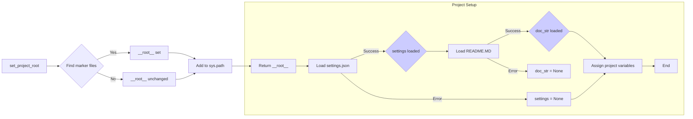

# <input code>

```python
## \file hypotez/src/goog/spreadsheet/header.py
# -*- coding: utf-8 -*-
#! venv/Scripts/python.exe
#! venv/bin/python/python3.12

"""
.. module:: src.goog.spreadsheet 
	:platform: Windows, Unix
	:synopsis:

"""
MODE = 'dev'


import sys
import json
from packaging.version import Version

from pathlib import Path
def set_project_root(marker_files=('pyproject.toml', 'requirements.txt', '.git')) -> Path:
    """
    Finds the root directory of the project starting from the current file's directory,
    searching upwards and stopping at the first directory containing any of the marker files.

    Args:
        marker_files (tuple): Filenames or directory names to identify the project root.
    
    Returns:
        Path: Path to the root directory if found, otherwise the directory where the script is located.
    """
    __root__:Path
    current_path:Path = Path(__file__).resolve().parent
    __root__ = current_path
    for parent in [current_path] + list(current_path.parents):
        if any((parent / marker).exists() for marker in marker_files):
            __root__ = parent
            break
    if __root__ not in sys.path:
        sys.path.insert(0, str(__root__))
    return __root__


# Get the root directory of the project
__root__ = set_project_root()
"""__root__ (Path): Path to the root directory of the project"""

from src import gs

settings:dict = None
try:
    with open(gs.path.root / 'src' / 'settings.json', 'r') as settings_file:
        settings = json.load(settings_file)
except (FileNotFoundError, json.JSONDecodeError):
    ...

doc_str:str = None
try:
    with open(gs.path.root / 'src' / 'README.MD', 'r') as settings_file:
        doc_str = settings_file.read()
except (FileNotFoundError, json.JSONDecodeError):
    ...


__project_name__ = settings.get("project_name", 'hypotez') if settings  else 'hypotez'
__version__: str = settings.get("version", '')  if settings  else ''
__doc__: str = doc_str if doc_str else ''
__details__: str = ''
__author__: str = settings.get("author", '')  if settings else ''
__copyright__: str = settings.get("copyrihgnt", '')  if settings else ''
__cofee__: str = settings.get("cofee", "Treat the developer to a cup of coffee for boosting enthusiasm in development: https://boosty.to/hypo69")  if settings else "Treat the developer to a cup of coffee for boosting enthusiasm in development: https://boosty.to/hypo69"
```

# <algorithm>

1. **`set_project_root` function:**
    * Takes a tuple of `marker_files` (default: `pyproject.toml`, `requirements.txt`, `.git`) as input.
    * Starts from the directory of the current file (`__file__`).
    * Iterates upwards through the parent directories.
    * Checks if any of the `marker_files` exists in the current parent directory.
    * If found, sets `__root__` to the parent directory and breaks the loop.
    * If not found after checking all parents, `__root__` remains the original directory.
    * Adds the `__root__` directory to `sys.path` if it's not already present.
    * Returns the `__root__` Path object.

    * **Example:**
        If the current file is in `/path/to/project/goog/spreadsheet/header.py`, and `pyproject.toml` exists in `/path/to/project`, then `__root__` will be set to `/path/to/project` and added to `sys.path`.

2. **`__root__` assignment:** Calls `set_project_root()` to determine the project root directory.
3. **`settings` loading:** Attempts to load `settings.json` from the `src` directory within the project root using `gs.path.root`. Catches errors if the file doesn't exist or is not valid JSON.

4. **`doc_str` loading:** Attempts to load `README.MD` from the `src` directory within the project root. Catches errors if the file doesn't exist.

5. **Variable assignment:** Sets project variables (`__project_name__`, `__version__`, `__doc__`, `__author__`, `__copyright__`, `__cofee__`) using values from the `settings` dictionary, or default values if `settings` is missing or the corresponding key is absent.


# <mermaid>




# <explanation>

**Imports:**

- `sys`: Provides access to system-specific parameters and functions.  Used here to modify `sys.path` for easier module import.

- `json`: Used for handling JSON data for loading project settings.

- `packaging.version`: For handling versions, though in this code it is not used in a directly functional manner.

- `pathlib`: For working with file paths in a more object-oriented and platform-independent way.

- `src.gs`: This import suggests a `gs` module in the `src` package that likely provides functionality related to Google Sheets or similar services.  The `gs.path.root` attribute within this code gets the root folder path of the project, presumably a component in a larger project.

**Classes:**

There are no classes defined in this code.

**Functions:**

- `set_project_root(marker_files=...)`: This function is crucial for locating the project root directory. It's a helper function for determining the project's top-level folder.  It's designed to work robustly even if the script isn't directly in the root directory. The tuple of marker files helps ensure that the search for the correct folder doesn't fail.

**Variables:**

- `__root__`: A `Path` object that holds the absolute path to the root directory of the project.

- `settings`: A dictionary holding project settings loaded from `settings.json`.  Defaults to `None` if loading fails.

- `doc_str`: A string containing the content of the `README.MD` file. Defaults to `None` if the file doesn't exist or if an error occurs during loading.

- `__project_name__`, `__version__`, `__doc__`, `__author__`, `__copyright__`, `__cofee__`: Project metadata variables, read from the `settings.json` file if present.  They have default values to avoid errors if `settings` is `None` or the specific key is missing.

**Possible Errors/Improvements:**

- **Error Handling:** The `try...except` blocks for loading `settings.json` and `README.MD` are good practice for robustness.  Adding more specific error messages would improve debugging if a problem occurs.


- **Dependency Clarification:**  The dependency on `gs` is unclear without seeing the implementation of the `gs` module. If this is a library, proper documentation and explicit versioning would improve maintainability.

- **`MODE` variable:** This variable remains unused. Consider removing or providing a definition/use.

- **Logging:** Consider adding logging for tracking the directory traversal steps during project root determination.  This would help in debugging issues when the project structure changes.


**Relationships with other parts of the project:**

This code relies on the `gs` module which in turn likely depends on other components of the broader project.  This code acts as a foundational element of the project by ensuring access to critical project configuration, allowing other modules to operate properly. Understanding the dependencies and the role of `gs` is essential for a full comprehension.