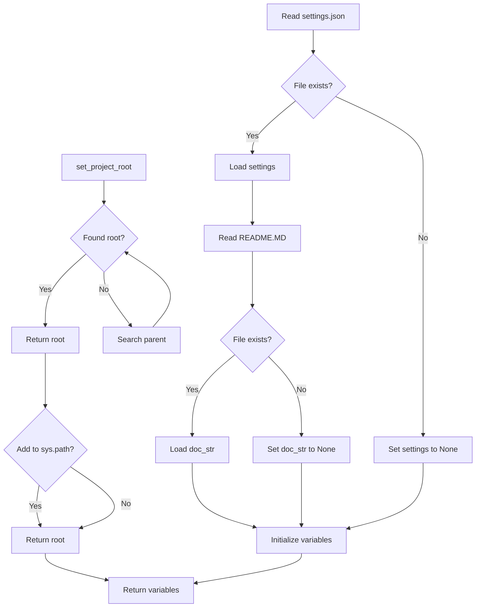

# <input code>

```python
## \file hypotez/src/goog/text_to_speech/header.py
# -*- coding: utf-8 -*-\
#! venv/Scripts/python.exe
#! venv/bin/python/python3.12

"""
.. module:: src.goog.text_to_speech 
	:platform: Windows, Unix
	:synopsis:

"""


import sys
import json
from packaging.version import Version

from pathlib import Path
def set_project_root(marker_files=('__root__')) -> Path:
    """
    Finds the root directory of the project starting from the current file's directory,
    searching upwards and stopping at the first directory containing any of the marker files.

    Args:
        marker_files (tuple): Filenames or directory names to identify the project root.
    
    Returns:
        Path: Path to the root directory if found, otherwise the directory where the script is located.
    """
    __root__:Path
    current_path:Path = Path(__file__).resolve().parent
    __root__ = current_path
    for parent in [current_path] + list(current_path.parents):
        if any((parent / marker).exists() for marker in marker_files):
            __root__ = parent
            break
    if __root__ not in sys.path:
        sys.path.insert(0, str(__root__))
    return __root__


# Get the root directory of the project
__root__ = set_project_root()
"""__root__ (Path): Path to the root directory of the project"""

from src import gs

settings:dict = None
try:
    with open(gs.path.root / 'src' /  'settings.json', 'r') as settings_file:
        settings = json.load(settings_file)
except (FileNotFoundError, json.JSONDecodeError):
    ...

doc_str:str = None
try:
    with open(gs.path.root / 'src' /  'README.MD', 'r') as settings_file:
        doc_str = settings_file.read()
except (FileNotFoundError, json.JSONDecodeError):
    ...


__project_name__ = settings.get("project_name", 'hypotez') if settings  else 'hypotez'
__version__: str = settings.get("version", '')  if settings  else ''
__doc__: str = doc_str if doc_str else ''
__details__: str = ''
__author__: str = settings.get("author", '')  if settings  else ''
__copyright__: str = settings.get("copyrihgnt", '')  if settings  else ''
__cofee__: str = settings.get("cofee", "Treat the developer to a cup of coffee for boosting enthusiasm in development: https://boosty.to/hypo69")  if settings  else "Treat the developer to a cup of coffee for boosting enthusiasm in development: https://boosty.to/hypo69"
```

# <algorithm>

1. **`set_project_root()`:**
   - Получает текущую директорию скрипта.
   - Итерируется по родительским директориям, проверяя наличие файлов/директорий в `marker_files` (например, `pyproject.toml`, `requirements.txt`, `.git`).
   - Если найдено соответствие, возвращает родительскую директорию `__root__`.
   - Добавляет директорию `__root__` в `sys.path`, что позволяет импортировать модули из корневой директории проекта.
   - Возвращает найденную корневую директорию.

   *Пример:* Если скрипт находится в `hypotez/src/goog/text_to_speech/header.py`, и `pyproject.toml` находится в `hypotez`, функция вернет `hypotez`.

2. **Получение `settings`:**
   - Использует `gs.path.root` для получения корневой директории проекта.
   - Пытается открыть файл `src/settings.json` и загрузить данные в `settings`.
   - Если файл не найден или данные некорректны, обрабатывает исключения.

   *Пример:* Если `settings.json` содержит данные `{ "project_name": "MyProject", "version": "1.0.0"}`, `settings` будет содержать эти данные.

3. **Получение `doc_str`:**
   - Аналогично пункту 2, но работает с файлом `README.MD`.

   *Пример:* Если `README.MD` содержит текст "Описание проекта", `doc_str` будет содержать этот текст.

4. **Инициализация переменных:**
   - Использует `settings.get()` для безопасного получения значений из словаря `settings`, устанавливая значение по умолчанию, если ключ не найден.

   *Пример:* Если `settings` содержит `"project_name": "MyProject"` и `"author"` отсутствует, `__project_name__` будет `"MyProject"`, а `__author__` будет пустой строкой.


# <mermaid>



**Подключаемые зависимости:**

- `sys`: Модуль для доступа к системным переменным, в том числе `sys.path`.
- `json`: Модуль для работы с JSON-файлами.
- `packaging.version`: Модуль для работы с версиями пакетов.
- `pathlib`: Модуль для работы с путями к файлам.
- `gs`: Предполагается, что это модуль из проекта, возможно, `src.gs` содержит функции для работы с файловыми путями, например, `gs.path.root`.

# <explanation>

**Импорты:**

- `sys`: Предоставляет доступ к системным переменным, в частности, `sys.path` для управления импортом модулей.
- `json`: Используется для сериализации и десериализации данных в формате JSON.
- `packaging.version`: Для работы с версиями пакетов (не используется напрямую, но необходим для работы с `requirements.txt` (не факт, что используется)).
- `pathlib`: Обеспечивает удобный и объектно-ориентированный способ работы с файловыми путями (позволяет работать с путями как с объектами).
- `gs`: Предполагается, что это вспомогательный модуль, вероятно, находящийся в папке `src`, предоставляющий функции для работы с файлами и папками проекта.  Без его кода невозможно полностью проанализировать его функциональность.

**Классы:**

В коде нет определений классов. Все действия выполняются через функции и глобальные переменные.

**Функции:**

- `set_project_root()`:  Ищет корневую директорию проекта.
    - `marker_files`: Кортеж имен файлов или папок, которые используются для поиска корневой директории проекта.
    - Возвращает `Path` объект, представляющий путь к корневой директории.

**Переменные:**

- `MODE`: Строковая переменная, вероятно, содержащая режим работы (например, 'dev', 'prod').
- `__root__`: `Path` объект, представляющий путь к корневой директории проекта.  Инициализируется в функции `set_project_root()`.
- `settings`: Словарь Python, содержащий данные из `settings.json`.
- `doc_str`: Строка, содержащая содержимое `README.MD`.
- `__project_name__`, `__version__`, `__doc__`, `__details__`, `__author__`, `__copyright__`, `__cofee__`:  Строковые переменные, содержащие информацию о проекте, считываемые из `settings.json`. Значения по умолчанию установлены, на случай отсутствия ключей.


**Возможные ошибки/улучшения:**

- **Обработка исключений:**  Обработка `FileNotFoundError` и `json.JSONDecodeError` важна, чтобы избежать аварийного завершения программы при отсутствии файлов или неправильном формате данных.
- **`gs.path.root`:** Необходимо понимать, как реализован этот объект, чтобы понять, как он определяет корневую директорию проекта.   Его логика не ясна без доступа к коду `gs`.  Если это функция, она могла бы быть рефакторирована для лучшей читаемости и понятности.
- **Документация:** Добавление `docstrings` к внутренним функциям/методам улучшит читабельность кода.
- **Использование `try...except` в цикле:** Исключения `FileNotFoundError` и `json.JSONDecodeError` могут возникать внутри цикла `for parent ...`. В текущем виде исключения обработаны только на уровне самого блока `with open(...)`, что может приводить к необработанным ошибкам.


**Цепочка взаимосвязей:**

Модуль `header.py` зависит от `gs` для определения корневой директории.  Далее, он считывает информацию из `settings.json` и `README.MD`, находящихся в корневом каталоге, и устанавливает значения переменных, которые, вероятно, будут использованы другими модулями в проекте.