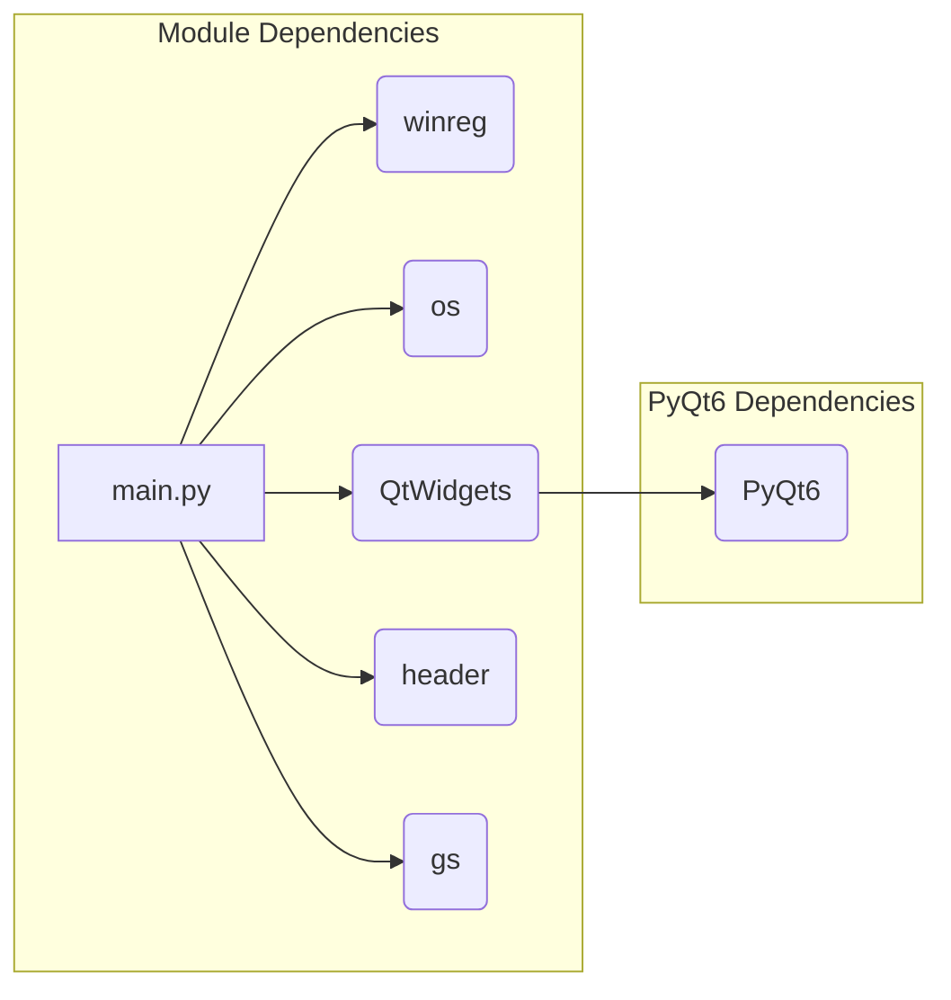

# <input code>

```python
## \file hypotez/src/gui/context_menu/qt6/main.py
# -*- coding: utf-8 -*-\

#! venv/bin/python/python3.12

"""
.. module:: src.gui.context_menu.qt6 
	:platform: Windows, Unix
	:synopsis:

"""


"""
	:platform: Windows, Unix
	:synopsis:

"""


"""
	:platform: Windows, Unix
	:synopsis:

"""


"""
  :platform: Windows, Unix

"""
"""
  :platform: Windows, Unix
  :platform: Windows, Unix
  :synopsis:
"""
  
""" module: src.gui.context_menu.qt6 """


"""Module to add or remove context menu items for the desktop and folder background using PyQt6.

This module provides functions to add or remove a custom context menu item called 
'hypo AI assistant' for the background of directories and the desktop in Windows Explorer.
It uses the Windows Registry to achieve this, with paths and logic implemented to target
the right-click menu on empty spaces (not on files or folders).
"""

import winreg as reg  # Module for interacting with Windows Registry
import os  # Module for OS path manipulation and checks
from PyQt6 import QtWidgets  # Module for GUI creation with PyQt6

import header  # Custom import, assuming it initializes settings or constants
from src import gs  # Custom import, likely for path settings or project structure


def add_context_menu_item():
    """Adds a context menu item to the desktop and folder background.

    This function creates a registry key under 'HKEY_CLASSES_ROOT\Directory\Background\shell' 
    to add a menu item named 'hypo AI assistant' to the background context menu in Windows Explorer.
    The item runs a Python script when selected.

    Registry Path Details:
        - `key_path`: Directory\Background\shell\hypo_AI_assistant
            This path adds the context menu item to the background of folders and 
            the desktop, allowing users to trigger it when right-clicking on empty space.
        
        - `command_key`: Directory\Background\shell\hypo_AI_assistant\command
            This subkey specifies the action for the context menu item and links it to a script 
            or command (in this case, a Python script).
    
    Raises:
        Displays an error message if the script file does not exist.
    """
    
    # Registry path for adding a menu item to the background of folders and the desktop
    key_path = r"Directory\\Background\\shell\\hypo_AI_assistant"

    try:
        # Create a new key for the menu item under the specified registry path
        with reg.CreateKey(reg.HKEY_CLASSES_ROOT, key_path) as key:
            reg.SetValue(key, "", reg.REG_SZ, "hypo AI assistant")  # Display name of the context menu item
            
            # Sub-key to define the command to run when the menu item is selected
            command_key = rf"{key_path}\\command"
            with reg.CreateKey(reg.HKEY_CLASSES_ROOT, command_key) as command:
                
                # Define the path to the Python script that will be executed
                command_path = gs.path.src / 'gui' / 'context_menu' / 'main.py'  # Path to the script
                if not os.path.exists(command_path):
                    QtWidgets.QMessageBox.critical(None, "Ошибка", f"Файл {command_path} не найден.")
                    return
                
                # Set the command to execute the script with Python when the context menu item is clicked
                reg.SetValue(command, "", reg.REG_SZ, f"python \\"{command_path}\\" \\"%1\\"")
        
        # Confirmation message for successful addition
        QtWidgets.QMessageBox.information(None, "Успех", "Пункт меню успешно добавлен!")
    except Exception as ex:
        # Display any error that occurs during the registry modification
        QtWidgets.QMessageBox.critical(None, "Ошибка", f"Ошибка: {ex}")


def remove_context_menu_item():
    # ... (same as above)

class ContextMenuManager(QtWidgets.QWidget):
    # ... (same as above)

if __name__ == "__main__":
    # ... (same as above)
```

# <algorithm>

```mermaid
graph TD
    A[Start] --> B{Check if "main.py" exists};
    B -- Yes --> C[Create Registry Key];
    B -- No --> D[Show Error];
    C --> E[Set Registry Value for Display Name];
    E --> F[Create Command Key];
    F --> G[Set Command in Registry];
    G --> H[Show Success Message];
    H --> I[End];
    D --> I;
    
    subgraph "remove_context_menu_item"
        J[Start] --> K{Check if key exists};
        K -- Yes --> L[Delete Registry Key];
        K -- No --> M[Show Warning];
        L --> N[Show Success Message];
        M --> O[End];
        N --> O;
    end
```

# <mermaid>



# <explanation>

**Импорты:**

- `winreg as reg`: Импортирует модуль `winreg`, который используется для взаимодействия с реестром Windows.  Переименован как `reg` для краткости.
- `os`: Импортирует модуль `os`, предоставляющий функции для работы с операционной системой, в том числе проверку существования файлов и манипуляцию с путями.
- `QtWidgets`: Импортирует класс `QtWidgets` из `PyQt6`, обеспечивая инструменты для создания графического интерфейса.
- `header`: Импортирует, предположительно, файл `header.py`, который содержит настройки или константы, необходимые для работы модуля.
- `gs`: Импортирует модуль `gs`, который, по всей видимости, находится в пакете `src`, и предоставляет функции, связанные с путями и структурой проекта (например, `gs.path.src`).

**Классы:**

- `ContextMenuManager`:  Представляет собой главное окно приложения для управления контекстным меню.  Используется `QtWidgets.QWidget` в качестве базового класса.  В нём реализованы методы для инициализации пользовательского интерфейса (UI) и обработки событий нажатия кнопок.
 - `initUI`: Метод, который отвечает за создание пользовательского интерфейса с кнопками для добавления, удаления и выхода.

**Функции:**

- `add_context_menu_item()`: Добавляет пункт меню "hypo AI assistant" в контекстное меню папок и рабочего стола.  Использует реестр Windows для изменения контекстного меню.
  -  Проверяет существование целевого файла (`command_path`).
- `remove_context_menu_item()`: Удаляет пункт меню "hypo AI assistant" из контекстного меню папок и рабочего стола.  Так же использует реестр Windows для изменения контекстного меню.

**Переменные:**

- `MODE`: Строковая константа, вероятно, хранящая режим работы (например, 'dev' или 'prod').
- `key_path`, `command_key`: Строковые переменные, содержащие пути к ключам реестра, необходимые для управления контекстным меню.
- `command_path`: Строковая переменная, хранящая путь к файлу Python-скрипта, который будет выполнен при выборе пункта меню.

**Возможные ошибки и улучшения:**

- **Обработка ошибок:** Код содержит `try...except` блоки для обработки потенциальных ошибок при работе с реестром (например, если ключ не найден). Однако, обработка некоторых ошибок, особенно `FileNotFoundError`, могла бы быть более подробной.
- **Локализация:**  Использование `QtWidgets.QMessageBox` хорошо, но для лучшего пользовательского опыта, рекомендуется использовать переведенные сообщения (например, с помощью Qt Linguist).
- **Обработка исключений:**  В обработчике исключений нужно возвращать значение.
- **Тестирование:** Тестирование кода, который взаимодействует с реестром Windows, крайне важно. Необходимо убедиться, что код работает как ожидается в разных ситуациях.


**Цепочка взаимосвязей с другими частями проекта:**

Модуль `main.py` напрямую зависит от `gs`, который предположительно предоставляет пути к ресурсам проекта, и `header.py`, содержащего настройки.  Функция `add_context_menu_item` пытается получить путь к файлу `main.py` из `gs.path.src`.  Это указывает на то, что этот модуль является частью более крупного приложения и зависит от структуры папок и конфигураций, определенных в других частях проекта.