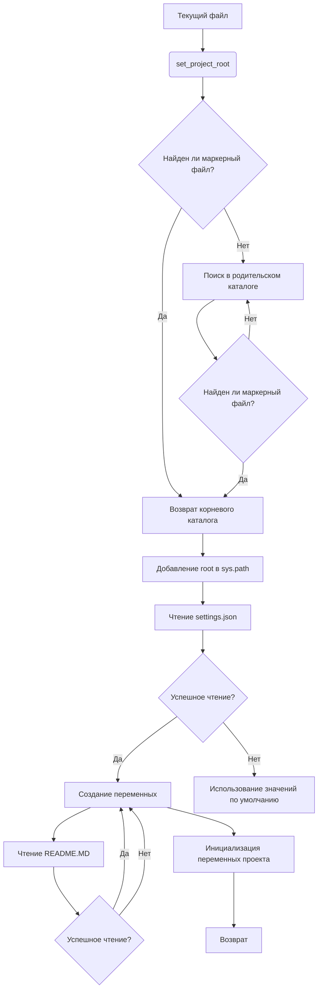

# <input code>

```python
## \file hypotez/src/gui/header.py
# -*- coding: utf-8 -*-

#! venv/bin/python/python3.12

"""
.. module: src.gui 
	:platform: Windows, Unix
	:synopsis:

"""


"""
	:platform: Windows, Unix
	:synopsis:

"""


"""
	:platform: Windows, Unix
	:synopsis: Модуль определяющий корневой путь к проекту. Все импорты строятся относительно этого пути.
    :TODO: В дальнейшем перенести в системную переменную

"""


import sys
import json
from packaging.version import Version

from pathlib import Path
def set_project_root(marker_files=('__root__','.git')) -> Path:
    """
    Finds the root directory of the project starting from the current file's directory,
    searching upwards and stopping at the first directory containing any of the marker files.

    Args:
        marker_files (tuple): Filenames or directory names to identify the project root.
    
    Returns:
        Path: Path to the root directory if found, otherwise the directory where the script is located.
    """
    __root__:Path
    current_path:Path = Path(__file__).resolve().parent
    __root__ = current_path
    for parent in [current_path] + list(current_path.parents):
        if any((parent / marker).exists() for marker in marker_files):
            __root__ = parent
            break
    if __root__ not in sys.path:
        sys.path.insert(0, str(__root__))
    return __root__


# Get the root directory of the project
__root__ = set_project_root()
"""__root__ (Path): Path to the root directory of the project"""

from src import gs

settings:dict = None
try:
    with open(gs.path.root / 'src' /  'settings.json', 'r') as settings_file:
        settings = json.load(settings_file)
except (FileNotFoundError, json.JSONDecodeError):
    ...

doc_str:str = None
try:
    with open(gs.path.root / 'src' /  'README.MD', 'r') as settings_file:
        doc_str = settings_file.read()
except (FileNotFoundError, json.JSONDecodeError):
    ...


__project_name__ = settings.get("project_name", 'hypotez') if settings  else 'hypotez'
__version__: str = settings.get("version", '')  if settings  else ''
__doc__: str = doc_str if doc_str else ''
__details__: str = ''
__author__: str = settings.get("author", '')  if settings  else ''
__copyright__: str = settings.get("copyrihgnt", '')  if settings  else ''
__cofee__: str = settings.get("cofee", "Treat the developer to a cup of coffee for boosting enthusiasm in development: https://boosty.to/hypo69")  if settings  else "Treat the developer to a cup of coffee for boosting enthusiasm in development: https://boosty.to/hypo69"
```

# <algorithm>

1. **`set_project_root(marker_files)`:**
    * Принимает кортеж `marker_files` — список файлов/папок, используемых для определения корневого каталога проекта.
    * Начинает поиск с текущего каталога файла `__file__`
    * Итеративно поднимается по иерархии каталогов.
    * Если в текущем каталоге или его родительских каталогах обнаруживается хотя бы один из файлов/папок в `marker_files`, поиск прекращается.
    * Возвращает путь к найденному корневому каталогу. Если корневой каталог не найден, возвращает путь к текущему каталогу.
    * Добавляет корневой каталог в `sys.path`, что позволяет импортировать модули из этого каталога.
2. **Получение `__root__`:**
    * Вызывается функция `set_project_root()`. Результат присваивается переменной `__root__`.
3. **`settings`:**
    * Пытается загрузить настройки из файла `gs.path.root / 'src' / 'settings.json'`.
    * Если файл не найден или содержит невалидный JSON,  `settings` остается `None`.
4. **`doc_str`:**
    * Пытается загрузить содержимое файла `gs.path.root / 'src' / 'README.MD'`.
    * Если файл не найден, `doc_str` остается `None`.
5. **Создание переменных проекта:**
    * Создает переменные `__project_name__`, `__version__`, `__doc__`, `__details__`, `__author__`, `__copyright__`, `__cofee__` на основе данных из `settings` или использует значения по умолчанию, если `settings` или соответствующий ключ отсутствуют.

**Пример:**

Если в текущей директории находится `pyproject.toml`, а родительской - `requirements.txt`, то функция вернет родительский каталог.

**Перемещение данных:**

* Функция `set_project_root()` возвращает путь к корневому каталогу, который затем используется для импорта модулей.
* Функция `set_project_root()` изменяет глобальную переменную `sys.path`.
* Файлы `settings.json` и `README.MD` считываются, а их содержимое загружается в переменные `settings` и `doc_str` соответственно.
* Эти данные используются для инициализации метаданных проекта (`__project_name__`, `__version__`, `__doc__` и т.д.).

# <mermaid>



**Подключаемые зависимости:**
* `pathlib`: Для работы с путями к файлам.
* `json`: Для работы с файлами JSON.
* `packaging.version`: Для работы с версиями пакетов.
* `sys`: Для доступа к системным переменным, в том числе `sys.path`.
* `gs`:  Предполагается, что это модуль, определённый в `src`.


# <explanation>

**Импорты:**

* `sys`: Модуль для взаимодействия с системными переменными, особенно `sys.path`, необходим для добавления пути к корневому каталогу в список доступных импортов.
* `json`: Для работы с файлами JSON, используется для загрузки настроек проекта из `settings.json`.
* `packaging.version`:  Для обработки версий пакетов,  используется для корректной работы с версиями в коде.
* `pathlib`: Модуль для работы с путями к файлам.
* `gs`:  Модуль, находящийся в подпапке `src`, вероятно, содержит полезные функции и переменные, относящиеся к  управлению данными проекта.

**Классы:**

В данном коде нет классов.

**Функции:**

* `set_project_root(marker_files)`: Находит корень проекта.  Аргумент `marker_files` — кортеж имен файлов (или папок), поиск идет вверх по дереву директорий, пока не будет найден хотя бы один из этих файлов/папок.  Возвращает объект `Path` — путь к корневому каталогу проекта.

**Переменные:**

* `__root__`: Путь к корневому каталогу проекта (тип `Path`).
* `MODE`: Строковая переменная, определяющая режим работы.
* `settings`: Словарь, хранящий настройки проекта (тип `dict`).
* `doc_str`: Строка, содержащая содержимое файла `README.MD` (тип `str`).
* `__project_name__`, `__version__`, `__doc__`, `__details__`, `__author__`, `__copyright__`, `__cofee__`: Переменные, содержащие метаданные проекта, полученные из `settings` или значения по умолчанию.  Важны для работы с метаинформацией о проекте.

**Возможные ошибки и улучшения:**

* **Обработка ошибок:** Обработка исключений ( `FileNotFoundError`, `json.JSONDecodeError`) для файлов `settings.json` и `README.MD` — хороший подход.  Однако,  возможна дальнейшая детализация обработчика ошибок (например, вывод сообщения об ошибке).
* **Более сложная логика поиска корня:** Вместо списка `marker_files` можно использовать более сложную логику или метод для определения корня проекта, если необходимо учитывать более сложные структуры проекта.
* **Использование переменных окружения:** Для хранения корневого пути проекта, вместо жестко заданной директории, целесообразнее использовать переменные окружения.  Это сделает код более гибким и позволит изменять путь без изменения кода.
* **Документация:** Более подробная документация для функции `set_project_root` улучшила бы понимание работы функции.
* **Ясность имён:** Имена переменных (`__root__`) могли бы быть более информативными (например, `project_root`).

**Взаимосвязь с другими частями проекта:**

Функция `set_project_root` и последующие операции считывания настроек и документации из файлов `settings.json` и `README.MD` являются критически важными для корректного функционирования других частей проекта, которые будут использовать данные, извлеченные из этих файлов. Например, это могут быть функции, использующие  `__project_name__`, `__version__`, `__doc__` для начальной инициализации, локализации, отображения и т.д.  Отсутствующая информация о `gs` затрудняет выявление полной цепочки взаимосвязей.