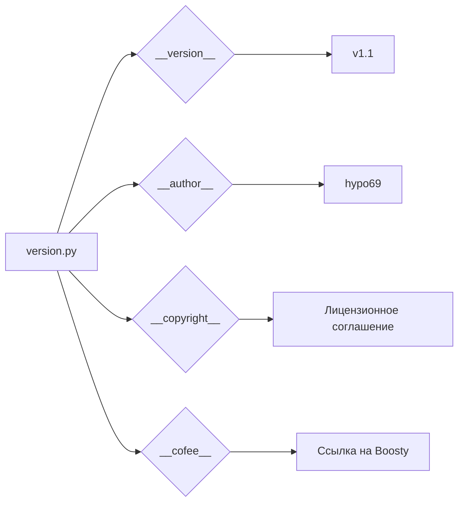

```MD
1. **<input code>**

```python
## \file hypotez/src/gui/openai_trаigner/version.py
# -*- coding: utf-8 -*-\n#! venv/Scripts/python.exe\n#! venv/bin/python/python3.12\n\n"""
.. module:: src.gui.openai_trаigner 
	:platform: Windows, Unix
	:synopsis:

"""


"""
	:platform: Windows, Unix
	:synopsis:

"""

"""
	:platform: Windows, Unix
	:synopsis:

"""


"""
  :platform: Windows, Unix

"""
"""
  :platform: Windows, Unix
  :platform: Windows, Unix
  :synopsis:
"""
  
""" module: src.gui.openai_trаigner """


__version__: str = 'v1.1'
__doc__: str = ''
__details__: str = ''
__author__: str = 'hypo69'
__copyright__: str = """
## License

Copyright (c) 2024 hypo69

This project is licensed under the MIT License. See the [MIT License](https://opensource.org/licenses/MIT) for details.

Commercial use of the code is prohibited without prior permission from the authors.
"""
__cofee__: str = "Treat the developer to a cup of coffee for boosting enthusiasm in development: https://boosty.to/hypo69"
```

2. **<algorithm>**

Этот код не содержит алгоритма в традиционном понимании. Он представляет собой файл конфигурации (или метаданных) для модуля `src.gui.openai_trаigner`. Он определяет константы, описывающие версию, автора и лицензию модуля.  Логики выполнения нет. Данные не перемещаются между функциями или методами, а просто хранятся в переменных.


3. **<mermaid>**



4. **<explanation>**

* **Импорты**: Нет импортов. Файл `version.py` содержит только определения переменных, предназначенных для хранения метаданных о модуле `src.gui.openai_trаigner`.  Этот файл не импортирует какие-либо другие модули.

* **Классы**: Нет классов.

* **Функции**: Нет функций.

* **Переменные**: Файл содержит несколько констант (например, `__version__`, `__author__`, `__copyright__`, `__cofee__`):
    * `__version__`: Строка, представляющая версию модуля.
    * `__author__`: Строка, представляющая имя автора.
    * `__copyright__`: Строка, представляющая лицензию.
    * `__cofee__`: Строка, содержащая ссылку на Boosty, возможно, для поддержки разработчика.
    * `MODE`: Константное значение 'dev'. Вероятно, используется для определения режима работы модуля (development).

* **Возможные ошибки или области для улучшений**:

    * **Документация:** В документации (`"""Docstrings"""`) можно добавить информацию о назначении `MODE`.
    * **Консистентность:** Не все строки документации имеют одинаковый стиль.  Было бы хорошо выровнять их по стилю.
    * **Конвенции**: В python используется нижнее подчеркивание, как правило, для констант, а так же, желательно, для имён.


**Цепочка взаимосвязей**:

Файл `version.py` является частью проекта `hypotez`. Он содержит метаданные для модуля `src.gui.openai_trаigner`. Данные из этого файла, вероятно, будут использованы другими частями проекта для определения версии, автора, лицензии и др. метаданных, например, при сборке документации, или выводе версии в пользовательском интерфейсе.  Связь косвенная, через контекст проекта.