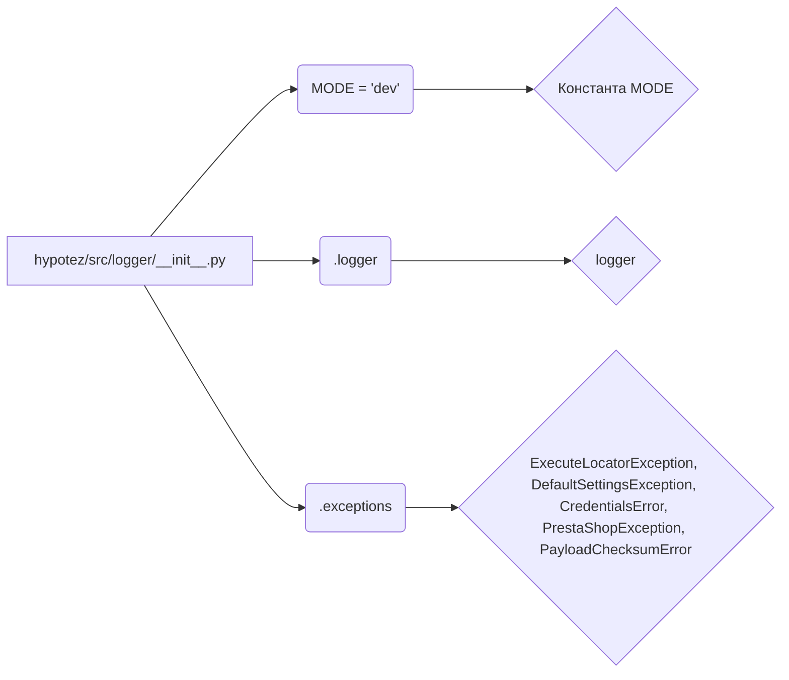

# Анализ кода hypotez/src/logger/__init__.py

## <input code>

```python
## \file hypotez/src/logger/__init__.py
# -*- coding: utf-8 -*-\
#! venv/Scripts/python.exe
#! venv/bin/python/python3.12

"""
.. module: src.logger 
	:platform: Windows, Unix
	:synopsis:

"""
MODE = 'dev'

from .logger import logger
#from .beeper import Beeper
from .exceptions import ( ExecuteLocatorException, 
                         DefaultSettingsException, 
                         CredentialsError, 
                         PrestaShopException, 
                         PayloadChecksumError
                        )
```

## <algorithm>

Этот код определяет инициализацию модуля `logger`. Алгоритм прост:

1. **Установка константы `MODE`:** Устанавливает значение переменной `MODE` равным 'dev'.  Это, вероятно, режим работы логгера.

2. **Импорт необходимых модулей:** Импортирует модуль `logger` из подпапки `.logger` и несколько исключений из подпапки `.exceptions`.

Блок-схема не требуется, так как алгоритм состоит лишь из нескольких простых шагов. Данные не перемещаются между функциями или классами, просто импортируются модули и устанавливается константа.

## <mermaid>



## <explanation>

**Импорты:**

- `from .logger import logger`: Импортирует объект `logger` из модуля `logger.py`, находящегося в подпапке `./logger`. Это, вероятно, логгер, использующий определённый стандарт или библиотеку для записи сообщений в журнал.  Связь с другими частями проекта заключается в том, что логгер используется для записи информации и отслеживания событий.
- `from .exceptions import ...`: Импортирует несколько классов исключений из модуля `exceptions.py`. Эти классы, вероятно, определяют типы ошибок, специфичных для проекта `hypotez`.


**Классы (неявные):**

- Из представленного кода классы не определяются явно. Однако, поскольку импортируются классы исключений (`ExecuteLocatorException`, `DefaultSettingsException`, и т.д.), очевидно, что они существуют в подпапке `./exceptions` и, вероятно, используются в других частях проекта для обработки ошибок.


**Функции (неявные):**

- Функции не определены в представленном коде.


**Переменные:**

- `MODE = 'dev'`: Строковая переменная, которая, скорее всего, определяет режим работы логгера (например, дебаг/производство).


**Возможные ошибки или улучшения:**

- Отсутствует описание функции `logger`, что затрудняет понимание того, как она используется.  
- Отсутствие документации для `MODE` может сделать код менее понятным.
- Возможно, не хватает обработки ошибок при импорте. Если подпапки не существуют, произойдёт ошибка `ImportError`.
- Необходимо добавить комментарии о назначении константы `MODE`.

**Взаимосвязи с другими частями проекта:**

- Этот модуль `logger/__init__.py` служит для инициализации логгера. Его использование предполагает существование других модулей или файлов, которые будут использовать этот логгер.
- Модуль `logger` будет, скорее всего, использоваться в других частях проекта `hypotez` для логирования событий и данных.
- Модуль `exceptions` необходим для специфической обработки ошибок при взаимодействии с другими системами.