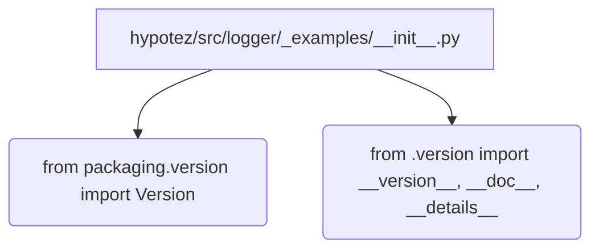

# <input code>

```python
## \file hypotez/src/logger/_examples/__init__.py
# -*- coding: utf-8 -*-\
#! venv/Scripts/python.exe
#! venv/bin/python/python3.12

"""
.. module:: src.logger._examples 
	:platform: Windows, Unix
	:synopsis:

"""
MODE = 'dev'

"""
	:platform: Windows, Unix
	:synopsis:

"""


"""
	:platform: Windows, Unix
	:synopsis:

"""


"""
  :platform: Windows, Unix

"""
"""
  :platform: Windows, Unix
  :platform: Windows, Unix
  :synopsis:
"""MODE = 'dev'
  
""" module: src.logger._examples """


from packaging.version import Version
from .version import __version__, __doc__, __details__
```

# <algorithm>

Этот код представляет собой файл инициализации модуля `src.logger._examples`.  Алгоритм работы сводится к импорту необходимых модулей и, возможно, к определению констант.  Пошаговой блок-схемы нет, поскольку весь код сводится к импортам и определению констант.


# <mermaid>



# <explanation>

**Импорты:**

- `from packaging.version import Version`:  Импортирует класс `Version` из пакета `packaging`. Этот пакет используется для работы с версиями пакетов, вероятно, для проверки совместимости или управления версиями. Пакет `packaging`  должен быть установлен в проекте.  Связь с другими частями проекта  в данном случае косвенная - это стандартный пакет для работы с версиями в Python.

- `from .version import __version__, __doc__, __details__`: Импортирует переменные `__version__`, `__doc__`, `__details__` из файла `version.py` в том же каталоге (`_examples`).  Это, вероятно, метаданные о версии модуля (например, `__version__`), документация (`__doc__`), и дополнительные детали (`__details__`) для документации модуля, которые, как правило, заполняются автоматически или вручную при помощи инструментов.  Здесь есть прямая зависимость от файла `version.py`, который должен находиться в том же каталоге что и данный файл `__init__.py`.


**Классы:**

Нет определений классов в данном коде.

**Функции:**

Нет определений функций в данном коде.

**Переменные:**

- `MODE = 'dev'`:  Строковая переменная, вероятно, задает режим работы, в котором может использоваться данный модуль (`dev` - режим разработки, `prod` - режим производства).  Это конфигурационная переменная.

**Возможные ошибки или области для улучшений:**

- Отсутствие документации для переменной `MODE` (хотя она обозначена  `.synopsis`). Рекомендуется добавление комментариев,  поясняющих назначение констант, чтобы другим разработчикам было проще понять их смысл и использовать код.

- Имя файла  `version.py`  не совсем типично для файла, содержащего метаданные о версии. Вместо  `version.py`, обычно используется `__init__.py`.

-  Лишние строки документации. Необходимо избавиться от дублирования и избыточных строк документации.


**Цепочка взаимосвязей с другими частями проекта:**

Этот файл `_examples/__init__.py` служит точкой входа для модулей из пакета `logger._examples`.  Он зависит от пакета `packaging` и файла `_examples/version.py`.  Вероятнее всего, это фрагмент  более крупного проекта (например,  `hypotez`) где используется логирование.  И файл `_examples/version.py`  является частью логики этого проекта,  в котором хранятся версии для используемых библиотек.

```
hypotez
├── src
│   └── logger
│       └── _examples
│           ├── __init__.py
│           └── version.py  <-- Связь с этим файлом
└── ... (другие модули)