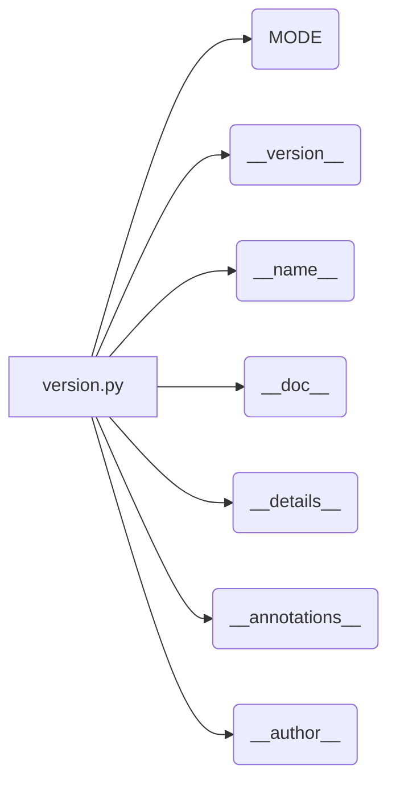

# <input code>

```python
## \file hypotez/src/logger/_examples/version.py
# -*- coding: utf-8 -*-\n#! venv/Scripts/python.exe\n#! venv/bin/python/python3.12\n\n"""
.. module:: src.logger._examples 
	:platform: Windows, Unix
	:synopsis:

"""
MODE = 'dev'

"""
	:platform: Windows, Unix
	:synopsis:

"""

"""
	:platform: Windows, Unix
	:synopsis:

"""


"""
  :platform: Windows, Unix

"""
"""
  :platform: Windows, Unix
  :platform: Windows, Unix
  :synopsis:
"""MODE = 'dev'
  
""" module: src.logger._examples """


"""
- `__version__`: This variable holds the version of the module or package.
- `__name__`: Contains the name of the module. If the script is being run directly, the value will be `"__main__"`.
- `__doc__`: The module's documentation string.
- `__details__`: This variable likely contains additional details about the module, but the exact purpose depends on the specific module or package.
- `__annotations__`: Contains type annotations for variables and functions in the module.
- `__author__`: The name(s) of the author(s) of the module.
"""
__name__:str
__version__="3.12.0.0.0.4"
__doc__:str
__details__:str="Details about version for module or class"
__annotations__

__author__='hypotez '
```

# <algorithm>

Этот код не содержит алгоритма в традиционном смысле. Это файл с константами, строками документации и переменными, определяющими информацию о модуле.  Пошаговая блок-схема не применима.  Данные не перемещаются между функциями или классами.

# <mermaid>



# <explanation>

Этот Python-файл (`hypotez/src/logger/_examples/version.py`) определяет метаданные для модуля `src.logger._examples`.  В нём нет действий, только конфигурация:

* **`MODE = 'dev'`:**  Определяет режим работы, вероятно, для отладки или разработки (`dev`).  В данном контексте, это константа, определяющая режим.  Это может использоваться в других частях проекта для условного выполнения кода (например, `if MODE == 'prod'`).

* **Документирующие строки (Docstrings):** `"""..."""`  Это многострочные комментарии, которые описывают модуль, а также переменные, содержащие дополнительную информацию о версии, имени, авторе и т.д. Они важны для понимания функциональности кода без его выполнения.  Эти строки документации (docstrings) используются средствами документации Python.

* **`__version__`, `__name__`, `__doc__`, `__details__`, `__annotations__`, `__author__`:**  Это специальные атрибуты Python, позволяющие хранить метаинформацию о модуле.  Их использование типично для Python-пакетов и библиотек. `__version__` определяет версию модуля, `__name__` - его имя, а `__doc__` - строку документации. `__details__`, `__annotations__` и `__author__` содержат дополнительные данные, как видно из комментариев внутри кода.

* **`__name__: str`:** Это объявление типа для переменной `__name__`, что добавляет к коду ясности.

**Связь с другими частями проекта:**

Этот файл `version.py` не выполняет операций, а только описывает свойства своего модуля `src.logger._examples`.  Он скорее всего используется другими частями проекта (например, модулями логирования или тестирования), которые нуждаются в информации о версии этого модуля.  Это стандартная практика для определения версий компонентов.

**Возможные ошибки или улучшения:**

* **Отсутствие использования:** Если данный файл не используется нигде в проекте, то он может быть удален.  Если `MODE` планируется использовать, следует найти место его применения.


**Общий вывод:**

Файл `version.py` содержит метаданные о модуле `src.logger._examples`. Он важен для понимания структуры и взаимодействия элементов проекта и обеспечения правильной документации.  Он не представляет логики в том виде, как ее понимает человек, но необходим для инфраструктуры проекта.