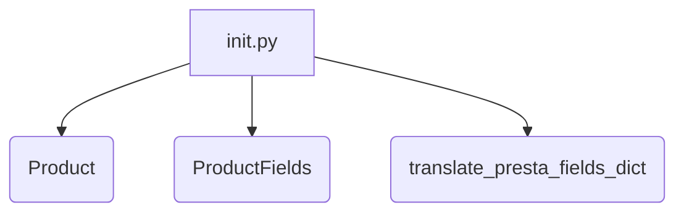

# <input code>

```python
## \file hypotez/src/product/__init__.py
# -*- coding: utf-8 -*-\
#! venv/Scripts/python.exe
#! venv/bin/python/python3.12

"""
.. module: src.product 
	:platform: Windows, Unix
	:synopsis: Product module
External classes and attributes:
- `Product`: Methods and attributes of the product. Detailed description in `product.py`
- `ProductFields`: Product fields. Detailed description in `product_fields.py`
- `record`: A dictionary of product fields in flat format (without nesting)
- `translate_presta_fields_dict`: Function that translates multilingual fields of `ProductFields`

"""
MODE = 'dev'

from .product import Product
from .product_fields.product_fields import ProductFields
from .product_fields.product_fields_translator import translate_presta_fields_dict
```

# <algorithm>

Этот код представляет собой модуль `product`, скорее всего, часть более крупного проекта. Он импортирует необходимые классы и функции из других файлов в том же пакете.  Блок-схема проста:



**Описание шагов:**

1. Модуль `__init__.py` импортирует классы `Product`, `ProductFields` и функцию `translate_presta_fields_dict`.

**Пример данных:**

* `Product`: Представление объекта продукта.
* `ProductFields`: Структура, содержащая поля продукта.
* `translate_presta_fields_dict`: Функция, которая обрабатывает многоязычные поля `ProductFields`.


# <mermaid>

```mermaid
graph LR
    subgraph Product Module
        A[product/__init__.py] --> B(Product);
        A --> C(ProductFields);
        A --> D(translate_presta_fields_dict);
    end
    subgraph product.py
        B -- импортирует -- product.py;
    end
    subgraph product_fields.py
        C -- импортирует -- product_fields.py;
    end
    subgraph product_fields_translator.py
        D -- импортирует -- product_fields_translator.py;
    end
```

# <explanation>

**Импорты:**

* `from .product import Product`: Импортирует класс `Product` из файла `product.py` в текущем подпакете `product`. `.product` указывает на подпапку `product` в текущей директории.
* `from .product_fields.product_fields import ProductFields`: Импортирует класс `ProductFields` из файла `product_fields.py`, который находится в подпапке `product_fields` пакета `product`.  Использование `.product_fields` указывает путь к соответствующему файлу.
* `from .product_fields.product_fields_translator import translate_presta_fields_dict`: Импортирует функцию `translate_presta_fields_dict` из файла `product_fields_translator.py`, который также находится в подпапке `product_fields` пакета `product`.

**Классы:**

* `Product`: Класс, представляющий продукт. Подробное описание находится в файле `product.py`.
* `ProductFields`: Класс, представляющий поля продукта. Подробное описание находится в файле `product_fields.py`.  Этот класс, скорее всего, содержит атрибуты, представляющие разные поля продукта, например, название, описание, цену.

**Функции:**

* `translate_presta_fields_dict`: Функция, которая, по всей видимости, переводит многоязычные поля `ProductFields`. Подробное описание находится в файле `product_fields_translator.py`.

**Переменные:**

* `MODE = 'dev'`:  Переменная, которая, скорее всего, определяет режим работы приложения (например, 'dev', 'prod').

**Возможные ошибки или области для улучшений:**

* Нет информации о `record`.  Для лучшего понимания, нужна информация о том, что это за переменная.
* Отсутствуют примеры использования импортированных классов и функций.
* Не указана цепочка взаимосвязей с другими частями проекта.


**Цепочка взаимосвязей:**

Этот модуль, скорее всего, является частью системы управления продуктами. Он импортирует классы, необходимые для представления и обработки информации о продуктах.  Для дальнейшего анализа необходимы файлы `product.py`, `product_fields.py` и `product_fields_translator.py`.  Следует обратить внимание на использование в других частях проекта импортированных здесь классов.