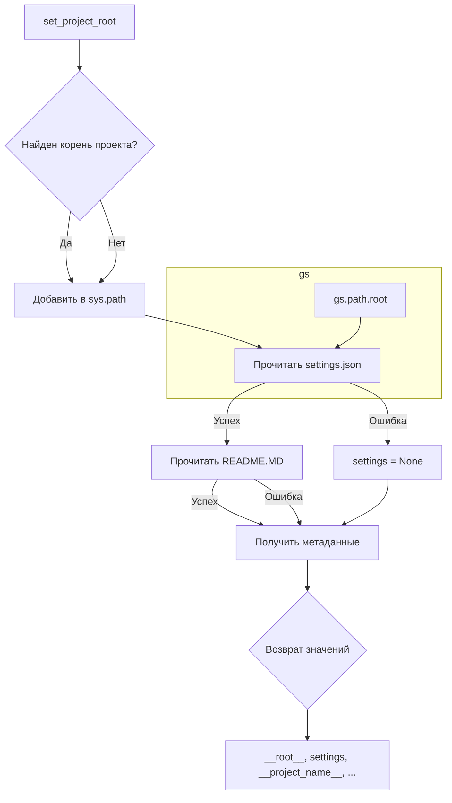

# Анализ кода hypotez/src/product/header.py

## <input code>

```python
## \file hypotez/src/product/header.py
# -*- coding: utf-8 -*-\n
#! venv/Scripts/python.exe
#! venv/bin/python/python3.12
"""
.. module: src.product 
	:platform: Windows, Unix
	:synopsis:

"""


"""
	:platform: Windows, Unix
	:synopsis:

"""


"""
	:platform: Windows, Unix
	:synopsis: Модуль определяющий корневой путь к проекту. Все импорты строятся относительно этого пути.
    :TODO: В дальнейшем перенести в системную переменную

"""

import sys
import json
from packaging.version import Version
from pathlib import Path

def set_project_root(marker_files=('__root__')) -> Path:
    """
    Finds the root directory of the project starting from the current file's directory,
    searching upwards and stopping at the first directory containing any of the marker files.

    Args:
        marker_files (tuple): Filenames or directory names to identify the project root.
    
    Returns:
        Path: Path to the root directory if found, otherwise the directory where the script is located.
    """
    __root__:Path
    current_path:Path = Path(__file__).resolve().parent
    __root__ = current_path
    for parent in [current_path] + list(current_path.parents):
        if any((parent / marker).exists() for marker in marker_files):
            __root__ = parent
            break
    if __root__ not in sys.path:
        sys.path.insert(0, str(__root__))
    return __root__


# Get the root directory of the project
__root__ = set_project_root()
"""__root__ (Path): Path to the root directory of the project"""

from src import gs

settings:dict = None
try:
    with open(gs.path.root / 'src' / 'settings.json', 'r') as settings_file:
        settings = json.load(settings_file)
except (FileNotFoundError, json.JSONDecodeError):
    ...

doc_str:str = None
try:
    with open(gs.path.root / 'src' / 'README.MD', 'r') as settings_file:
        doc_str = settings_file.read()
except (FileNotFoundError, json.JSONDecodeError):
    ...


__project_name__ = settings.get("project_name", 'hypotez') if settings  else 'hypotez'
__version__: str = settings.get("version", '')  if settings  else ''
__doc__: str = doc_str if doc_str else ''
__details__: str = ''
__author__: str = settings.get("author", '')  if settings  else ''
__copyright__: str = settings.get("copyrihgnt", '')  if settings  else ''
__cofee__: str = settings.get("cofee", "Treat the developer to a cup of coffee for boosting enthusiasm in development: https://boosty.to/hypo69")  if settings  else "Treat the developer to a cup of coffee for boosting enthusiasm in development: https://boosty.to/hypo69"
```

## <algorithm>

**Блок-схема (словесное описание):**

1. **Инициализация:**
   - `set_project_root()` получает корневой путь проекта, начиная с текущего файла и ищет файлы `pyproject.toml`, `requirements.txt` или `.git`.  Пример: Если текущий файл находится в `hypotez/src/product/header.py`, поиск пойдет вверх по иерархии директорий: `product`, `src`, `hypotez`.  
   - Если корневой путь не найден, функция возвращает текущую директорию.
   - В случае успеха, добавляет путь к корню в `sys.path`, что позволяет импортировать модули из корневой директории проекта.
2. **Чтение настроек:**
   - Читает файл `settings.json` из корневой директории проекта ( `gs.path.root / 'src' / 'settings.json'`).
   - Возвращает словарь `settings` с настройками проекта. 
   - Если файл не найден или JSON некорректный, то `settings` остается `None`.  Пример: Если файл settings.json не существует, то `settings` останется `None`.
3. **Чтение документации:**
   - Читает файл `README.MD` из корневой директории проекта (`gs.path.root / 'src' / 'README.MD'`).
   - Возвращает содержимое файла в переменную `doc_str`.
   - Обрабатывает исключения (FileNotFoundError, json.JSONDecodeError), если файл не найден или некорректный, устанавливая `doc_str` равным `None`. Пример: Если файл README.MD не существует, то `doc_str` останется `None`.
4. **Получение метаданных:**
   - Извлекает из `settings` значения `project_name`, `version`, `author`, `copyright` и `cofee`.
   - Использует значения по умолчанию, если соответствующий ключ в `settings` отсутствует.  Пример: если в `settings` нет ключа `project_name`, то `__project_name__` получит значение по умолчанию `hypotez`.
5. **Возвращение значений:**
   - Возвращает полученные метаданные.


## <mermaid>



## <explanation>

**Импорты:**

- `sys`: используется для управления системными переменными, в частности, для добавления пути к корневой директории в `sys.path`, что позволяет Python находить импортируемые модули.
- `json`: для работы с JSON-файлами (чтения и записи настроек).
- `packaging.version`:  не используется напрямую, но импортируется для работы с версиями, возможно для дальнейшего использования.
- `pathlib`:  для работы с путями к файлам в системе.
- `src.gs`:  имеется зависимость от модуля `gs`, вероятно, содержащего вспомогательные функции и данные, связанные с путями в проекте.  Это позволяет использовать `gs.path.root`, который, скорее всего, представляет путь к корню проекта.


**Классы:**

- Нет определенных классов.  Код использует функции и глобальные переменные.


**Функции:**

- `set_project_root(marker_files=...)`: Находит корневую директорию проекта, начиная с текущего файла и ищет указанные маркерные файлы.  Возвращает `Path` к корневому каталогу.
   - Аргументы: `marker_files` (кортеж строк) - имена файлов/папок, по которым определяется корень проекта.
   - Возвращаемое значение: `Path` к корневому каталогу.


**Переменные:**

- `MODE`: строковая константа, вероятно, для обозначения режима работы (разработка, продакшн).
- `__root__`: глобальная переменная, содержащая `Path` к корневому каталогу проекта.
- `settings`: словарь, содержащий настройки проекта, загруженные из `settings.json`.
- `doc_str`: строка, содержащая содержимое `README.MD`.
- `__project_name__`, `__version__`, `__doc__`, `__details__`, `__author__`, `__copyright__`, `__cofee__`:  глобальные переменные, содержащие метаданные о проекте, полученные из `settings`.


**Возможные ошибки и улучшения:**

- Использование `...` в блоках `try...except` не обрабатывает все возможные ошибки.  Важно перехватывать конкретные типы исключений и, желательно,  выводить более подробные сообщения об ошибках.
- В `set_project_root()` можно использовать более универсальные критерии для поиска корневого каталога, такие как наличие `pyproject.toml` или `setup.py` файлов.
- `gs.path.root` является потенциальной точкой отказа, если  `gs` не доступен.  Нужно убедиться в правильности импорта и наличия необходимых файлов.


**Цепочка взаимосвязей:**

`header.py` использует `gs` для получения пути к корню проекта, извлекает данные из `settings.json` и `README.MD`, и устанавливает метаданные проекта.  `gs`  вероятно представляет собой модуль, который предоставляет инструменты для работы с путями, необходимыми для работы `header.py`.  `settings.json` и `README.MD` являются внешними файлами, описывающими свойства и документацию проекта, на которые опирается модуль.