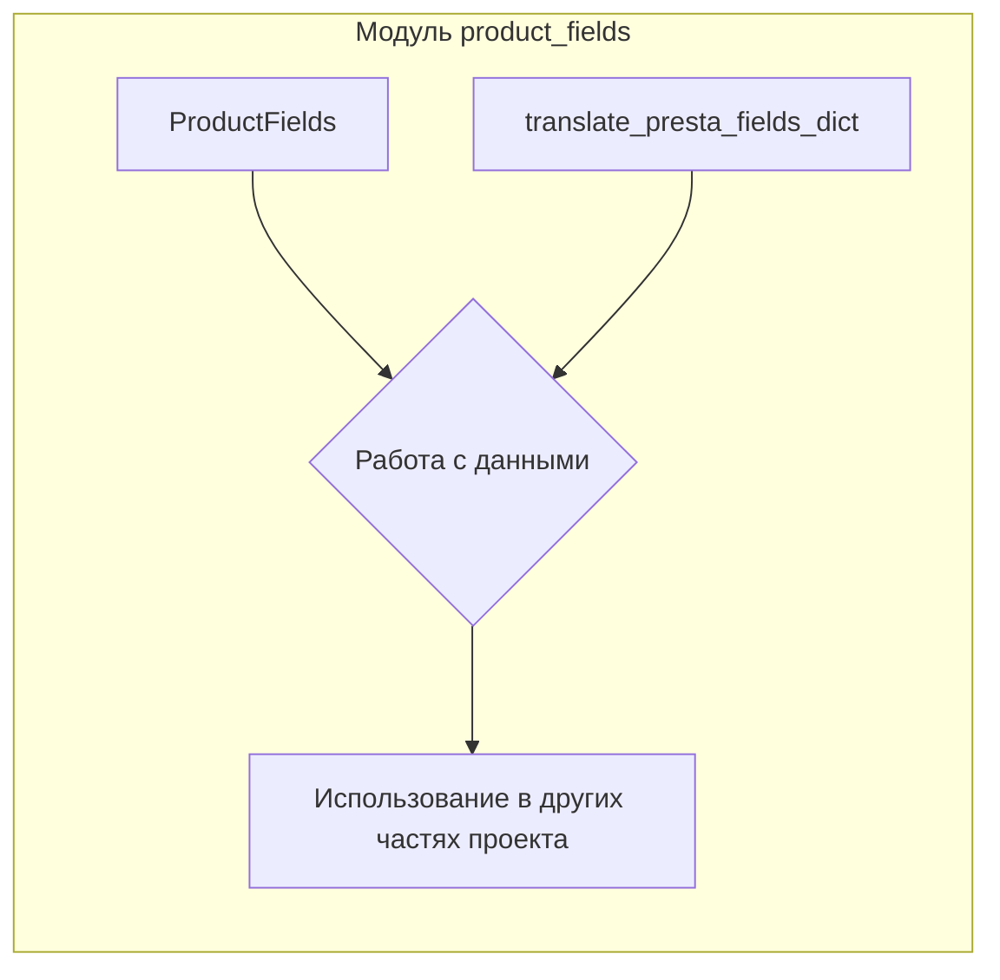

# <input code>

```python
## \file hypotez/src/product/product_fields/__init__.py
# -*- coding: utf-8 -*-

#! venv/bin/python/python3.12

"""
.. module:: src.product.product_fields 
	:platform: Windows, Unix
	:synopsis: Модуль полей товара

"""


from .product_fields import ProductFields
from .product_fields_translator import translate_presta_fields_dict
```

# <algorithm>

```mermaid
graph TD
    A[Модуль product_fields] --> B(ProductFields);
    A --> C(translate_presta_fields_dict);
    B --> D{Инициализация полей товара};
    C --> E{Перевод словаря полей};
    D -- Поля товара -- > F[Работа с данными];
    E -- Словарь полей -- > F;
    F -- Результаты -- > G[Использование в других модулях];
```

**Пример:**  Модуль инициализирует класс `ProductFields`. Функция `translate_presta_fields_dict` получает словарь данных, например, `{'presta_field_1': 'значение_1', 'presta_field_2': 'значение_2'}`.  Эта функция преобразует этот словарь в формат, соответствующий внутреннему представлению модуля.  После этого `ProductFields` использует эти преобразованные данные. Результат работы `ProductFields` (например, объект с заполненными полями) может быть использован в других частях проекта.

# <mermaid>



# <explanation>

* **Импорты**:
    * `from .product_fields import ProductFields`: Импортирует класс `ProductFields` из подпапки `product_fields` текущего модуля.  Связь: `ProductFields` используется внутри текущего модуля.
    * `from .product_fields_translator import translate_presta_fields_dict`: Импортирует функцию `translate_presta_fields_dict` из подпапки `product_fields_translator` текущего модуля.  Связь: `translate_presta_fields_dict` необходима для преобразования данных.  Именно эта функция выполняет логику перевода и используется в классах и функциях, которые находятся в других модулях.

* **Классы**:
    * `ProductFields`: Представляет сущность "поля товара".  Подробная информация о классе `ProductFields` не предоставлена, но скорее всего он имеет атрибуты для хранения данных полей и методы для работы с ними (получение, обновление и т.д.)  Связь:  Данный класс предоставляет интерфейс для работы с полями товара.

* **Функции**:
    * `translate_presta_fields_dict`:  Функция, предназначенная для перевода данных, полученных от платформы PrestaShop (возможно, из базы данных или API), в формат, удобный для использования в данном проекте.  Связь:  Функция отвечает за адаптацию данных к внутренней структуре модуля. Пример: Если `presta_field_1` - это идентификатор товара, то `translate_presta_fields_dict` преобразует его в понятный формат, например, `id_product`.

* **Переменные**:
    * ``: Глобальная переменная, вероятно, используется для определения режима работы (разработка, продакшен).  Связь: Модуль может вести себя по-разному в зависимости от значения `MODE`.

* **Возможные ошибки/улучшения**:
    * Не указан тип возвращаемого значения функции `translate_presta_fields_dict` и какие типы ошибок она обрабатывает.  Необходимо учесть возможность ошибок при чтении или преобразовании данных.
    * Нет описания класса `ProductFields`. Необходимо дополнить документацию для него.
    * Возможно, полезно добавить logging, чтобы отслеживать ошибки при работе с данными.

**Цепочка взаимосвязей**:

Модуль `product_fields` использует данные, полученные из PrestaShop (возможно, через API или базу данных). `translate_presta_fields_dict` преобразует эти данные, а `ProductFields` использует преобразованные данные для работы с полями товаров.  Другие части проекта могут использовать класс `ProductFields` для доступа к данным товаров.


**Дополнительные замечания**: Файл содержит метаданные (комментарии, `#!`), которые не влияют на функциональность, но важны для понимания проекта и документации.