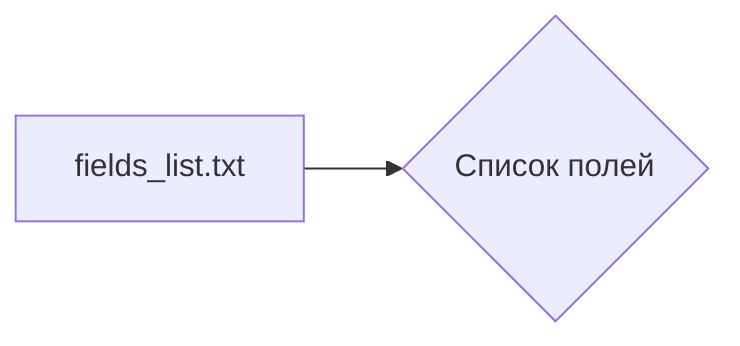

# Анализ кода из файла `hypotez/src/product/product_fields/fields_list.txt`

```markdown
1. **<input code>**:

```active
additional_delivery_times
additional_shipping_cost
advanced_stock_management
affiliate_short_link
affiliate_summary
affiliate_summary_2
affiliate_text
affiliate_image_large
affiliate_image_medium
affiliate_image_small
associations
available_date
available_for_order
available_later
available_now
cache_default_attribute
cache_has_attachments
cache_is_pack
condition
customizable
date_add
date_upd
delivery_in_stock
delivery_out_stock
depth
description
description_short
ean13
ecotax
height
how_to_use
specification
id_category_default
id_default_combination
id_default_image
locale
id_manufacturer
id_product
id_shop_default
id_shop
id_supplier
id_tax
id_type_redirected
indexed
ingredients
is_virtual
isbn
link_rewrite
location
low_stock_alert
low_stock_threshold
meta_description
meta_keywords
meta_title
minimal_quantity
mpn
name
online_only
on_sale
out_of_stock
pack_stock_type
price
product_type
quantity_discount
redirect_type
reference
show_condition
show_price
state
supplier_reference
text_fields
unit_price_ratio
unity
upc
uploadable_files
visibility
volume
weight
wholesale_price
width
local_saved_image
local_saved_video
```
2. **<algorithm>**:

Данный код не является алгоритмом в традиционном понимании. Он представляет собой список строк, содержащих имена полей, которые, вероятно, используются для описания продукта в системе управления товарами (например, в электронной коммерции).  Пошаговая блок-схема не применима, так как нет вычислений или операций.

3. **<mermaid>**:



**Объяснение:**

Диаграмма показывает, что файл `fields_list.txt` содержит список имен полей.  Нет сложных зависимостей или вызовов функций.  Сама структура файла представляет собой простую коллекцию данных.

4. **<explanation>**:

* **Импорты**:  Нет импортов.  Файл представляет собой простой текстовый файл, содержащий список строк.

* **Классы**:  Нет классов.

* **Функции**: Нет функций.

* **Переменные**: Нет переменных. Файл содержит только строки, которые вероятно будут использоваться для идентификации или описания полей в базе данных или конфигурации приложения.

* **Возможные ошибки или улучшения**:  Нет очевидных ошибок.  Возможно, файл не содержит достаточных данных для анализа его связи с другими частями проекта, без дополнительного контекста.  Для лучшего анализа необходимо знать, как этот список полей используется в коде.


**Цепочка взаимосвязей с другими частями проекта:**

Список `fields_list.txt` скорее всего используется в следующих частях проекта:

* **База данных:**  Список полей может соответствовать столбцам в базе данных, используемых для хранения информации о продуктах.
* **Формы ввода данных:**  Список полей может использоваться для генерации форм ввода данных о продуктах в пользовательском интерфейсе.
* **Обработка запросов:**  Список полей может использоваться для создания запросов к базе данных или для формирования ответов на запросы, связанные с продуктами.
* **Конфигурация:**  Список может определять конфигурацию для различных компонентов системы обработки данных.


В общем, этот файл служит справочником, описывающим, какие данные должны храниться и обрабатываться в системе управления товарами. Без контекста, включающего использование этого файла в других частях проекта, сложно дать более глубокий анализ.