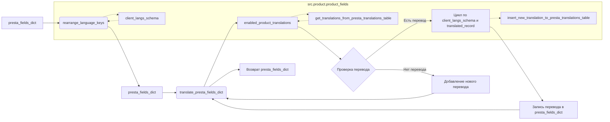

```MD
# <input code>

```python
## \file hypotez/src/product/product_fields/product_fields_translator.py
# -*- coding: utf-8 -*-

#! venv/bin/python/python3.12

"""
.. module:: src.product.product_fields 
	:platform: Windows, Unix
	:synopsis: Модуль перевода полей товара на языки клиентской базы данных

"""


from pathlib import Path
from typing import List
...
from src import gs
from src.utils.printer import pprint
from src.logger import logger
#from src.db import ProductTranslationsManager
#from src.translator import get_translations_from_presta_translations_table
#from src.translator import insert_new_translation_to_presta_translations_table
from src.logger.exceptions import ProductFieldException
...

def rearrange_language_keys(presta_fields_dict: dict, client_langs_schema: dict | List[dict], page_lang: str) -> dict:
    """Функция обновляет идентификатор языка в словаре presta_fields_dict на соответствующий идентификатор
    из схемы клиентских языков при совпадении языка страницы.

    Args:
        presta_fields_dict (dict): Словарь полей товара.
        page_lang (str): Язык страницы.
        client_langs_schema (list | dict): Схема языков клиента.

    Returns:
        dict: Обновленный словарь presta_fields_dict.
    """
    client_lang_id = None
    for lang in client_langs_schema:
        if lang['locale'] == page_lang or \
        lang['iso_code'] == page_lang or  \
        lang['language_code'] == page_lang:   # <- оч плохо А если he или IL?
            client_lang_id = lang['id']
            break

    if client_lang_id is not None:
        for field in presta_fields_dict.values():
            if isinstance(field, dict) and 'language' in field:
                for lang_data in field['language']:
                    lang_data['attrs']['id'] = str(client_lang_id)   # <- Эти айдишники ОБЯЗАТЕЛЬНО строки. Связано с XML парсером

    return presta_fields_dict


def translate_presta_fields_dict (presta_fields_dict: dict, 
                                  client_langs_schema: list | dict, 
                                  page_lang: str = None) -> dict:
    """ @Перевод мультиязычных полей в соответствии со схемой значений `id` языка в базе данных клиента
    Функция получает на вход заполненный словарь полей. Мультиязычные поля содржат значения,
    полученные с сайта поставщика в виде словаря 
    ```
    {
        'language': [
            {'attrs':{'id':'1'}, 'value':value},
        ]
    }
    ```
    У клиента язык с ключом `id=1` Может быть любым в зависимости от того на каком языке была 
    изначально установлена PrestaShop. Чаще всего это английский, но это не правило.
    Точные соответствия я получаю в схеме языков клиента 
    locator_description
    Самый быстрый способ узнать схему API языков - набрать в адресной строке браузера
    https://API_KEY@mypresta.com/api/languages?display=full&io_format=JSON
  
    @param client_langs_schema `dict` словарь актуальных языков на клиенте
    @param presta_fields_dict `dict` словарь полей товара собранный со страницы поставщика
    @param page_lang `str` язык страницы поставщика в коде en-US, ru-RU, he_HE. 
    Если не задан - функция пытается определить п тексту
    @returns presta_fields_dict переведенный словарь полей товара
    """

    presta_fields_dict = rearrange_language_keys (presta_fields_dict, client_langs_schema, page_lang)
    #product_translations = get_translations_from_presta_translations_table(presta_fields_dict['reference'])
    enabled_product_translations = get_translations_from_presta_translations_table(presta_fields_dict['reference'])
    ...
    if not enabled_product_translations or enabled_product_translations or len(enabled_product_translations) <1:
        """ В таблице переводов нет такого перевода товара. Добавляю текущий, как новый """
        ...
        global record
        rec = record(presta_fields_dict)
        insert_new_translation_to_presta_translations_table(rec)
        ...
        return presta_fields_dict

    for client_lang in client_langs_schema:
        for translated_record in enabled_product_translations:
            """ 
                        ПЕРЕВОД
            client codes from PrestaShop table
            'iso_code'    'en'    str
            'locale'    'en-US'    str
            'language_code'    'en-us'    str
            мне нужен iso_code
            """
            try:
                if client_lang['iso_code'] in translated_record.locale: 
                    "Записываю перевод из таблицы"
                    for key in presta_fields_dict.keys():
                        if hasattr(translated_record, key):
                            presta_fields_dict[key] = {'language': [{'attrs': {'id': str(client_lang['id'])}, 'value': getattr(translated_record, key)}]}
                            # айдишники ОБЯЗАТЕЛЬНО строки. Связано с XML парсером
            except Exception as ex:
                logger.error(f"""Ошибка {ex}
                client_lang = {pprint(client_lang)}
                """)
                ...


    return presta_fields_dict
```

# <algorithm>

**Шаг 1:** Функция `rearrange_language_keys` ищет соответствие между языком страницы (`page_lang`) и языковым идентификатором (`client_lang_id`) в схеме языков (`client_langs_schema`).


**Пример:**

Если `page_lang` = "ru-RU", а `client_langs_schema` содержит элемент `{'locale': 'ru-RU', 'id': 4}`, то `client_lang_id` будет равен 4.


**Шаг 2:** Если `client_lang_id` найден, функция обновляет все языковые поля в `presta_fields_dict`.


**Пример:**

Если поле `field` в `presta_fields_dict` имеет `field['language'][0]['attrs']['id']` = "1", то после выполнения `lang_data['attrs']['id'] = str(client_lang_id)` станет `field['language'][0]['attrs']['id']` = "4".

**Шаг 3:** Функция `translate_presta_fields_dict` вызывает `rearrange_language_keys`, чтобы переупорядочить языковые поля.


**Шаг 4:** Функция получает переводы из таблицы (`enabled_product_translations`).


**Шаг 5:** Проверяет, есть ли переводы для текущего товара. Если нет, добавляет новый.


**Шаг 6:** Перебирает каждый язык из `client_langs_schema` и каждый перевод из `enabled_product_translations`.


**Шаг 7:** Проверяет, соответствует ли язык из `client_langs_schema` языку из `translated_record`.


**Пример:**

Если `client_lang['iso_code']` = "en" и `translated_record.locale` содержит "en", то выполняет запись перевода в `presta_fields_dict`.


**Шаг 8:**  Записывает перевод в словарь `presta_fields_dict`.


**Пример:**

Если `presta_fields_dict['name']` содержит языковое поле `{'language': [{'attrs': {'id': '1'}, 'value': 'Название'}]}`, а `translated_record.name` = "New name", то `presta_fields_dict['name']` обновляется до `{'language': [{'attrs': {'id': '2'}, 'value': 'New name'}]}`.


# <mermaid>




# <explanation>

**Импорты:**

- `from pathlib import Path`: Импортирует класс `Path` для работы с путями к файлам.
- `from typing import List`: Импортирует тип данных `List` для работы со списками.
- `from src import gs`: Импортирует модуль `gs` из пакета `src`.  Непонятно, что это за модуль без контекста.
- `from src.utils.printer import pprint`: Импортирует функцию `pprint` для красивой печати данных. Она находится в модуле `printer` из подпакета `utils` пакета `src`.
- `from src.logger import logger`: Импортирует логгер `logger` из модуля `logger` пакета `src`. Логгер используется для записи сообщений об ошибках.
- `from src.logger.exceptions import ProductFieldException`: Импортирует пользовательское исключение `ProductFieldException` из модуля `exceptions` подпакета `logger` пакета `src`.  Это позволяет локализовать обработку исключений в конкретном месте.

**Классы:**

В коде нет определенных классов, только функции и переменные.

**Функции:**

- `rearrange_language_keys`: Принимает словарь полей товара, схему языков и язык страницы.  Ищет соответствие языка страницы с языковым идентификатором в схеме и обновляет идентификаторы языков в словаре полей товара.
- `translate_presta_fields_dict`: Принимает словарь полей товара, схему языков и язык страницы.  Переупорядочивает языковые поля. Получает переводы из базы данных, если перевод не найден – добавляет его в базу. Заменяет языковые поля в соответствии с переводами из базы данных.
    - **Аргументы**: `presta_fields_dict` (dict): словарь полей товара, `client_langs_schema` (list|dict): схема языков, `page_lang` (str): язык страницы. 
    - **Возвращаемые значения**: Обновленный словарь `presta_fields_dict`.
    - **Возможные ошибки**: Обработка исключений `Exception` позволяет ловить ошибки во время работы с переводом, но нет конкретики, что именно обрабатывает исключение.

**Переменные:**

- `MODE`: Строковая переменная, определяющая режим работы (например, 'dev' или 'prod').
- `client_lang_id`: Переменная, хранящая идентификатор языка из схемы.
- `enabled_product_translations`: Переменная, содержащая переводы из базы данных.

**Возможные ошибки и улучшения:**

1. **Обработка исключений**: Обработка исключений `Exception` очень общая. Необходимо добавить конкретные типы исключений, например, `KeyError` или `AttributeError`, и обработать их более целенаправленно, в зависимости от того, что именно вы хотите ловить.
2. **Явное указание типов**: Переменная `client_langs_schema` может быть списком или словарем. Для большей ясности рекомендуется указать конкретный тип при определении переменной.
3. **Переменная `record`:**  Глобальная переменная `record` используется в коде, но ее определение неизвестно. Следует определить ее вне функции `translate_presta_fields_dict`.
4. **Проверка `enabled_product_translations`**: Проверка `enabled_product_translations` является неэффективной. Достаточно проверить, является ли она пустым списком, или содержит хотя бы один элемент.
5. **Язык страницы**: Если `page_lang` не задан, функция `translate_presta_fields_dict` пытается определить его по тексту. Это может быть неоднозначным и привести к ошибкам.

**Взаимосвязи с другими частями проекта:**

Код взаимодействует с другими модулями:

- `src.utils.printer`: для печати отладочных данных.
- `src.logger`: для записи логов.
- `src.db`: для работы с базой данных переводов (`ProductTranslationsManager`).
- `src.translator`: для получения переводов из таблицы (`get_translations_from_presta_translations_table`) и добавления новых (`insert_new_translation_to_presta_translations_table`).

Взаимодействие с другими частями проекта не представлено на уровне кода, но предполагается.  Необходимо проанализировать эти модули, чтобы понять полную функциональность.  Отсутствующие `ProductTranslationsManager`,  `get_translations_from_presta_translations_table`, и `insert_new_translation_to_presta_translations_table` явно указывают на необходимость связи с модулем базы данных.