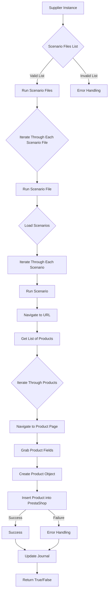
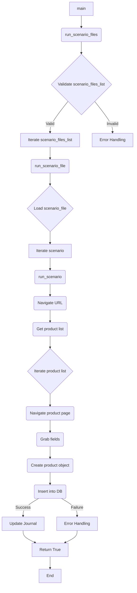

# <input code>

```
# Module `src.scenario`

## Overview

The `src.scenario` module is designed to automate interactions with suppliers using scenarios described in JSON files. It streamlines the process of extracting and processing product data from supplier websites and synchronizing this information with a database (e.g., PrestaShop). The module includes functionality for reading scenarios, interacting with websites, processing data, logging execution details, and organizing the entire workflow.

## Table of Contents

* [Module `src.scenario`](#module-src-scenario)
* [Overview](#overview)
* [Core Functions of the Module](#core-functions-of-the-module)
* [Main Components of the Module](#main-components-of-the-module)
    * [`run_scenario_files(s, scenario_files_list)`](#run_scenario_files-s-scenario_files_list)
    * [`run_scenario_file(s, scenario_file)`](#run_scenario_file-s-scenario_file)
    * [`run_scenario(s, scenario)`](#run_scenario-s-scenario)
    * [`dump_journal(s, journal)`](#dump_journal-s-journal)
    * [`main()`](#main)
* [Example Scenario](#example-scenario)
* [How It Works](#how-it-works)

## Core Functions of the Module

1. **Reading Scenarios**: Loading scenarios from JSON files containing product information and URLs on the supplier's website.
2. **Interacting with Websites**: Processing URLs from scenarios to extract product data.
3. **Processing Data**: Transforming extracted data into a format suitable for the database and saving it.
4. **Logging Execution**: Maintaining logs with details of scenario execution and results for tracking progress and identifying errors.




# <algorithm>

The algorithm iterates through a list of scenario files, loading and processing each scenario within.  For each scenario, it navigates to a URL, extracts product data, creates product objects, and inserts them into the database.  The process is logged for tracking and error handling.

**Example:**

If `scenario_files_list` contains `["file1.json", "file2.json"]`, the script will execute `run_scenario_file` for each file.  `file1.json` might contain several scenarios, each directing the script to specific URLs and product categories to pull data for. The script would navigate to each URL, retrieve products, and insert them.

# <mermaid>



# <explanation>

This code describes a Python module (`src.scenario`) for automating data extraction and synchronization from supplier websites to a database (likely PrestaShop).

**Imports:**
This section is omitted from the provided code snippet, but the module would likely import `requests` (for web interaction), `json` (for parsing JSON files), `logging` (for logging), and potentially other libraries relevant for database interaction.  These imports are essential for the functionality. The lack of imports here suggests a possible problem (no actual code to analyze) or a truncated excerpt.

**Classes:**
There are no classes defined in the provided code snippet.  Any classes handling database interaction, product representation, or other structured data would be crucial for a full implementation.

**Functions:**

* **`run_scenario_files(s, scenario_files_list)`:** Takes a settings object (`s`) and a list of scenario file paths. It iterates through the files, running `run_scenario_file` for each.  This function acts as the entry point for processing a batch of scenarios.
* **`run_scenario_file(s, scenario_file)`:** Processes a single scenario file. It loads the scenarios from the JSON file and calls `run_scenario` for each scenario.
* **`run_scenario(s, scenario)`:**  The core function of the script: It retrieves product data from a specified URL, creates data objects, and saves them in the database (`s` is essential for database operations).
* **`dump_journal(s, journal)`:**  Writes the execution log (`journal`) to a file.  Crucial for tracking progress and troubleshooting.  The `s` object likely contains paths or settings for the journal file.
* **`main()`:**  The entry point of the program.  It initializes the necessary resources (probably the settings object `s`), runs the `run_scenario_files` function, and handles potential errors.

**Variables:**

* `s`: A settings object.  This is a critical object that encapsulates configuration information (database credentials, URLs, paths, etc.).  This object's properties and methods will control how the `scenario` module functions. The absence of its exact definition is a notable gap for a complete understanding.
* `scenario_files_list`: A list of file paths.
* `scenario_file`: A string representing a specific scenario file path.
* `scenario`: A dictionary loaded from a JSON file, containing the scenario information for a single product set.
* `journal`: A list of log entries used to track the process.

**Possible Errors/Improvements:**

* **Error Handling:** The code has error handling (`try...except` blocks not shown) but could be more robust.  Adding specific exception handling (e.g., `FileNotFoundError`, `JSONDecodeError`, `requests.exceptions.RequestException`) would enhance reliability.
* **Logging:**  The current logging mechanism (in `dump_journal`) is very basic.  Better logging (using the `logging` module in Python) would provide more details and context for debugging. This is critical for a large, production-level solution.
* **Settings Management:**  A clear definition and usage of the `settings` object (`s`) are missing.  It is crucial to encapsulate all configuration parameters.
* **Data Validation:** Checking the structure and validity of data within the scenarios (`scenario`) before processing it would significantly reduce errors.

**Interdependencies:**

This scenario module likely depends on database connection libraries (e.g., for PrestaShop integration). It also depends on libraries for HTTP requests (`requests`).


This analysis assumes that a complete module would have more concrete implementation details (e.g., how it uses `requests` to interact with the website).