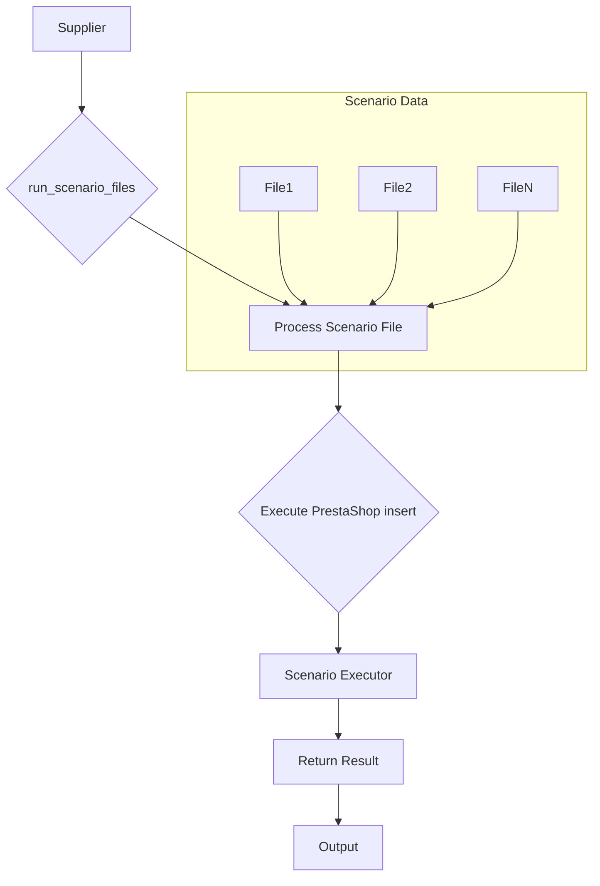

# <input code>

```python
## \file hypotez/src/scenario/__init__.py
# -*- coding: utf-8 -*-\
#! venv/Scripts/python.exe
#! venv/bin/python/python3.12

"""
.. module: src.scenario 
	:platform: Windows, Unix
	:synopsis: Module with scenario execution functions: `run_scenario_files`, `run_scenarios`  
Scenario executor for suppliers.
----

.. :codeblock:
s = Supplier('aliexpress')

run_scenario_files(s, 'file1')

scenario_files = ['file1', ...]
run_scenario_files(s, scenario_files)


scenario1 = {'key': 'value'}
run_scenarios(s, scenario1)


list_of_scenarios = [scenario1, ...]
run_scenarios(s, list_of_scenarios)


.. :examples:
Example of a scenario file:
```json
{
  "scenarios": {

    "feet-hand-treatment": {
      "url": "https://hbdeadsea.co.il/product-category/bodyspa/feet-hand-treatment/",
      "name": "Foot and Hand Care",
      "condition": "new",
      "presta_categories": {
        "default_category": 11259,
        "additional_categories": []
      }
    },

    "creams-butters-serums-for-body": {
      "url": "https://hbdeadsea.co.il/product-category/bodyspa/creams-butters-serums-for-body/",
      "name": "Creams, Butters, and Serums for Body",
      "condition": "new",
      "presta_categories": {
        "default_category": 11260,
        "additional_categories": []
      }
    }
}
}
```
```python

For detailed information on the scenario dictionary, read here: ...

When the program is started via main(), the following sequence of execution occurs:
@code
s = Supplier('aliexpress')

s.run()

s.run('file1')

scenario_files = ['file1', ...]
s.run(scenario_files)

scenario1 = {'key': 'value'}
s.run(scenario1)


list_of_scenarios = [scenario1, ...]
s.run(list_of_scenarios)
```
"""

from .executor import (
    run_scenario, 
    run_scenarios, 
    run_scenario_file, 
    run_scenario_files, 
    execute_PrestaShop_insert, 
    execute_PrestaShop_insert_async,
)
```

# <algorithm>

The code defines an execution module for scenarios, likely related to product import or management.  The `__init__.py` file likely acts as a facade, providing functions to execute scenarios based on different input formats (single file, list of files, or a dictionary/list of dictionaries representing scenarios).

**Algorithm Outline (Conceptual):**

1.  **Import necessary modules:**  The `from .executor import ...` line imports functions needed to execute the scenarios. The `.` indicates that the functions are located in a subdirectory named `executor` within the `scenario` directory.

2.  **Run scenario functions:** The `run_scenario_files` function is defined here to process multiple scenario files in a list. The `run_scenarios` function is defined here to process a list of scenario dictionaries. These likely perform the main logic of fetching, parsing, and processing scenario data.

3. **Execution Example:** The docstrings provide examples of how to use the functions. These functions presumably interact with functions in the `hypotez/src/scenario/executor` module, which likely handles the actual execution of the scenarios.  The `Supplier` class, mentioned in the examples, would be defined in another module. The `s = Supplier('aliexpress')` part instantiates the supplier object with the supplier name.

**Example Data Flow:**

```
+-----------------+       +-----------------+       +-----------------+
|  Scenario Data  |------>| run_scenario_files |------>| Scenario Executor |
+-----------------+       +-----------------+       +-----------------+
|   (File List)   |       |   (Process list)  |       |  (e.g., insert) |
+-----------------+       +-----------------+       +-----------------+
```

This outlines a basic processing where the list of scenario files is passed to `run_scenario_files`, this function will then use a loop and call the `run_scenario_file` function for each file, where the function handles the data from each scenario file.


# <mermaid>



**Dependencies:**

*   **`.executor`**: The code imports functions from a submodule, which likely contains the actual implementation of scenario execution logic, potentially including functions for inserting data into a PrestaShop database (`execute_PrestaShop_insert`).


# <explanation>

*   **Imports:** The `from .executor import ...` statement imports functions from the `executor` submodule within the `scenario` package.  This indicates a modular design, separating the logic for scenario execution from the initiation and management in the `scenario` module. This is a common Python practice for organizing code.

*   **Classes:** The `__init__.py` file itself does not define any classes, it only defines the necessary function to interact with the `Executor` module.  The `Supplier` class is likely defined in another file, probably in a `supplier` module (e.g.,  `hypotez/src/supplier/__init__.py` or similar) and is used to manage interactions with a specific supplier.

*   **Functions:**
    *   `run_scenario_files`, `run_scenarios`: These functions are likely responsible for iterating through a list of scenario files or scenario dictionaries, respectively, passing each to functions in the `executor` module.  They are used to execute scenarios in bulk.
    *   `run_scenario`, `run_scenario_file`:  These functions are likely located in the `executor` module and do the actual scenario processing.
    *   `execute_PrestaShop_insert`, `execute_PrestaShop_insert_async`: These functions likely interact with a PrestaShop database, either synchronously or asynchronously.


*   **Variables:** The `MODE` variable is used for conditional logic based on the application mode (likely 'dev' or 'prod').

*   **Possible Errors/Improvements:**
    *   **Error Handling:** The code lacks error handling.  It's crucial to include `try...except` blocks around database interactions and file operations to handle potential issues like file not found, database connection problems, or incorrect scenario data formats.  This would greatly increase the robustness of the application.
    *   **Data Validation:**  Adding validation to the scenario data (e.g., checking that the data is in the expected format) would be beneficial to prevent unexpected errors during execution.
    *   **Logging:** Implementing logging would provide crucial information about the execution progress and any errors encountered.  This would help diagnose and fix problems, especially in production environments.
    *   **Asynchronous Operations (Important):** Using `execute_PrestaShop_insert_async` implies the intention to improve performance through concurrency, this needs thorough testing and error handling to prevent race conditions and data corruption issues when handling multiple requests concurrently.  This design requires careful considerations about thread safety, database locking, and proper queue management.


**Relationship with Other Parts of the Project:**

*   The `scenario` module relies on the `executor` module, and likely other modules that are involved in managing the data processing and PrestaShop interactions.
*   The `Supplier` class (missing from this file) would interact with supplier-specific data and APIs, creating a clear separation of concerns.


This detailed analysis provides a comprehensive understanding of the code's structure, functionality, and potential areas for improvement.