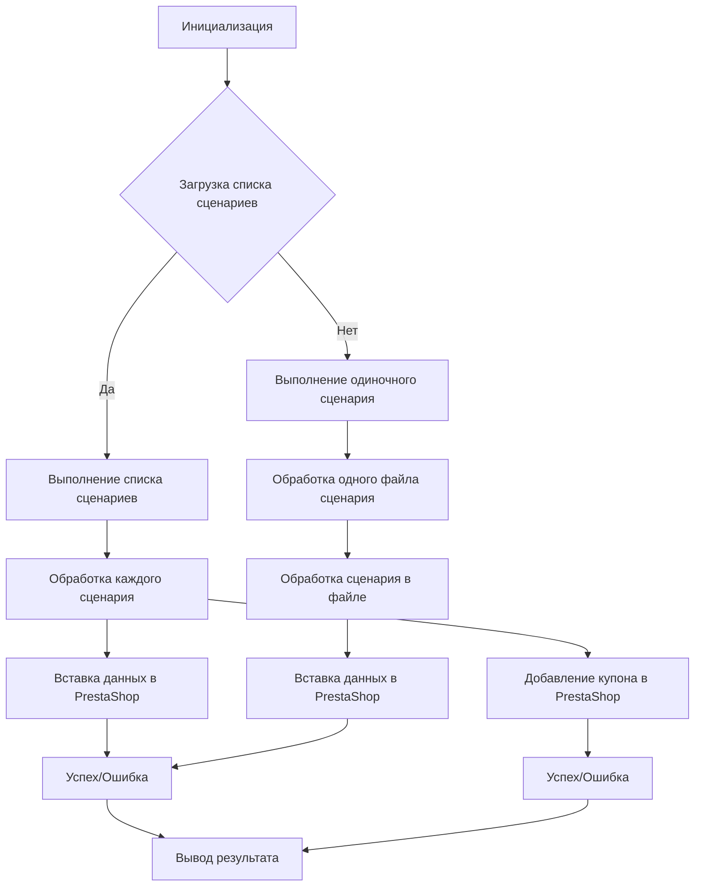
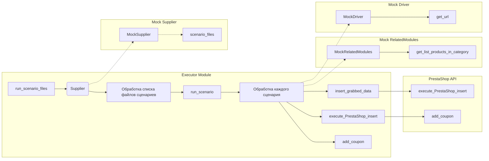

# Анализ кода модуля executor.py

```
Вот файл примеров для модуля `executor.py`, который иллюстрирует использование всех функций и методов, представленных в коде. В примерах показано, как можно использовать функции для выполнения сценариев, обработки файлов сценариев, работы с продуктами и взаимодействия с PrestaShop API.

```python
# ... (код модуля) ...
```

## <algorithm>

Алгоритм работы кода представлен последовательностью вызовов функций, обрабатывающих сценарии, файлы сценариев, данные о продуктах и взаимодействующие с API PrestaShop.  Данные передаются между функциями и классами в виде аргументов.

**Примерный алгоритм (блок-схема):**



**Пример данных:**

*   **`scenario_files`**: Список `Path`-объектов, представляющих пути к файлам сценариев.
*   **`scenario`**: Словарь, содержащий данные сценария (например, URL категории, список URL продуктов).
*   **`product_fields`**: Объект `ProductFields`, содержащий информацию о продукте, необходимую для вставки в PrestaShop.
*   **`credentials`**: Словарь, содержащий данные для аутентификации в API PrestaShop.

**Взаимодействие между функциями/классами:**

Функции `run_scenario_files`, `run_scenario_file`, `run_scenario` обрабатывают сценарии, передавая данные о продуктах (`product_fields`) в `insert_grabbed_data` или `execute_PrestaShop_insert`.

## <mermaid>



**Объяснение зависимости:**

*   Модуль `executor` взаимодействует с классом `Supplier`, который моделирует логику работы со сценариями.
*   `Supplier` использует `MockRelatedModules`, имитирующие взаимодействие с другими модулями (получение списка продуктов).
*   `Supplier` использует `MockDriver` для работы с URL.
*   `Executor` взаимодействует с API PrestaShop для добавления купонов и вставки данных о продуктах.

## <explanation>

**Импорты:**

```python
from pathlib import Path
from src.scenario.executor import run_scenario_files, ...
```

Импортируются необходимые классы и функции из модулей проекта, начиная с `src.`:

*   `Path` для работы с путями к файлам.
*   Функции `run_scenario_files`, `run_scenario_file`, `run_scenarios`, `run_scenario` для выполнения сценариев.
*   `j_loads_ns` для обработки JSON.
*   `ProductFields` для работы с данными о продуктах.
*   `PrestaShop` для взаимодействия с API PrestaShop.

**Классы:**

*   `MockSupplier`: Имитирует взаимодействие с источником сценариев. Содержит необходимые атрибуты и методы для работы с сценариями и данными.
*   `MockRelatedModules`: Мокирует взаимодействие с другими модулями, необходимыми для получения данных о продуктах (например, список продуктов в категории).
*   `MockDriver`:  Имитирует запрос URL.
*   `ProductFields`: Хранит данные о продукте. `presta_fields_dict` - данные для Престашопа, `assist_fields_dict` - вспомогательные данные.


**Функции:**

*   `run_scenario_files`, `run_scenario_file`, `run_scenario`, `run_scenario`:  Выполняют сценарии. Ввод - `Supplier` объект с данными сценариев. Возвращаемое значение - `bool` (успех/неудача).
*   `insert_grabbed_data`: Вставляет данные продукта в PrestaShop. Аргумент `product_fields`.
*   `execute_PrestaShop_insert`, `execute_PrestaShop_insert_async`: Вставка данных в PrestaShop синхронно/асинхронно. Возвращаемое значение - `bool` (успех/неудача).
*   `add_coupon`: Добавляет купон в PrestaShop. Аргументы: `credentials`, `reference`, `coupon_code`, `start_date`, `end_date`.

**Переменные:**

Переменные, такие как `scenario_files`, `scenario`, `product_fields`, `credentials` содержат данные, необходимые для выполнения сценариев и работы с API PrestaShop.

**Возможные ошибки и улучшения:**

*   Отсутствует обработка исключений. Важно добавить обработку ошибок (например, исключений при работе с файлами, API) для повышения устойчивости кода.
*   Использование моков для тестирования, но не для продуктивной среды.  В реальной ситуации требуется подключать реальные классы, не мокированные, к API.
*   Отсутствует валидация вводимых данных. Необходимо обеспечить проверку данных на корректность и корректные типы данных на входе в функции.
*   В `MockRelatedModules` методы `get_list_products_in_category` и `grab_product_page` являются синхронными, что может быть проблемой в больших приложениях.  Рассмотреть возможность асинхронной обработки (`async def`).
*   `MockDriver` просто возвращает `True`.  Это нереалистичный мок; в реальном приложении, он должен возвращать результат запроса по URL.


**Взаимосвязь с другими частями проекта:**

Код явно связан с модулями `src.scenario`, `src.utils.jjson`, `src.product.product_fields`, `src.endpoints.PrestaShop`.


**Общее:**

Данный код - пример использования модуля `executor`. Он демонстрирует, как обрабатывать сценарии, взаимодействовать с API Престашоп и продуктами, но нуждается в улучшении для практического использования.  Добавление обработки исключений, валидации данных и использование реальных компонентов вместо моков - критически важные шаги для продуктивного кода.