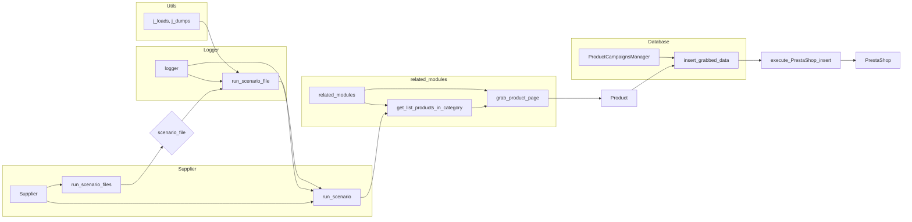

# <input code>

```python
# \file hypotez/src/scenario/executor.py
# -*- coding: utf-8 -*-
#! venv/Scripts/python.exe
#! venv/bin/python/python3.12

"""
.. module:: src.scenario.executor
   :platform: Windows, Unix
   :synopsis: Module for executing scenarios.

This module contains functions for executing scenarios, loading them from files,
and handling the process of extracting product information and inserting it into PrestaShop.
"""


import os
import sys
import requests
import asyncio
import time
import tempfile
from datetime import datetime
from math import log, prod
from pathlib import Path
from typing import Dict, List
import json

import header
from src import gs
from src.utils.printer import pprint
from src.utils.jjson import j_loads, j_dumps
from src.product import Product, ProductFields, translate_presta_fields_dict
from src.endpoints.prestashop import PrestaShop
from src.db import ProductCampaignsManager
from src.logger import logger
from src.logger.exceptions import ProductFieldException


_journal: dict = {'scenario_files': ''}
_journal['name'] = timestamp = gs.now


def dump_journal(s, journal: dict):
    """
    Save the journal data to a JSON file.

    :param s: Supplier instance.
    :param journal: Dictionary containing the journal data.
    """
    _journal_file_path = Path(s.supplier_abs_path, '_journal', f"{journal['name']}.json")
    j_dumps(journal, _journal_file_path)


def run_scenario_files(s, scenario_files_list: List[Path] | Path) -> bool:
    """
    Executes a list of scenario files.

    :param s: Supplier instance.
    :param scenario_files_list: List of file paths for scenario files, or a single file path.
    :raises TypeError: if scenario_files_list is not a list or a string.
    :return: True if all scenarios were executed successfully, False otherwise.
    """
    # ... (rest of the code)
```

# <algorithm>

**Алгоритм работы модуля `executor.py`**

1. **Инициализация:**
    * Объявляется глобальная переменная `_journal` для хранения журнальных данных.
    * Записывается текущая дата и время в `_journal`.

2. **`dump_journal`:**
    * Сохраняет журнал в файл JSON.
    * Принимает экземпляр поставщика (s) и словарь журнала.
    * Формирует путь к файлу журнала, используя `Path` и информацию о поставщике.

3. **`run_scenario_files`:**
    * Принимает экземпляр поставщика (s) и список путей к файлам сценариев.
    * Если входной параметр `scenario_files_list` является единственным файлом, преобразует его в список.
    * Если входной параметр `scenario_files_list` не является списком или путем, генерирует исключение `TypeError`.
    * Инициализирует подсловарь в _journal['scenario_files'] для текущей задачи
    * Обрабатывает каждый файл сценария:
        * Запускает `run_scenario_file` для текущего файла.
        * Сохраняет сообщение об успехе/ошибке в _journal.
        * Обрабатывает возможные исключения, записывая их в журнал.
    * Возвращает True, если все сценарии выполнены успешно, False иначе.

4. **`run_scenario_file`:**
    * Загружает сценарии из файла JSON.
    * Обрабатывает каждый сценарий:
        * Устанавливает текущий сценарий для поставщика (s).
        * Запускает `run_scenario` для текущего сценария.
        * Сохраняет сообщение об успехе/ошибке в _journal.
    * Возвращает True, если все сценарии в файле успешно выполнены, False иначе.

5. **`run_scenarios`:**
    * Принимает экземпляр поставщика (s) и список/словарь сценариев.
    * Если `scenarios` не указан, берет сценарии из `s.current_scenario`.
    * Преобразует входные данные в список, если это не список.
    * Для каждого сценария вызывает `run_scenario` и сохраняет результат в `res`.
    * Обновляет journal, записывая результаты каждого сценария.
    * Возвращает список результатов.

6. **`run_scenario`:**
    * Принимает экземпляр поставщика (s), сценарий (словарь) и его имя.
    * Выводит информацию о старте сценария.
    * Устанавливает текущий сценарий для поставщика (s).
    * Получает драйвер (d) от поставщика.
    * Переходит на страницу сценария (URL).
    * Получает список продуктов из категории.
    * Если продуктов нет, выводит предупреждение.
    * Для каждого продукта:
        * Переходит на страницу продукта.
        * Если переход на страницу не удался, регистрирует ошибку.
        * Получает данные о продукте.
        * Если данные о продукте не получены, регистрирует ошибку.
        * Создает объект `Product` и вставляет данные продукта в PrestaShop.
        * Обрабатывает возможные исключения при сохранении продукта.
    * Возвращает список URL продуктов.

7. **`insert_grabbed_data`:**
   * Вставляет данные продукта в PrestaShop, используя `execute_PrestaShop_insert`.

8. **`execute_PrestaShop_insert`:**
   *  Вставляет данные продукта в PrestaShop.
   * Использует класс `PrestaShop` для отправки данных на сервер PrestaShop.
   * Возвращает True в случае успеха, False в случае ошибки.

Данные передаются между функциями и классами в виде аргументов. Например, `run_scenario` получает `supplier` и `scenario` (словарь), а `insert_grabbed_data` получает `product_fields` (объект).

# <mermaid>



# <explanation>

**Импорты:**

Код импортирует необходимые библиотеки для работы:
* `os`, `sys`, `requests`, `asyncio`, `time`, `tempfile`, `datetime`, `math`, `pathlib`, `typing`, `json`: стандартные библиотеки Python для работы с операционной системой, сетью, асинхронностью, временем, файлами, данными и т.д.
* `header`: Вероятно, пользовательский модуль, содержащий вспомогательные функции.
* `gs`: Модуль, предполагается, из проекта, отвечает за получение текущей даты и времени.
* `pprint`: Функции для красивого вывода данных.
* `j_loads`, `j_dumps`: Функции для работы с JSON, вероятно, из `utils.jjson`.
* `Product`, `ProductFields`, `translate_presta_fields_dict`: классы и функции для работы с данными о продуктах.
* `PrestaShop`: Класс для взаимодействия с API PrestaShop.
* `ProductCampaignsManager`: Класс для работы с базой данных рекламных кампаний продуктов.
* `logger`: Модуль для логирования.
* `ProductFieldException`: Класс для обработки исключений при работе с полями продукта.


**Классы:**

* **`Product`:** Представляет данные о продукте.  В примере не показано полное определение, но по использованию `supplier_prefix`, `presta_fields_dict` предполагается, что содержит поля для хранения данных продукта и его связи с поставщиком.
* **`ProductFields`:** Хранит поля продукта, необходимые для вставки в PrestaShop.  Включает `presta_fields_dict` и `assist_fields_dict`.
* **`PrestaShop`:** Класс для взаимодействия с API PrestaShop.  Содержит метод `post_product_data` для отправки данных о продукте.
* **`ProductCampaignsManager`:** Класс для работы с базой данных рекламных кампаний.

**Функции:**

* **`dump_journal`:** Сохраняет журнал выполнения в файл.
* **`run_scenario_files`:** Выполняет сценарии из списка файлов.
* **`run_scenario_file`:** Загружает и выполняет сценарии из одного файла.
* **`run_scenarios`:** Выполняет сценарии из списка словарей.
* **`run_scenario`:** Выполняет один сценарий, загрузка данных о продуктах, обработка их и отправка в PrestaShop.
* **`insert_grabbed_data`:** Вставляет данные продукта в PrestaShop.
* **`execute_PrestaShop_insert`:** Отправляет данные о продукте на сервер PrestaShop.
* **`execute_PrestaShop_insert_async`:** Асинхронная версия `execute_PrestaShop_insert`.

**Переменные:**

`_journal`: словарь, хранящий журнал выполнения сценариев.
`timestamp`: текущая дата и время выполнения.
`scenario_files_list`: Список путей к файлам сценариев.
`s`: Экземпляр поставщика (Supplier).
`d`: Экземпляр драйвера (driver).


**Возможные ошибки и улучшения:**

* **Обработка ошибок:**  Код содержит обработку исключений (try...except), но она могла бы быть более детальной и исчерпывающей.  Например, добавленны проверки на корректность типов данных в функциях.
* **Модульность:** Функция `insert_grabbed_data` следует вынести в отдельный файл (или класс).  Это сделает код более организованным и позволит повторно использовать эту логику в других частях проекта.
* **Асинхронность:** Использование `asyncio` для `execute_PrestaShop_insert` уже хорошо. Но стоит продумать, как это взаимодействие с `PrestaShop` оптимально организовать.


**Взаимосвязь с другими частями проекта:**

Код активно взаимодействует с другими модулями проекта, включая `gs` для получения времени, `src.utils.printer` для вывода, `src.utils.jjson` для работы с JSON, `src.product`, `src.endpoints.prestashop`, `src.db`, `src.logger`.  Взаимодействие происходит через вызовы функций и классов этих модулей.  По всей видимости, класс `Supplier` находится в другом модуле, но используется для получения данных о поставщике и управлении сценарием.  `s.related_modules` намекает на наличие модуля, отвечающего за сбор данных о продуктах.