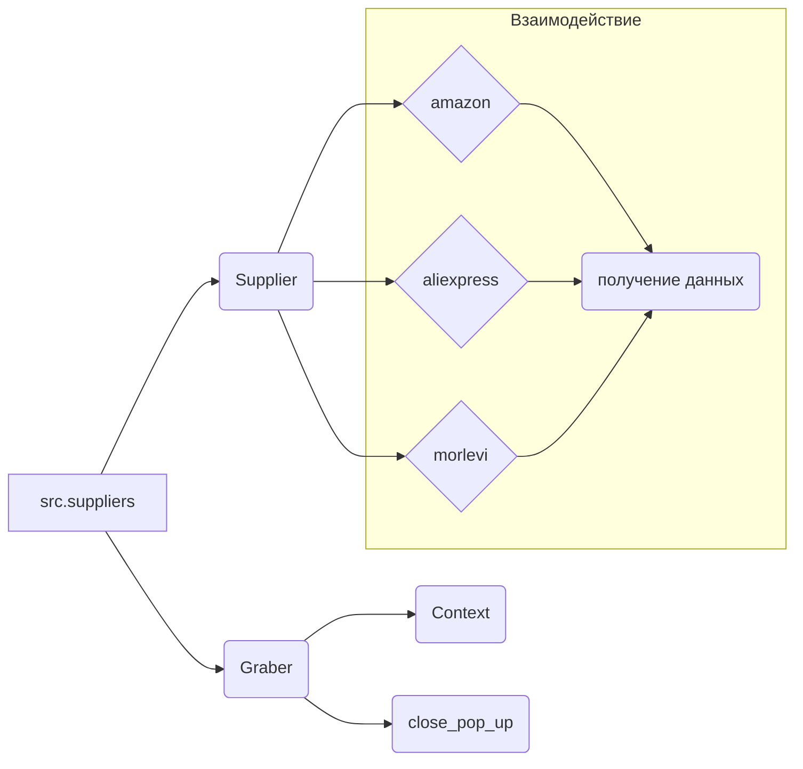

```MD
# Анализ кода hypotez/src/suppliers/__init__.py

## <input code>

```python
## \file hypotez/src/suppliers/__init__.py
# -*- coding: utf-8 -*-\
#! venv/Scripts/python.exe
#! venv/bin/python/python3.12

"""
.. module: src.suppliers 
	:platform: Windows, Unix
	:synopsis: Модуль поставщика. Класс `Supplier`

Для каждого конкретного поставщика есть свои специфичные методы (функции) извлечения информации. 
Эти функции дополняют базовый класс `Supplier` и подключаются через интерфейс `supplier.related_functions`.

Методы каждого конкретного поставщика находятся в директориях с именем <supplier_prefix>, 
например: `amazon`, `aliexpress`, `morlevi`,...  
- `supplier_prefix` задается во время создания в системе нового поставщика и обычно основывается на сокращении имени или сайта поставщика.

## Взаимосвязь сущностей Supplier, Driver, Product
@image html supplier-warehouse-client.png

"""


# from .supplier import Supplier
# from .graber import Graber, Context, close_pop_up
```

## <algorithm>

К сожалению, предоставленный код представляет собой лишь заготовку модуля.  В нем определены константы и комментарии, но нет реального алгоритма. Алгоритм будет существовать в классах и функциях, которые планируется импортировать. Поскольку импорты пока комментарии,  блок-схема и примеры будут абстрактными, отражая структуру, которая должна быть реализована.

* **Заготовка класса `Supplier`:**  Предполагается класс, который будет содержать методы для взаимодействия с различными поставщиками (Amazon, Aliexpress, и т. д.). Эти методы будут получать данные из соответствующих источников.
* **Импорт класса `Graber`:** Предполагается класс `Graber` для обработки данных, например, веб-скрейпинга.
* **Контекст `Context`:** Вероятно, это класс, содержащий настройки или параметры, необходимые для работы с поставщиками.
* **Функция `close_pop_up`:**  Предполагается функция для закрытия всплывающих окон или других диалоговых элементов, которые могут появиться при работе со специфичными источниками.


## <mermaid>



## <explanation>

* **Импорты:**  Код содержит заготовки импортов.  `from .supplier import Supplier` и т.д. предполагают, что в каталоге `hypotez/src/suppliers` находятся файлы `supplier.py`, `graber.py` и т.д.  Это структура, характерная для Python пакетов, позволяющая организовывать код в модули.  Вместо закомментированных импортов в дальнейшем будут импортироваться классы и функции из подкаталогов внутри пакета `src.suppliers` для реализации конкретных поставщиков.  Эти импорты необходимы для использования функций и классов, определенных в этих файлах.

* **Классы:** Код содержит заготовку для класса `Supplier`.  В реальном коде этот класс будет базовым, и от него будут наследоваться классы для конкретных поставщиков (например, `AmazonSupplier`, `AliexpressSupplier`).  Этот базовый класс `Supplier` может содержать общие методы, такие как подключение к поставщику, авторизация и т.п., а специфичные методы будут переопределяться для разных поставщиков.

* **Функции:** Заготовка предполагает наличие функций (например,  `Graber`, `close_pop_up`, `Context`) для обработки данных, работы с веб-страницами и другими необходимыми действиями.

* **Переменные:**  `` - переменная, вероятно, для определения режима работы (разработки, тестирования, производства).

* **Возможные ошибки и улучшения:** Закомментированные импорты пока не используются, что делает код нерабочим в текущем виде.  Не хватает реализации классов и функций, которые должны быть импортированы.  Наличие документации (документированные классы и функции) крайне важно для понимания и использования кода другими разработчиками.  В реальном проекте, рекомендуется использовать модули `typing` для указания типов параметров функций и методов.

* **Взаимосвязи:**  Судя по имени пакета и комментариям, код связан с другими частями проекта, такими как класс `Driver` и `Product`. Связь обеспечивается через методы класса `Supplier`, которые взаимодействуют с другими частями проекта для обработки данных о поставщиках, продуктах и других сущностях, как показано на диаграмме.  `supplier-warehouse-client.png` предполагает графическое представление взаимосвязи, которая, однако, в коде пока не реализована.


```