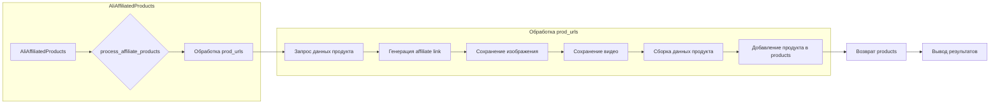

```MD
# Анализ кода `affiliated_products_generator.en.md`

## <input code>

```python
# example_usage.py

from src.suppliers.aliexpress.affiliated_products_generator import AliAffiliatedProducts

def main():
    campaign_name = "summer_sale_2024"
    campaign_category = "electronics"
    language = "EN"
    currency = "USD"

    parser = AliAffiliatedProducts(
        campaign_name,
        campaign_category,
        language,
        currency
    )

    prod_urls = [
        '123',
        'https://www.aliexpress.com/item/123.html',
        '456',
        'https://www.aliexpress.com/item/456.html',
    ]

    products = parser.process_affiliate_products(prod_urls)

    if products:
        print(f"Received {len(products)} affiliate products.")
        for product in products:
            print(f"Product ID: {product.product_id}")
            print(f"Affiliate Link: {product.promotion_link}")
            print(f"Local Image Path: {product.local_image_path}")
            if product.local_video_path:
                print(f"Local Video Path: {product.local_video_path}")
            print()
    else:
        print("No affiliate products found.")

if __name__ == "__main__":
    main()
```

## <algorithm>

**Блок-схема:**

```mermaid
graph TD
    A[Начало] --> B{Создать AliAffiliatedProducts};
    B --> C[Установить параметры кампании];
    C --> D{Прочитать prod_urls};
    D --> E[Вызвать process_affiliate_products(prod_urls)];
    E --> F{products пустой?};
    F -- Да --> G[Вывести "No affiliate products found."];
    F -- Нет --> H[Вывести "Received ... affiliate products."];
    H --> I[Цикл по products];
    I --> J[Вывести данные о продукте];
    J --> I;
    I --> K[Конец цикла];
    K --> L[Конец];
    
    subgraph "process_affiliate_products"
        E -- Нет --> X{Обработать каждый URL/ID из prod_urls};
        X --> Y[Получить данные продукта];
        Y --> Z[Сгенерировать affiliate link];
        Z --> AA[Сохранить изображение];
        AA --> BB[Сохранить видео (если есть)];
        BB --> CC[Собрать данные о продукте];
        CC --> DD[Добавить product в список products];
        DD --> E;
    end
```

**Пример:**

Предположим, `prod_urls` содержит `['123', 'https://example.com/456.html']`. Функция `process_affiliate_products` обрабатывает каждый URL по отдельности, получает данные о продукте, генерирует партнерскую ссылку, сохраняет изображение и видео (если есть), добавляет данные о продукте в список `products`.


## <mermaid>



**Объяснение зависимостей:**

Диаграмма показывает зависимость `AliAffiliatedProducts` от `process_affiliate_products` для обработки `prod_urls`.  Внутренние шаги (запросы данных, генерация ссылок, сохранение) являются внутренними деталями класса `AliAffiliatedProducts`.


## <explanation>

**Импорты:**

- `from src.suppliers.aliexpress.affiliated_products_generator import AliAffiliatedProducts`: Импортирует класс `AliAffiliatedProducts` из модуля `affiliated_products_generator` в пакете `aliexpress` внутри проекта `suppliers`.  Это ключевая зависимость, показывающая использование модулей из пакета `src` внутри проекта.

**Классы:**

- `AliAffiliatedProducts`: Этот класс отвечает за сбор данных о продуктах с AliExpress, генерацию партнерских ссылок и сохранение изображений/видео.  Непосредственный код класса `AliAffiliatedProducts` не представлен в примере, но по коду `example_usage.py` видно, что он имеет метод `process_affiliate_products` и по-видимому, атрибуты `campaign_name`, `campaign_category`, `language`, `currency` для хранения параметров кампании.

**Функции:**

- `main()`:  Функция, которая инициализирует класс `AliAffiliatedProducts`, передаёт ему необходимые параметры, обрабатывает список `prod_urls`, выводит результаты обработки в консоль.

**Переменные:**

- `campaign_name`, `campaign_category`, `language`, `currency`: Хранят параметры рекламной кампании.
- `prod_urls`: Список URL или ID продуктов, для которых необходимо получить партнерские ссылки и загрузить изображения.

**Возможные ошибки и улучшения:**

- **Обработка ошибок:** Не хватает обработки ошибок при запросе данных к AliExpress (например, отсутствие продукта, неверный URL, сетевые проблемы).  Нужно добавить проверки и обработку исключений (try-except блоки).
- **Управление ресурсами:** Необходимо явно закрывать соединения и освобождать ресурсы, например, при сохранении файлов.
- **Проверка данных:**  Необходимо добавить проверки для `prod_urls` - некорректные данные в списке могут привести к ошибкам.
- **Модули для парсинга:** Возможно, для обработки данных с AliExpress необходимы дополнительные модули (например, для парсинга веб-страниц).
- **Логирование:**  Добавление логирования позволит отслеживать поведение кода и ошибки в процессе обработки данных.
- **Проверка параметров:**  Нужно добавить валидацию параметров, передаваемых в класс `AliAffiliatedProducts`. Например, убедиться, что `language` - это допустимое значение.


**Взаимосвязи с другими частями проекта:**

Предполагается, что `AliAffiliatedProducts` использует другие модули из пакета `src` (возможно, для работы с хранилищем изображений/видео, для связи с AliExpress API).  Без доступа к полному коду `AliAffiliatedProducts`  и других модулей трудно определить полную взаимосвязь. Этот пример показывает, как использовать класс `AliAffiliatedProducts`, но не детали его внутреннего функционирования.