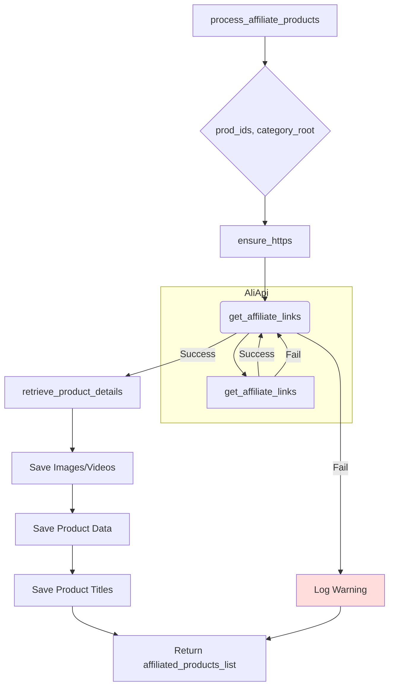

# <input code>

```python
## \file hypotez/src/suppliers/aliexpress/affiliated_products_generator.py
# -*- coding: utf-8 -*-\

#! venv/bin/python/python3.12

"""
.. module:: src.suppliers.aliexpress 
	:platform: Windows, Unix
	:synopsis:

"""


import asyncio
from datetime import datetime
import html
from pathlib import Path
from urllib.parse import urlparse
from types import SimpleNamespace
from typing import List

from src.logger import logger
from src import gs
from src.suppliers.aliexpress import AliApi
from src.suppliers.aliexpress.campaign.html_generators import ProductHTMLGenerator, CategoryHTMLGenerator, CampaignHTMLGenerator 
from src.suppliers.aliexpress.utils.ensure_https import ensure_https
from src.product.product_fields import ProductFields as f
from src.utils.image import save_png_from_url 
from src.utils.video import save_video_from_url
from src.utils.file import get_directory_names, get_filenames, read_text_file, save_text_file
from src.utils.jjson import j_loads_ns, j_dumps
from src.utils.printer import pprint
from src.logger import logger


class AliAffiliatedProducts(AliApi):
    """ Class to collect full product data from URLs or product IDs.
    For more details on how to create templates for ad campaigns, see the section `Managing Aliexpress Ad Campaigns`.
    """
    ...
    language:str = None
    currency:str = None
    def __init__(self,
                 language: str | dict = 'EN',
                 currency: str = 'USD',
                 *args, **kwargs):
        """
        Initializes the AliAffiliatedProducts class.
        Args:
            language: Language for the campaign (default 'EN').
            currency: Currency for the campaign (default 'USD').
        """
        ...
        if not language or not currency:
            logger.critical(f"No language, currency !")
            return
        super().__init__(language, currency)
        self.language, self.currency = language, currency


    async def process_affiliate_products(self, prod_ids: list[str], category_root: Path | str) -> list[SimpleNamespace]:
        """ ... """
        ...
```

# <algorithm>

**Шаг 1:** Инициализация.  Функция `process_affiliate_products` получает список `prod_ids` (списка URL или идентификаторов продуктов) и `category_root` (путь к каталогу для сохранения данных). 
    * Пример: `prod_ids = ["url1", "url2"]`, `category_root = Path("./campaign_data")`.
**Шаг 2:** Нормализация URL.  Метод `ensure_https` преобразует URL к виду `https://...`.
    * Пример: `["http://example.com/product1", "http://example.com/product2"]` -> `["https://example.com/product1", "https://example.com/product2"]`.
**Шаг 3:** Поиск аффилированных ссылок.  Цикл проходит по каждому `prod_url` и использует `get_affiliate_links` из базового класса `AliApi` для поиска аффилированных ссылок.
    * Пример: Если для `prod_url` найдена ссылка, то она добавляется в `_promotion_links` и  `_prod_urls`.
**Шаг 4:** Обработка отсутствия аффилированных ссылок. Если ни для одного продукта не найдено аффилированных ссылок, генерируется предупреждение и функция возвращает пустой список.
**Шаг 5:** Получение данных продуктов.  Метод `retrieve_product_details` извлекает подробную информацию о продуктах по `_prod_urls`.
**Шаг 6:** Сохранение изображений и видео. Для каждого продукта из `_affiliated_products`  сохраняется изображение (`save_png_from_url`) и видео (`save_video_from_url`) в соответствующие каталоги.
**Шаг 7:** Сохранение данных продуктов.  Данные о каждом продукте сохраняются в JSON-файлы в указанной папке.
**Шаг 8:** Сохранение списка названий продуктов. Список названий продуктов сохраняется в текстовый файл.
**Шаг 9:** Возврат списка продуктов.  Функция возвращает список обработанных продуктов (`affiliated_products_list`).


# <mermaid>



**Объяснение диаграммы:**

* `process_affiliate_products`: функция, принимающая на вход `prod_ids` и `category_root`.
* `ensure_https`: преобразует URL в HTTPS.
* `get_affiliate_links`:  метод из `AliApi` для извлечения аффилированных ссылок.
* `retrieve_product_details`:  метод из `AliApi` для получения подробных данных о продуктах.
* `Save Images/Videos`:  использование `save_png_from_url` и `save_video_from_url` для сохранения файлов.
* `Save Product Data`: использование `j_dumps` для сохранения данных в JSON.
* `Save Product Titles`: использование `save_text_file` для сохранения названий продуктов.
* `Return affiliated_products_list`:  возвращение результата.


# <explanation>

**Импорты:**

* `asyncio`:  для асинхронной обработки.
* `datetime`:  для работы со временем (не используется напрямую в этом коде).
* `html`: для работы с HTML (не используется напрямую в этом коде).
* `pathlib`: для работы с путями к файлам.
* `urllib.parse`: для работы с URL.
* `types`: для использования `SimpleNamespace`.
* `typing`: для типизации.
* `logger`: модуль для логирования, определён в `src.logger`.
* `gs`: предполагается, что это модуль для работы с Google Sheets (или похожим инструментом).
* `AliApi`: базовый класс для работы с Aliexpress API, определён в `src.suppliers.aliexpress`.
* `ProductHTMLGenerator`, `CategoryHTMLGenerator`, `CampaignHTMLGenerator`:  классы для генерации HTML-разметки, определённые в `src.suppliers.aliexpress.campaign.html_generators`.
* `ensure_https`: функция для форматирования URL, определённая в `src.suppliers.aliexpress.utils.ensure_https`.
* `ProductFields`:  класс для работы с полями продуктов, определённый в `src.product.product_fields`  (используется псевдоним `f`).
* `save_png_from_url`, `save_video_from_url`: функции для скачивания и сохранения изображений/видео, определённые в `src.utils.image` и `src.utils.video` соответственно.
* `get_directory_names`, `get_filenames`, `read_text_file`, `save_text_file`: функции для работы с файлами, определённые в `src.utils.file`.
* `j_loads_ns`, `j_dumps`:  функции для работы с JSON, определённые в `src.utils.jjson`.
* `pprint`:  функция для красивой печати данных, определённая в `src.utils.printer`.


**Классы:**

* `AliAffiliatedProducts`:  наследуется от `AliApi`.  Собирает полные данные продуктов с Aliexpress, включая аффилированные ссылки, изображения и видео.
    * `language`, `currency`: атрибуты для задания языка и валюты кампании.
    * `__init__`:  Инициализирует класс, проверяет наличие `language` и `currency`, и инициализирует базовый класс `AliApi`.
    * `process_affiliate_products`:  главный метод для обработки списка продуктов.


**Функции:**

* `process_affiliate_products`:  обрабатывает список продуктов и возвращает список `SimpleNamespace` объектов.  Принимает список идентификаторов продуктов и корневую папку для сохранения результатов.


**Переменные:**

* `_promotion_links`, `_prod_urls`: временные списки для хранения найденных аффилированных ссылок и URL-адресов продуктов.
* `normilized_prod_urls`: список URL-адресов продуктов после преобразования в HTTPS.
* `print_flag`, `product_titles`, `affiliated_products_list`, `product_titles_path`: временные переменные для управления выводом и сохранением данных.

**Возможные ошибки и улучшения:**

* **Обработка ошибок:**  Не хватает обработки исключений при скачивании изображений/видео.
* **Проверка входных данных:**  Не хватает валидации входных данных, например, проверка, что `prod_ids` содержит корректные URL-адреса или идентификаторы.
* **Производительность:**  Обработка большого количества продуктов может быть медленной.
* **Модульность:**  Код можно сделать более модульным, выделив отдельные функции для скачивания изображений/видео и сохранения данных.

**Цепочка взаимосвязей:**

`AliAffiliatedProducts` использует `AliApi` для работы с Aliexpress API. Функции `save_png_from_url`, `save_video_from_url` и другие служебные функции, реализованные в различных модулях, работают совместно для хранения и обработки данных о продуктах.  Все данные в итоге хранятся в заданном корневом каталоге в формате JSON и TXT.