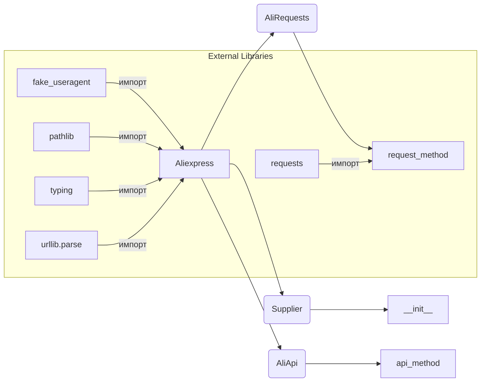

```MD
# Анализ кода файла `hypotez/src/suppliers/aliexpress/aliexpress.py`

## <input code>

```python
## \file hypotez/src/suppliers/aliexpress/aliexpress.py
# -*- coding: utf-8 -*-\
#! venv/Scripts/python.exe
#! venv/bin/python/python3.12

"""
.. module:: src.suppliers.aliexpress 
	:platform: Windows, Unix
	:synopsis: module provides the `Aliexpress` class, which integrates functionality
from `Supplier`, `AliRequests`, and `AliApi` for working with AliExpress.

"""


import header
import pickle
import threading
from requests.sessions import Session
from fake_useragent import UserAgent
from pathlib import Path
from typing import Union
from requests.cookies import RequestsCookieJar
from urllib.parse import urlparse

from src import gs  
from src.suppliers.supplier import Supplier
from .alirequests import AliRequests
from .aliapi import AliApi
from src.logger import logger  

class Aliexpress(Supplier, AliRequests, AliApi):
    """
    Base class for AliExpress.

    This class combines features of the `Supplier`, `AliRequests`, and `AliApi`
    classes to facilitate interaction with AliExpress.

    **Usage examples**:\n
    
    .. code-block:: python\n

        # Run without a webdriver\n
        a = Aliexpress()\n

        # Webdriver `Chrome`\n
        a = Aliexpress('chrome')\n

        # Requests mode\n
        a = Aliexpress(requests=True)\n
    """
    ...

    def __init__(self, 
                 webdriver: bool | str = False, 
                 locale: str | dict = {'EN': 'USD'},
                 *args, **kwargs):
        """
        Initialize the Aliexpress class.

        :param webdriver: Webdriver mode. Supported values are:
            - `False` (default): No webdriver.
            - `'chrome'`: Use the Chrome webdriver.
            - `'mozilla'`: Use the Mozilla webdriver.
            - `'edge'`: Use the Edge webdriver.
            - `'default'`: Use the system's default webdriver.
        :type webdriver: bool | str

        :param locale: The language and currency settings for the script.
        :type locale: str | dict

        :param args: Additional positional arguments.
        :param kwargs: Additional keyword arguments.

        **Examples**:\n

        .. code-block:: python\n

            # Run without a webdriver\n
            a = Aliexpress()\n

            # Webdriver `Chrome`\n
            a = Aliexpress('chrome')\n

        """
        ...
        super().__init__(supplier_prefix = 'aliexpress', 
                         locale = locale, 
                         webdriver = webdriver, 
                         *args, **kwargs)
```

## <algorithm>

Этот код определяет класс `Aliexpress`, который наследуется от классов `Supplier`, `AliRequests`, и `AliApi`.  Он предназначен для работы с AliExpress.

Шаг 1: Импортирование необходимых библиотек (requests, fake_useragent, pathlib, typing, etc).  Данные импортируются для использования функций и классов из этих библиотек.

Шаг 2: Определение класса `Aliexpress`. Этот класс наследует методы и атрибуты от родительских классов.

Шаг 3: Конструктор `__init__` класса `Aliexpress`. Он принимает параметры `webdriver` и `locale` для настройки работы с веб-драйвером и региональными настройками.  Он вызывает конструктор родительского класса `Supplier`, передавая параметры `supplier_prefix`, `locale`, `webdriver` и другие.  Пример:  `a = Aliexpress('chrome')`  - создает экземпляр с указанием вебдрайвера Chrome.

Пример данных между функциями: `webdriver` и `locale` передаются в конструктор,  внутри класса  они используются для инициализации работы с AliExpress.

## <mermaid>



## <explanation>

**Импорты:**
- `header`: Вероятно, импортирует дополнительные модули или конфигурацию, необходимые для проекта.
- `pickle`: Используется для сериализации и десериализации объектов.
- `threading`: Позволяет создавать потоки для параллельной обработки задач.
- `requests`: Библиотека для работы с HTTP-запросами.
- `fake_useragent`: Генератор фейковых user-agent для имитации разных браузеров.
- `pathlib`: Для работы с путями к файлам.
- `typing`: Для задания типов переменных.
- `requests.cookies`: Для работы с куки.
- `urllib.parse`: Для работы с URL.
- `src import gs`: Импортирует  модуль `gs` из пакета `src`, указывая на наличие связанных файлов.
- `src.suppliers.supplier import Supplier`: Импортирует класс `Supplier` из пакета `src.suppliers`, указывая на модульную структуру проекта.
- `src.suppliers.aliexpress.alirequests import AliRequests`: Импортирует класс `AliRequests` из текущего модуля, указывая на использование взаимосвязанных частей.
- `src.suppliers.aliexpress.aliapi import AliApi`: Импортирует класс `AliApi` из текущего модуля, опять же указывая на использование взаимосвязанных частей.
- `src.logger import logger`: Импортирует логгер из пакета `src.logger`.


**Классы:**
- `Aliexpress`: Основной класс для работы с AliExpress. Он комбинирует функциональность из `Supplier`, `AliRequests`, и `AliApi`, предоставляя единый интерфейс для работы с AliExpress. 
- `Supplier`, `AliRequests`, `AliApi`:  Родительские классы, вероятно, содержат базовые методы и атрибуты для работы с поставщиками, запросами и API-интерфейсом, соответственно.  Полноту их функциональности  нельзя оценить без доступа к их определениям.

**Функции:**
- `__init__`: Инициализирует класс `Aliexpress`. Принимает параметры `webdriver` (для выбора веб-драйвера) и `locale` (для настройки региональных параметров).  Звонит конструктор родительского класса.


**Переменные:**
- ``:  Вероятно, переменная для определения режима работы (разработка, производство).
- `webdriver`, `locale`: Параметры, определяющие способ работы с веб-драйвером и языковые настройки.


**Возможные ошибки и улучшения:**
- Отсутствие реализации методов `__init__` и других методов в классе `Aliexpress`.  Класс `Aliexpress` не содержит реализации методов, и, соответственно, не пригоден для непосредственного использования. Требуется заполнение тела метода.
- Неясно, как происходят взаимодействие между классами `AliExpress`, `Supplier`, `AliRequests`, и `AliApi`, и как данные передаются между ними.  Более подробное описание взаимодействия между классами приветствуется.
- Недостаточно информации о функциональности библиотек, таких как `gs` или `logger`.


**Взаимосвязи с другими частями проекта:**
- `gs`: Возможно, используется для работы с Google Sheets или другими сервисами.
- `logger`:  Для ведения логирования работы скрипта.
-  `Supplier`, `AliRequests`, `AliApi`:  Эти классы должны определяться в других модулях, вероятно, в папке `src/suppliers`.


**Заключение:**  Код представляет основу для класса, который будет взаимодействовать с AliExpress. Для его корректной работы нужны реализации методов внутри класса `Aliexpress` и описание взаимодействия между `Aliexpress` и связанными с ним классами `Supplier`, `AliRequests`, `AliApi`.