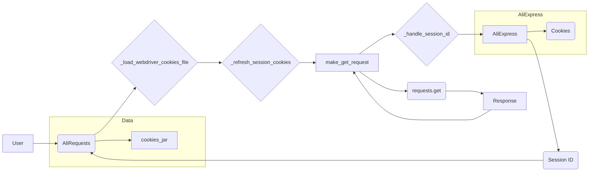

```MD
# <input code>

```python
## \file hypotez/src/suppliers/aliexpress/alirequests.py
# -*- coding: utf-8 -*-\

#! venv/bin/python/python3.12

"""
.. module:: src.suppliers.aliexpress 
	:platform: Windows, Unix
	:synopsis:

"""


import pickle
import requests
from pathlib import Path
from typing import List
from requests.cookies import RequestsCookieJar
from urllib.parse import urlparse
from fake_useragent import UserAgent

from src import gs
from src.utils.jjson import j_dumps
from src.logger import logger
# -*- coding: utf-8 -*-\

class AliRequests:
    """Handles requests to AliExpress using the requests library."""

    def __init__(self, webdriver_for_cookies: str = 'chrome'):
        """ Initializes the AliRequests class.

        @param webdriver_for_cookies The name of the webdriver for loading cookies.
        """
        self.cookies_jar = RequestsCookieJar()
        self.session_id = None
        self.headers = {'User-Agent': UserAgent().random}
        self.session = requests.Session()
        
        self._load_webdriver_cookies_file(webdriver_for_cookies)

    def _load_webdriver_cookies_file(self, webdriver_for_cookies: str = 'chrome') -> bool:
        """ Loads cookies from a webdriver file.

        @param webdriver_for_cookies The name of the webdriver.
        @returns True if cookies loaded successfully, False otherwise.
        """
        cookie_file_path = Path(gs.dir_cookies, 'aliexpress.com', webdriver_for_cookies, 'cookie')

        try:
            with open(cookie_file_path, 'rb') as file:
                cookies_list = pickle.load(file)
                for cookie in cookies_list:
                    self.cookies_jar.set(
                        cookie['name'],
                        cookie['value'],
                        domain=cookie.get('domain', ''),
                        path=cookie.get('path', '/'),
                        secure=bool(cookie.get('secure', False)),
                        rest={'HttpOnly': cookie.get('HttpOnly', 'false'), 'SameSite': cookie.get('SameSite', 'unspecified')},
                        expires=cookie.get('expirationDate')
                    )
                logger.success(f"Cookies loaded from {cookie_file_path}")
                self._refresh_session_cookies()  # Refresh session cookies after loading
                return True
        except (FileNotFoundError, ValueError) as ex:
            logger.error(f"Failed to load cookies from {cookie_file_path}", ex)
            return False
        except Exception as ex:
            logger.error("An error occurred while loading cookies", ex)
            return False

    # ... (rest of the code)
```

# <algorithm>

The code manages requests to AliExpress.  The core algorithm is as follows:

1. **Initialization (`__init__`):**
   - Creates an empty `RequestsCookieJar` for storing cookies.
   - Initializes `session_id` to None.
   - Generates a random User-Agent.
   - Creates a `requests.Session`.
   - Loads cookies from the specified webdriver file.

2. **Cookie Loading (`_load_webdriver_cookies_file`):**
   - Constructs the cookie file path.
   - Attempts to open the file and load cookies (using `pickle`).
   - Sets cookies in the `cookies_jar`.
   - Logs success or failure of loading.
   - Refreshes the session cookies.

3. **Session Refresh (`_refresh_session_cookies`):**
   - Makes a GET request to `https://portals.aliexpress.com`.
   - If cookies are present, it sends them in the request.
   - Extracts the `JSESSIONID` from the response cookies.
   - Updates the `cookies_jar` with the `JSESSIONID` if found.
   - Logs any errors.

4. **Handling Session ID (`_handle_session_id`):**
   - Iterates through the response cookies.
   - If `JSESSIONID` is found, updates `self.session_id` and `self.cookies_jar` with the new value.
   - Logs warnings if no `JSESSIONID` is found.

5. **GET Request (`make_get_request`):**
   - Updates the session cookies.
   - Makes a GET request to the specified URL, including headers and cookies.
   - Handles potential errors (e.g., `requests.exceptions.RequestException`).
   - Updates `session_id` from the response cookies.
   - Returns the `requests.Response` object if successful.

6. **Short Affiliate Link (`short_affiliate_link`):**
   - Constructs the URL for generating a short affiliate link.
   - Calls `make_get_request` to fetch the short link.
   - Returns the response.

Example Data Flow:

- User provides `webdriver_for_cookies`.
- `_load_webdriver_cookies_file` retrieves cookies from file.
- `_refresh_session_cookies` refreshes session cookies.
- `make_get_request` uses the loaded cookies for a request to a given URL.
- `_handle_session_id` updates the session cookie.


# <mermaid>



This diagram shows that the `AliRequests` class interacts with `requests` library to make HTTP requests, handles cookies, and retrieves a session ID from the AliExpress server.  `gs`, `j_dumps`, and `logger` are assumed to be dependencies from other parts of the project.

# <explanation>

- **Imports:**
    - `pickle`: Used for loading and saving cookies from files.
    - `requests`: For making HTTP requests to AliExpress.
    - `pathlib`: For working with file paths.
    - `typing`: For type hints.
    - `requests.cookies`: For managing cookies in requests.
    - `urllib.parse`:  For URL manipulation (though not directly used in the example).
    - `fake_useragent`: For generating realistic user agents.
    - `src.gs`: Likely a module for accessing global settings or resources (e.g., directory paths).
    - `src.utils.jjson`:  Likely for JSON serialization/deserialization.
    - `src.logger`: For logging events and errors.
    - These imports link the code to other parts of the larger application framework (`src` package).

- **Classes:**
    - `AliRequests`: This class encapsulates all the AliExpress request handling logic.  It maintains the session, cookies, and handles the interactions.  The `__init__` method is crucial for setting up the request environment.
- **Methods:**
    - `_load_webdriver_cookies_file`: Loads cookies from a pickle file.  Critically, it handles potential errors during file access.
    - `_refresh_session_cookies`:  Keeps the session fresh by requesting a new `JSESSIONID`, essential to maintain valid sessions on the AliExpress site.
    - `_handle_session_id`: Parses the response cookies to update the session ID.
    - `make_get_request`: Makes a GET request to a given URL, including cookies and headers.  Error handling is critical in a production-level library.
    - `short_affiliate_link`:  Generates a short affiliate link by making an appropriate request to AliExpress' API.
- **Variables:**
    - `MODE`: A global variable, likely for choosing operating modes or configurations.
    - `cookies_jar`: Stores the cookies for the current session.
    - `session_id`: Stores the session ID, crucial for authenticating with the website.
    - `headers`: Contains headers for HTTP requests, including a User-Agent.
    - `session`: A `requests.Session` for managing HTTP requests more efficiently.

- **Possible Errors/Improvements:**
    - **Error Handling:** The error handling is somewhat robust, but could be more detailed, particularly in cases where the cookie file format is unexpected.  More specific exception handling can prevent silent failures.
    - **Cookie Expiration:**  The code doesn't check for expired cookies.  This is a crucial aspect of maintaining cookie validity, as expired cookies should be discarded.
    - **Rate Limiting:**  The code lacks built-in mechanisms to handle rate limiting by the AliExpress website.  A retry mechanism or rate-limiting logic would improve robustness.

**Relationship with other parts of the project:**
The code relies on the `src` package, which suggests a more extensive project structure.  `gs`, `j_dumps`, and `logger` modules are likely components of the same project, providing global settings, JSON handling, and logging functionality. The `gs` module, especially, dictates where the cookie file is found.  Without seeing those files, you can't understand the full interaction with other parts of the project.