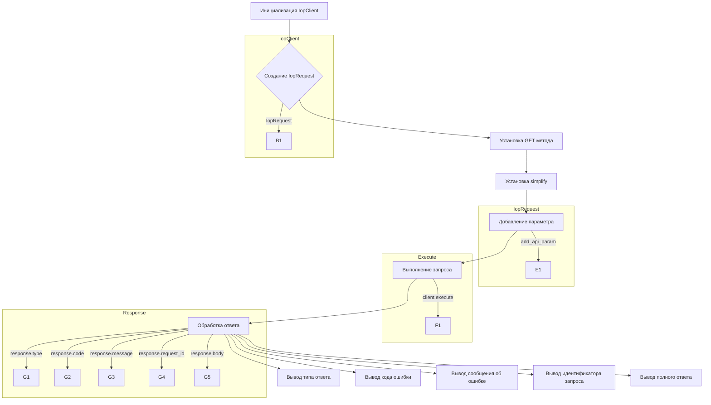

# <input code>

```python
## \file hypotez/src/suppliers/aliexpress/api/_examples/iop/test_get.py
# -*- coding: utf-8 -*-\
#! venv/Scripts/python.exe # <- venv win
## ~~~~~~~~~~~~~\
""" module: src.suppliers.aliexpress.api._examples.iop """

import iop

# params 1 : gateway url
# params 2 : appkey
# params 3 : appSecret
client = iop.IopClient('https://api-pre.aliexpress.com/sync', '33505222', 'e1fed6b34feb26aabc391d187732af93')

# create a api request set GET mehotd
# default http method is POST
request = iop.IopRequest('aliexpress.logistics.redefining.getlogisticsselleraddresses', 'POST')
request.set_simplify()
# simple type params ,Number ,String
request.add_api_param('seller_address_query', 'pickup')

response = client.execute(request, "50000001a27l15rndYBjw6PrtFFHPGZfy09k1Cp1bd8597fsduP0RStringNormalizery0jhF6FL")

# response type nil,ISP,ISV,SYSTEM
# nil ：no error
# ISP : API Service Provider Error
# ISV : API Request Client Error
# SYSTEM : Iop platform Error
print(response.type)

# response code, 0 is no error
print(response.code)

# response error message
print(response.message)

# response unique id
print(response.request_id)

# full response
print(response.body)
```

# <algorithm>

1. **Инициализация клиента:** Создается экземпляр класса `IopClient` из модуля `iop`. Передаются параметры: URL API-шлюза, ключ приложения (`appkey`) и секретный ключ приложения (`appSecret`).

2. **Создание запроса:** Создается экземпляр класса `IopRequest` для запроса данных о адресах продавца.  Устанавливается тип запроса `GET` (хотя в коде используется `POST`,  это, вероятно, ошибка).

3. **Установка упрощения:** Метод `set_simplify()` настраивает запрос для упрощенного ответа.

4. **Добавление параметра:**  Метод `add_api_param` добавляет параметр поиска (`seller_address_query`) со значением `pickup`.

5. **Выполнение запроса:** Метод `execute`  обрабатывает запрос, передавая его и уникальный идентификатор (похоже на `request_id`): `50000001a27l15rndYBjw6PrtFFHPGZfy09k1Cp1bd8597fsduP0RStringNormalizery0jhF6FL`. Результат (объект `response`) содержит данные ответа.

6. **Обработка ответа:**  Выводятся типы ответа (`response.type`), код ошибки (`response.code`), сообщение об ошибке (`response.message`), идентификатор запроса (`response.request_id`) и полный ответ (`response.body`).

**Пример:**
Если запрос успешен, то `response.type` будет `nil`, `response.code` будет `0`, а `response.body` будет содержать данные о адресах. Если произошла ошибка, то `response.type` будет `ISP`, `ISV` или `SYSTEM`, и `response.message` будет содержать сообщение об ошибке.


# <mermaid>




# <explanation>

**Импорты:**

- `import iop`: Импортирует модуль `iop`, вероятно, являющийся собственным модулем проекта, отвечающим за взаимодействие с API.  Без дополнительной информации о `iop` трудно определить его точное назначение. Вероятно, он содержит классы и функции для работы с API-шлюзами.


**Классы:**

- `IopClient`:  Класс для взаимодействия с API.  Имеет атрибуты `url`, `appkey`, `appSecret`, и методы для выполнения запросов.

- `IopRequest`: Класс для описания API-запроса. Имеет атрибуты, описывающие тип запроса, параметры и другие настройки, необходимые для работы с API.

**Функции:**

- `client.execute(request, request_id)`: Выполняет API-запрос. Возвращает объект `response` с данными ответа.  Необходимо добавить проверку ошибок в `execute` для лучшей обработки разных типов ошибок.

**Переменные:**

- `client`: Экземпляр класса `IopClient` для работы с API.

- `request`: Экземпляр класса `IopRequest`, содержащий параметры запроса.

- `response`: Объект, содержащий результат выполнения запроса, например, код ответа, сообщение и тело ответа.


**Возможные ошибки и улучшения:**

- **Метод GET:** В коде указано создание запроса POST, но используется метод GET. Необходимо изменить метод запроса в `IopRequest` на GET.

- **Обработка ошибок:**  Код не содержит обработку потенциальных ошибок во время выполнения запроса (например, сетевые ошибки, ошибки API). Необходимо добавить обработку исключений и логирование ошибок для улучшения отказоустойчивости.

- **Проверка валидности данных:** Код не содержит валидации входных данных. Например, следует убедиться, что `appkey` и `appSecret` имеют корректный формат и действительные значения.

- **Дополнения:** Добавьте логирование, чтобы отслеживать успешность запросов.  Включите проверку статуса HTTP-кода.

**Взаимосвязи с другими частями проекта:**

Без дополнительного контекста проекта трудно определить точную взаимосвязь с другими частями. Возможно, `iop` интегрирован в систему управления поставщиками (suppliers) и используется для взаимодействия с API AliExpress.  Для полноценного анализа необходимо больше информации о проекте.