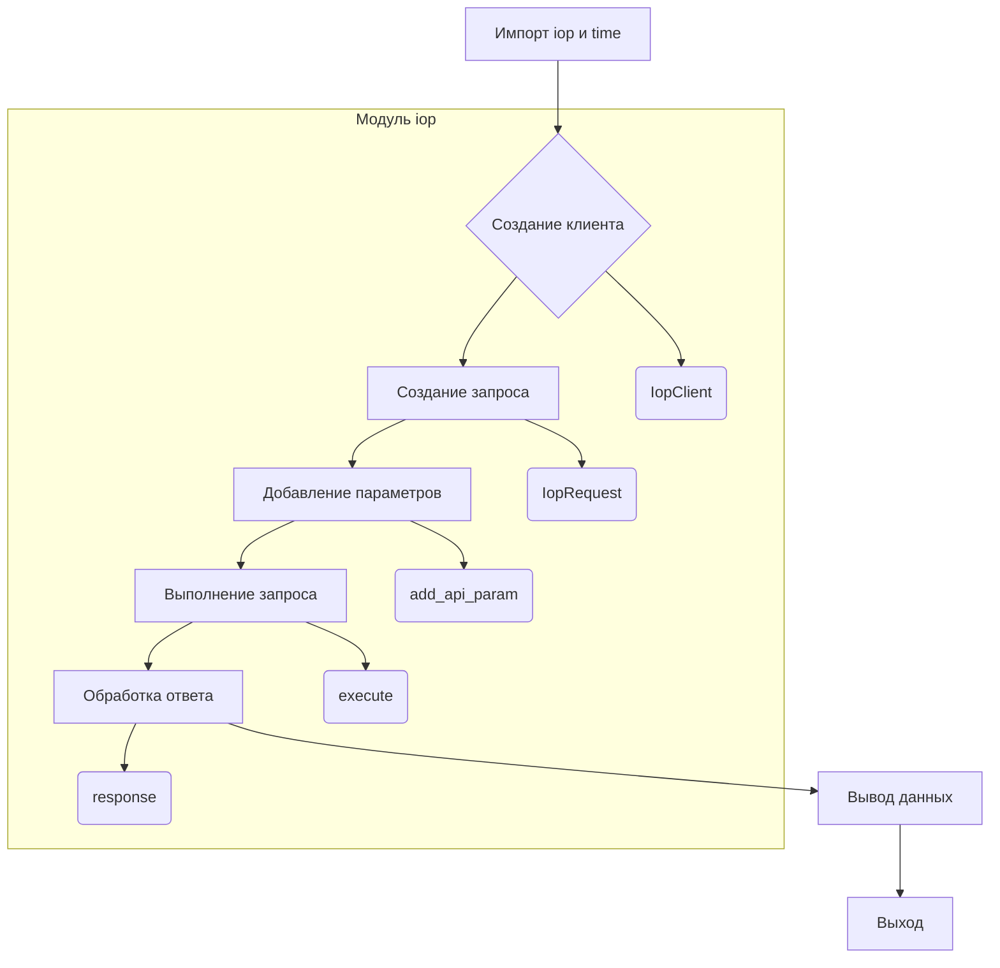

```MD
# <input code>

```python
## \file hypotez/src/suppliers/aliexpress/api/_examples/iop/test_internal.py
# -*- coding: utf-8 -*-
 # <- venv win
## ~~~~~~~~~~~~~
""" module: src.suppliers.aliexpress.api._examples.iop """
"""   [File's Description]


 @section libs imports:
  - iop 
  - time 
Author(s):
  - Created by Davidka on 09.11.2023 .
"""


import iop
import time

# params 1 : gateway url
# params 2 : appkey
# params 3 : appSecret
client = iop.IopClient('https://api-pre.taobao.tw/rest', '100240', 'hLeciS15d7UsmXKoND76sBVPpkzepxex')
# client.log_level = iop.P_LOG_LEVEL_DEBUG
# create a api request set GET mehotd
# default http method is POST
request = iop.IopRequest('/product/item/get', 'GET')

# simple type params ,Number ,String
request.add_api_param('itemId','157432005')
request.add_api_param('authDO', '{"sellerId":2000000016002}')

response = client.execute(request)
#response = client.execute(request,access_token)

# response type nil,ISP,ISV,SYSTEM
# nil ：no error
# ISP : API Service Provider Error
# ISV : API Request Client Error
# SYSTEM : Iop platform Error
print(response.type)

# response code, 0 is no error
print(response.code)

# response error message
print(response.message)

# response unique id
print(response.request_id)

# full response
print(response.body)

print(str(round(time.time())) + '000')
```

# <algorithm>

**Пошаговая блок-схема:**

1. **Импорт:**  Импортируются модули `iop` и `time`.

2. **Создание клиента:** Создается объект `IopClient` с заданными параметрами: URL-адрес API-шлюза, ключ приложения (`appkey`) и секретный ключ приложения (`appSecret`).

3. **Создание запроса:** Создается объект `IopRequest` для запроса к API. Указывается путь к ресурсу (`/product/item/get`) и метод (`GET`).

4. **Добавление параметров:**  К запросу добавляются параметры `itemId` и `authDO` с соответствующими значениями.

5. **Выполнение запроса:** Метод `client.execute(request)` выполняет запрос к API и возвращает объект `response`.

6. **Обработка ответа:** Из объекта `response` извлекаются следующие данные: тип ответа (`response.type`), код ответа (`response.code`), сообщение об ошибке (`response.message`), идентификатор запроса (`response.request_id`) и тело ответа (`response.body`).

7. **Вывод данных:**  На консоль выводятся значения `response.type`, `response.code`, `response.message`, `response.request_id`, `response.body` и отформатированное значение текущего времени.


# <mermaid>



# <explanation>

**Импорты:**

- `import iop`: Импортирует модуль `iop`, который, судя по коду, содержит классы и функции для взаимодействия с API. Вероятно, `iop` - это собственная библиотека или модуль, специфичный для проекта.  Связь с другими частями проекта (если применимо) -  `iop` используется для доступа к API, поэтому он связан с API-функционалом приложения.

- `import time`: Импортирует модуль `time` для получения текущего времени.

**Классы:**

- `iop.IopClient`: Представляет клиента для взаимодействия с API.  Его атрибуты включают `gateway_url`, `appkey`, `appSecret`.  Метод `execute` выполняет запрос.

- `iop.IopRequest`: Представляет собой запрос к API.  Его атрибуты включают `path` (путь к ресурсу), `method` (HTTP-метод).  Метод `add_api_param` добавляет параметры к запросу.

**Функции:**

- Нет явных пользовательских функций, только методы классов.  

**Переменные:**

- `client`: Объект типа `iop.IopClient`, представляющий клиента для работы с API.
- `request`: Объект типа `iop.IopRequest`, содержащий данные запроса.
- `response`: Объект, содержащий результат выполнения запроса.

**Возможные ошибки и улучшения:**

- Отсутствует проверка ошибок: код не обрабатывает возможные исключения при выполнении запроса (например, проблемы с подключением к API, некорректные данные). Необходимо добавить обработку ошибок.

- Отсутствие обработки `access_token`: Комментарий `response = client.execute(request,access_token)` подразумевает, что для работы с API необходим `access_token`, но он не используется. Если он необходим, нужно добавить его в запрос.

- Не указан контекст использования. Непонятно, в какой части приложения этот код используется. Где формируется `access_token`, как он связан с `client`.

- Не указан формат данных `body`, что затрудняет анализ данных.  Необходимо понимать структуру JSON/XML/другого формата для дальнейшей обработки.

- Не указано, какова структура `authDO`, нет информации о том, как создаётся этот параметр. Нужно добавить описание в коде или документацию.

- Отсутствие логирования: Нет логирования ошибок. Добавление логирования (например, с использованием `logging` модуля) позволит отследить проблемы в работе кода.

**Цепочка взаимосвязей:**

Код является частью модуля `src.suppliers.aliexpress.api._examples.iop`.  Он взаимодействует с `iop` модулем, что предполагает наличие более сложных зависимостей и API-специфического функционала для работы с `https://api-pre.taobao.tw/rest`.  Взаимодействие с другими частями приложения будет зависеть от того, как этот код используется (например, для обработки полученной информации, обновления базы данных и т.д.).