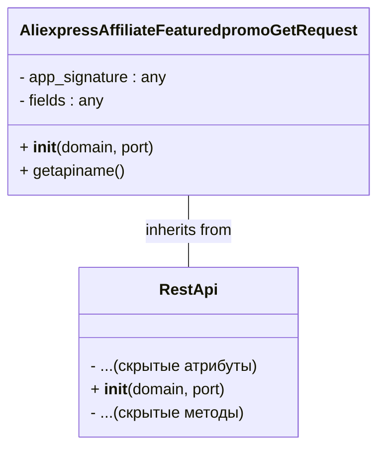

# <input code>

```python
## \file hypotez/src/suppliers/aliexpress/api/_examples/rest/AliexpressAffiliateFeaturedpromoGetRequest.py
# -*- coding: utf-8 -*-\
 # <- venv win
## ~~~~~~~~~~~~~\
""" module: src.suppliers.aliexpress.api._examples.rest """

'''
Created by auto_sdk on 2020.09.25
'''
from ..base import RestApi
class AliexpressAffiliateFeaturedpromoGetRequest(RestApi):
	def __init__(self, domain="api-sg.aliexpress.com", port=80):
		RestApi.__init__(self,domain, port)
		self.app_signature = None
		self.fields = None

	def getapiname(self):
		return 'aliexpress.affiliate.featuredpromo.get'
```

# <algorithm>

Этот код определяет класс `AliexpressAffiliateFeaturedpromoGetRequest`, который наследуется от класса `RestApi`.  Алгоритм работы можно представить в виде следующей блок-схемы:

```mermaid
graph TD
    A[__init__(domain, port)] --> B{Инициализация RestApi};
    B --> C{Инициализация self.app_signature = None};
    B --> D{Инициализация self.fields = None};
    C --> E[Возвращение объекта];
    D --> E;

    F[getapiname()] --> G{Возвращение 'aliexpress.affiliate.featuredpromo.get'};
    G --> H[Результат];
```

**Описание шагов:**

1. **`__init__(self, domain="api-sg.aliexpress.com", port=80)`**:  Выполняется при создании экземпляра класса.  Вызывает конструктор базового класса `RestApi`, передавая `domain` и `port`.  Далее инициализирует `self.app_signature` и `self.fields` со значениями `None`.

2. **`getapiname(self)`**: Возвращает строку 'aliexpress.affiliate.featuredpromo.get'. Это имя API-метода, вероятно, используемого для получения данных.

**Пример:**

```python
request = AliexpressAffiliateFeaturedpromoGetRequest()
api_name = request.getapiname()  # api_name будет содержать 'aliexpress.affiliate.featuredpromo.get'
```


# <mermaid>



В этой диаграмме `AliexpressAffiliateFeaturedpromoGetRequest`  имеет зависимость от класса `RestApi` , унаследуюя от него. Конкретные детали реализации методов `RestApi` скрыты.


# <explanation>

* **Импорты:** `from ..base import RestApi` импортирует базовый класс `RestApi` из папки `base` в том же уровне каталога (двухточечная нотация `..` означает переход на родительский каталог). Это указывает на существование иерархии классов и модулей.

* **Классы:**
    * `AliexpressAffiliateFeaturedpromoGetRequest`:  Этот класс предназначен для взаимодействия с API AliExpress, более конкретно для запроса данных о "featured promo" в рамках партнерской программы. Он наследуется от `RestApi`, что предполагает общий функционал (например, обработка запросов, параметры, подключение к API).  Атрибуты `app_signature` и `fields` вероятно, будут использоваться для параметров запроса к API.
    * `RestApi`: Базовый класс, предоставляющий общие функции для взаимодействия с REST API.  Этот класс не представлен полностью в данном фрагменте кода, но предполагается, что он содержит логику работы с HTTP-запросами, аутентификацией, обработкой ответов и другими аспектами REST API.

* **Функции:**
    * `__init__(self, domain="api-sg.aliexpress.com", port=80)`: Инициализирует экземпляр класса.  Передает параметры `domain` и `port` в конструктор базового класса `RestApi`, что подразумевает, что  `RestApi` отвечает за установление соединения.  Инициализирует `self.app_signature` и `self.fields` со значением `None`.
    * `getapiname(self)`: Возвращает строку, идентифицирующую API-метод, который нужно вызвать,  в данном случае это 'aliexpress.affiliate.featuredpromo.get'.

* **Переменные:**
    * `domain`, `port`: Строковые переменные, содержащие адрес домена и порт API AliExpress. Они могут быть переопределены при создании экземпляра класса.


* **Возможные ошибки или улучшения:**
    * Не указана логика работы с ответами API.  Необходимо добавить код обработки ответа от API для извлечения нужных данных.
    * Не указаны  типы данных для  `app_signature` и `fields`, что может привести к ошибкам.


**Цепочка взаимосвязей:**

Класс `AliexpressAffiliateFeaturedpromoGetRequest` использует класс `RestApi`, который, предположительно, отвечает за низкоуровневое взаимодействие с API.  Это указывает на разделение ответственности и модульность.  Дальнейший код, вероятно, будет использовать экземпляр `AliexpressAffiliateFeaturedpromoGetRequest` для выполнения запросов к API AliExpress.