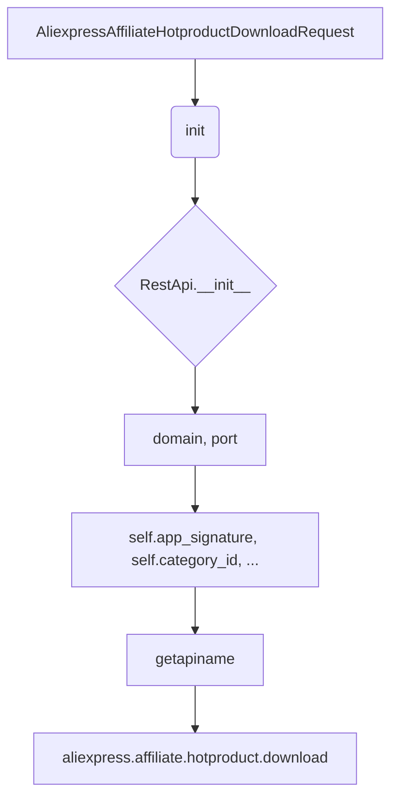

# <input code>

```python
## \file hypotez/src/suppliers/aliexpress/api/_examples/rest/AliexpressAffiliateHotproductDownloadRequest.py
# -*- coding: utf-8 -*-
 # <- venv win
## ~~~~~~~~~~~~~
""" module: src.suppliers.aliexpress.api._examples.rest """

'''
Created by auto_sdk on 2021.05.12
'''
from ..base import RestApi
class AliexpressAffiliateHotproductDownloadRequest(RestApi):
	def __init__(self, domain="api-sg.aliexpress.com", port=80):
		RestApi.__init__(self,domain, port)
		self.app_signature = None
		self.category_id = None
		self.country = None
		self.fields = None
		self.scenario_language_site = None
		self.page_no = None
		self.page_size = None
		self.target_currency = None
		self.target_language = None
		self.tracking_id = None

	def getapiname(self):
		return 'aliexpress.affiliate.hotproduct.download'
```

# <algorithm>

**Шаг 1:** Инициализация класса `AliexpressAffiliateHotproductDownloadRequest`.

* Принимает `domain` и `port` (по умолчанию "api-sg.aliexpress.com" и 80 соответственно).
* Вызывает конструктор базового класса `RestApi`, передавая ему полученные значения.
* Инициализирует несколько атрибутов, которые будут хранить параметры запроса (app_signature, category_id, country и т.д.).  Эти атрибуты могут быть заполнены позже.


**Шаг 2:** Получение имени API-метода.

* Метод `getapiname` возвращает строку 'aliexpress.affiliate.hotproduct.download'. Это имя используется для вызова соответствующего API-метода.


**Пример:**

```
request = AliexpressAffiliateHotproductDownloadRequest(domain="my-domain.com")
print(request.getapiname())  # Выведет "aliexpress.affiliate.hotproduct.download"
```

**Взаимодействие:** Класс `AliexpressAffiliateHotproductDownloadRequest` наследуется от класса `RestApi`.  `RestApi` является базовым классом, который, скорее всего, предоставляет общие методы для работы с API, такие как отправка запросов и обработка ответов.  Данные передаются между классами через наследование и вызовы методов.


# <mermaid>



# <explanation>

* **Импорты:**

```python
from ..base import RestApi
```

Этот импорт подключает базовый класс `RestApi` из пакета `src.suppliers.aliexpress.api.base`.  `..base` указывает на директории выше текущей.  Это означает, что `RestApi` предоставляет общие функции для работы с API, такие как отправка HTTP-запросов, обработка ответов и т.д.

* **Классы:**

```python
class AliexpressAffiliateHotproductDownloadRequest(RestApi):
```

Это класс, предназначенный для формирования запросов к API AliExpress для загрузки горячих продуктов.  Он наследует от класса `RestApi`, что позволяет использовать общие функции работы с API.

* **Атрибуты:**

```python
self.app_signature = None
self.category_id = None
# ... другие атрибуты
```

Эти атрибуты хранят параметры запроса, которые могут быть заданы при создании объекта.  Они могут быть использованы для фильтрации результатов, выбора нужных данных и т.д.

* **Методы:**

```python
def __init__(self, domain="api-sg.aliexpress.com", port=80):
    RestApi.__init__(self, domain, port)

def getapiname(self):
	return 'aliexpress.affiliate.hotproduct.download'
```

* `__init__`: Инициализирует объект с заданными параметрами `domain` и `port`, а также устанавливает значения по умолчанию для других атрибутов.  Это, скорее всего, подготовительный метод для формирования запроса.
* `getapiname`: Возвращает имя API-метода, которое необходимо использовать для запроса.

* **Переменные:**

`domain`, `port`: Строковые и целочисленные переменные, хранящие значения домена и порта API.


**Возможные ошибки и улучшения:**

* **Отсутствует логика формирования запроса:**  Класс не содержит логики построения HTTP-запроса или обработки ответов.  Он просто описывает структуру запроса. Для работы с API необходимы дополнительные методы для выполнения запроса и обработки ответа.
* **Нет валидации входных данных:** Класс не проверяет корректность входных параметров (`domain`, `port`, другие параметры), что может привести к ошибкам.
* **Отсутствие документации:**  Не хватает подробного документального описания  параметров и ожидаемого поведения, что затрудняет понимание и использование класса.
* **Не указано назначение атрибутов:** Непонятно, какие значения должны быть установлены в атрибуты `app_signature`, `category_id` и т.д.

**Взаимосвязи с другими частями проекта:**

Класс `AliexpressAffiliateHotproductDownloadRequest` является частью модуля, который взаимодействует с API AliExpress.  Скорее всего, существуют другие классы и функции для обработки полученных данных, обработки ошибок, а также для настройки подключения к API.