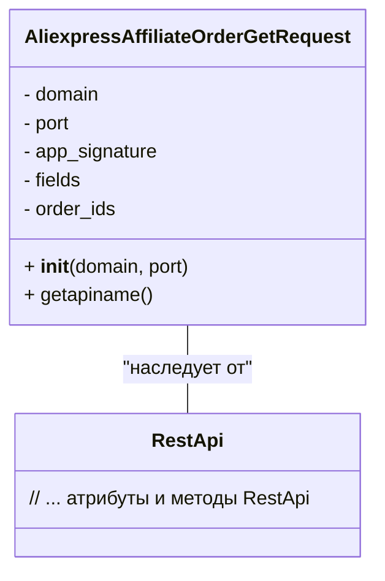

```MD
# Анализ кода AliexpressAffiliateOrderGetRequest.py

## <input code>

```python
## \file hypotez/src/suppliers/aliexpress/api/_examples/rest/AliexpressAffiliateOrderGetRequest.py
# -*- coding: utf-8 -*-\
#! venv/Scripts/python.exe # <- venv win
## ~~~~~~~~~~~~
""" module: src.suppliers.aliexpress.api._examples.rest """

'''
Created by auto_sdk on 2021.03.05
'''
from ..base import RestApi
class AliexpressAffiliateOrderGetRequest(RestApi):
	def __init__(self, domain="api-sg.aliexpress.com", port=80):
		RestApi.__init__(self,domain, port)
		self.app_signature = None
		self.fields = None
		self.order_ids = None

	def getapiname(self):
		return 'aliexpress.affiliate.order.get'
```

## <algorithm>

Блок-схема алгоритма не может быть представлена, так как код представляет собой определение класса, а не алгоритм с циклами и ветвлениями.  Данный код задает структуру класса `AliexpressAffiliateOrderGetRequest` и его методы.  В нём нет явных действий, выполняющихся на основе входных данных.


## <mermaid>



## <explanation>

**Импорты:**

- `from ..base import RestApi`: Импортирует класс `RestApi` из модуля `base`, который, судя по пути `..base`, находится в папке на один уровень выше `api/_examples/rest`.  Этот импорт необходим для наследования от базового класса `RestApi`.

**Классы:**

- `AliexpressAffiliateOrderGetRequest`:  Этот класс реализует запрос к API AliExpress для получения информации об аффилиатских заказах.
    - `__init__(self, domain="api-sg.aliexpress.com", port=80)`: Конструктор класса. Инициализирует атрибуты `domain` и `port`, а также вызывает конструктор базового класса `RestApi` для инициализации общих свойств.  `app_signature`, `fields`, и `order_ids` — пустые атрибуты, скорее всего, предназначенные для хранения параметров запроса или данных, полученных от API.
    - `getapiname(self)`: Возвращает строку 'aliexpress.affiliate.order.get', которая, вероятно, представляет собой имя API-метода, используемого для получения данных о заказах.

**Функции:**

- `__init__`: Инициализирует экземпляр класса, устанавливая значения атрибутов и вызывая конструктор родительского класса.
- `getapiname`: Возвращает строку, содержащую имя API-метода для получения данных об аффилиатских заказах.


**Переменные:**

- `domain`: строка, содержащая доменное имя API AliExpress (например, "api-sg.aliexpress.com").
- `port`: целое число, представляющее порт API (80 по умолчанию).
- `app_signature`:  возможно, предназначена для подписи приложения.
- `fields`:  вероятно, список или словарь полей, которые нужно получить.
- `order_ids`: список идентификаторов заказов, для которых необходима информация.

**Возможные ошибки и области для улучшений:**

- Отсутствует логика обработки параметров запроса, таких как `fields` и `order_ids`. В `__init__` их значения инициализируются как `None`, но не используются.
- Нет обработки ошибок при вызове API или работы с данными.
- Не указано, как эти данные будут использоваться далее в приложении.

**Взаимосвязи с другими частями проекта:**

Этот класс, вероятно, используется в других частях приложения (например, в модулях обработки данных или отображения информации), для взаимодействия с API AliExpress и получения данных об аффилиатских заказах.  Это часть инфраструктуры, которая обеспечивает взаимодействие с внешним API, основываясь на базовом классе `RestApi`.