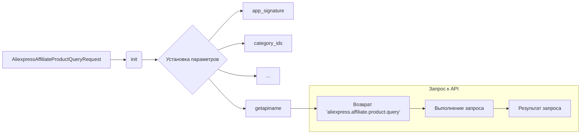

# <input code>

```python
## \file hypotez/src/suppliers/aliexpress/api/_examples/rest/AliexpressAffiliateProductQueryRequest.py
# -*- coding: utf-8 -*-
#! venv/Scripts/python.exe # <- venv win
## ~~~~~~~~~~~~
""" module: src.suppliers.aliexpress.api._examples.rest """

'''
Created by auto_sdk on 2021.05.20
'''
from ..base import RestApi
class AliexpressAffiliateProductQueryRequest(RestApi):
	def __init__(self, domain="api-sg.aliexpress.com", port=80):
		RestApi.__init__(self,domain, port)
		self.app_signature = None
		self.category_ids = None
		self.delivery_days = None
		self.fields = None
		self.keywords = None
		self.max_sale_price = None
		self.min_sale_price = None
		self.page_no = None
		self.page_size = None
		self.platform_product_type = None
		self.ship_to_country = None
		self.sort = None
		self.target_currency = None
		self.target_language = None
		self.tracking_id = None

	def getapiname(self):
		return 'aliexpress.affiliate.product.query'
```

# <algorithm>

**Шаг 1:** Инициализация объекта `AliexpressAffiliateProductQueryRequest`

```
+---------------------+
| AliexpressAffiliateProductQueryRequest |
+---------------------+
| domain = "api-sg.aliexpress.com" |
| port = 80            |
| app_signature = None |
| category_ids = None  |
| ...                  |
+---------------------+
```

**Шаг 2:** Установка параметров запроса

```
+---------------------+
| AliexpressAffiliateProductQueryRequest |
+---------------------+
| domain = "api-sg.aliexpress.com" |
| port = 80            |
| app_signature = "значение"    |
| category_ids = [1, 2, 3] |
| ...                  |
+---------------------+
```

**Шаг 3:** Получение имени API

```
+---------------------+
| AliexpressAffiliateProductQueryRequest |
+---------------------+
| api_name = "aliexpress.affiliate.product.query" |
+---------------------+
```

**Шаг 4:**  Выполнение запроса (опустим этот шаг, т.к. он не представлен в данном фрагменте).

В этом примере данные передаются внутри класса `AliexpressAffiliateProductQueryRequest`, как атрибуты экземпляра.  


# <mermaid>



# <explanation>

**Импорты:**

- `from ..base import RestApi`: Импортирует базовый класс `RestApi` из пакета `hypotez/src/suppliers/aliexpress/api/base`.  Это указывает на иерархическое наследование и респользование кода, обеспечивая общий функционал для запросов к API.  `..` означает возврат на один уровень вверх от текущей директории.


**Классы:**

- `AliexpressAffiliateProductQueryRequest`: Этот класс, наследующийся от `RestApi`, предоставляет структуру для создания запросов к API AliExpress для получения данных о товарах.

**Атрибуты:**

- `domain`, `port`: параметры, необходимые для соединения с API.
- `app_signature`, `category_ids`, `delivery_days`, `fields`, `keywords`, `max_sale_price`, `min_sale_price`, `page_no`, `page_size`, `platform_product_type`, `ship_to_country`, `sort`, `target_currency`, `target_language`, `tracking_id`:  Атрибуты, хранящие параметры, которые могут быть использованы для настройки запроса к API AliExpress для получения информации о продуктах.


**Методы:**

- `__init__(self, domain="api-sg.aliexpress.com", port=80)`: Конструктор класса. Инициализирует атрибуты класса, принимая значения параметров, или используя значения по умолчанию.  Наследует конструктор `RestApi`.
- `getapiname(self)`: Возвращает строку 'aliexpress.affiliate.product.query', которая представляет собой имя API-метода, используемого для получения данных.  Это имя может быть использовано для построения URL запроса или для других операций.

**Возможные ошибки и улучшения:**

- Отсутствует реализация логики запроса к API (вызова `RestApi`). Необходимо реализовать `RestApi` и логику отправки запроса с заданными параметрами к API.
- Не указана обработка ошибок (например, некорректные данные, ошибки сети).  В реальной реализации необходимо добавить обработку ошибок.
- Отсутствуют тесты. Необходимо добавить тесты, чтобы проверить корректность работы класса.


**Взаимосвязи с другими частями проекта:**

Класс использует базовый класс `RestApi` из `hypotez/src/suppliers/aliexpress/api/base`. Это указывает на наличие модуля, который предоставляет общие методы для взаимодействия с разными API.  Существует зависимость от `RestApi` для выполнения запросов к API. Дальнейшие взаимосвязи зависят от реализации `RestApi` и используемого фреймворка.


**Пример использования (предполагаемый):**

```python
from .AliexpressAffiliateProductQueryRequest import AliexpressAffiliateProductQueryRequest
request = AliexpressAffiliateProductQueryRequest(domain="example.com", app_signature="my_signature")
request.category_ids = [1, 2, 3]
result = request.execute() # Или какой-то другой метод для выполнения запроса
```

```