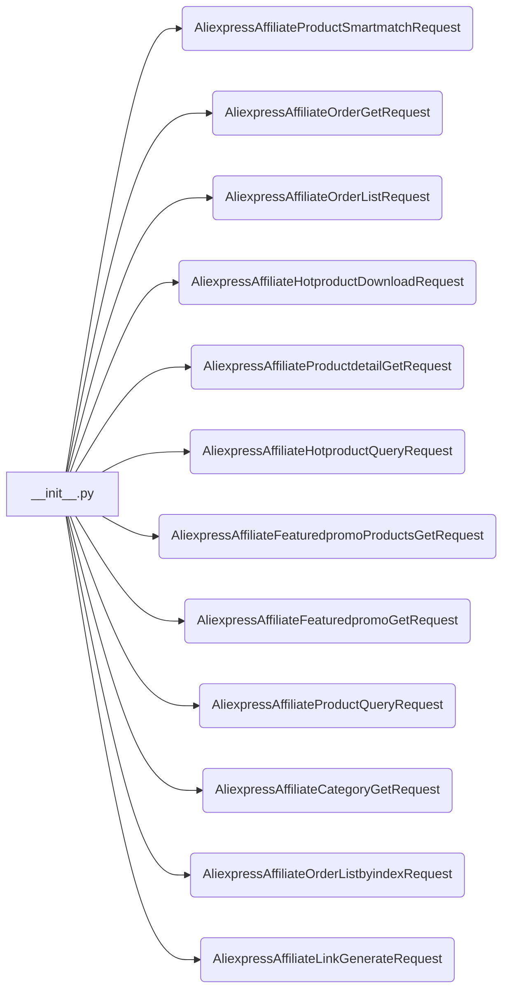

# <input code>

```python
## \file hypotez/src/suppliers/aliexpress/api/_examples/rest/__init__.py
# -*- coding: utf-8 -*-\
#! venv/Scripts/python.exe # <- venv win
## ~~~~~~~~~~~~~\
""" module: src.suppliers.aliexpress.api._examples.rest """
from .AliexpressAffiliateProductSmartmatchRequest import AliexpressAffiliateProductSmartmatchRequest
from .AliexpressAffiliateOrderGetRequest import AliexpressAffiliateOrderGetRequest
from .AliexpressAffiliateOrderListRequest import AliexpressAffiliateOrderListRequest
from .AliexpressAffiliateHotproductDownloadRequest import AliexpressAffiliateHotproductDownloadRequest
from .AliexpressAffiliateProductdetailGetRequest import AliexpressAffiliateProductdetailGetRequest
from .AliexpressAffiliateHotproductQueryRequest import AliexpressAffiliateHotproductQueryRequest
from .AliexpressAffiliateFeaturedpromoProductsGetRequest import AliexpressAffiliateFeaturedpromoProductsGetRequest
from .AliexpressAffiliateFeaturedpromoGetRequest import AliexpressAffiliateFeaturedpromoGetRequest
from .AliexpressAffiliateProductQueryRequest import AliexpressAffiliateProductQueryRequest
from .AliexpressAffiliateCategoryGetRequest import AliexpressAffiliateCategoryGetRequest
from .AliexpressAffiliateOrderListbyindexRequest import AliexpressAffiliateOrderListbyindexRequest
from .AliexpressAffiliateLinkGenerateRequest import AliexpressAffiliateLinkGenerateRequest
```

# <algorithm>

Этот код представляет собой модуль `__init__.py` для пакета `rest` внутри API AliExpress.  Он импортирует различные классы, вероятно, определяющие запросы к API AliExpress. Алгоритм - это просто импорт этих классов.  Нету логики выполнения, нет циклов или условий.  Данные не передаются.

# <mermaid>



**Объяснение диаграммы:**

Диаграмма `mermaid` показывает, как файл `__init__.py` импортирует различные классы, определенные в других файлах (например, `AliexpressAffiliateProductSmartmatchRequest`).  Эти классы, по всей видимости, представляют запросы к API AliExpress для получения разной информации (продукты, заказы и т.д.).  Нет взаимосвязей внутри самих классов.


# <explanation>

**Импорты:**

Файл `__init__.py` - это специальный файл, который используется для инициализации пакета в Python.  В данном случае, он импортирует 12 классов из подпапок (`AliexpressAffiliate...Request`). Все эти импорты указывают на то, что эти классы, скорее всего, реализуют API-запросы, направленные к Ali Express.

**Классы:**

Классы с именами вроде `AliexpressAffiliateProductSmartmatchRequest`  по всей вероятности, представляют собой структурированные запросы для разных действий с API AliExpress.  Каждый класс, вероятно, содержит атрибуты для указания параметров запроса и методы для отправки запросов к API и обработки полученных данных.  Подробная информация о функциях этих классов скрыта за пределами этого файла `__init__.py`.

**Функции:**

В данном файле нет определений функций.  Это файл импорта, который содержит только импорты классов, которые будут использоваться другими частями проекта.

**Переменные:**

Нет объявлений переменных.

**Возможные ошибки или области для улучшений:**

* **Документация:**  Не хватает документирования классов, что затрудняет понимание их назначения и параметров.
* **Имена:**  Имена классов немного длинные,  использование аббревиатур или более кратких имён могло бы улучшить читабельность кода.
* **Структура:**  Использование docstring для модуля (`""" module: src.suppliers.aliexpress.api._examples.rest """`) показывает, что этот файл является частью более сложного проекта.  Необходимы другие модули и файлы, чтобы определить, как эти запросы используются.
* **Типизация:** Для лучшей поддерживаемости и понятности, рекомендуется использовать аннотации типов для аргументов и возвращаемых значений методов.
* **Обработка ошибок:** Учитывая, что запросы направляются в сторонний API, важна обработка потенциальных ошибок, таких как исключения, некорректный ответ API, ошибки сети и др.


**Взаимосвязи с другими частями проекта:**

Файл `__init__.py` в пакете `rest` является частью более крупного проекта, который, вероятно, включает в себя:

* **`src.suppliers.aliexpress.api`:** Этот пакет содержит код, взаимодействующий с API AliExpress.  В нём находятся функции для отправки запросов и обработки ответов.
* **Другие модули или классы в `src.suppliers.aliexpress.api`:**  Указанные классы, вероятно, используются в других частях кода для обработки и анализа данных, полученных от API AliExpress.
* **Модули бизнес-логики (`src...`):**  Полученные данные из API используются в бизнес-логике приложения, например, для обновления данных в базе данных, построения отчетов или других задач.

В целом, код показывает структурированный подход к взаимодействию с внешним API.  Однако, детали реализации  (например, обработка ошибок, валидация, логика) спрятаны в импортируемых классах, поэтому для полного понимания необходимо изучить код этих классов.