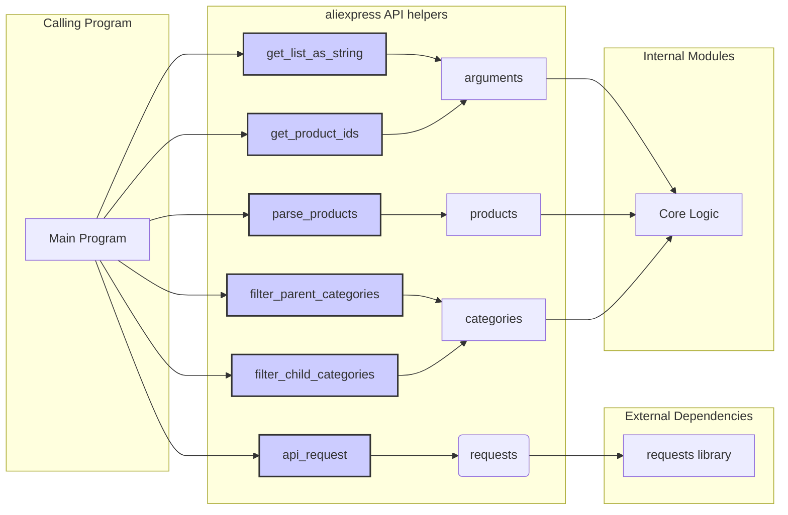

```MD
1. <input code>
```python
## \file hypotez/src/suppliers/aliexpress/api/helpers/__init__.py
# -*- coding: utf-8 -*-
 # <- venv win
## ~~~~~~~~~~~~
""" module: src.suppliers.aliexpress.api.helpers """
from .requests import api_request
from .arguments import get_list_as_string, get_product_ids
from .products import parse_products
from .categories import filter_parent_categories, filter_child_categories
```

2. <algorithm>

(Схема отсутствует, так как код состоит только из импортов.  Блок-схема в данном случае не имеет смысла.)

3. <mermaid>


4. <explanation>

**Импорты:**

* `from .requests import api_request`: Импортирует функцию `api_request` из модуля `requests` в текущем подпакете (`hypotez/src/suppliers/aliexpress/api/helpers/requests`). Эта функция вероятно осуществляет запросы к API AliExpress.
* `from .arguments import get_list_as_string, get_product_ids`: Импортирует функции `get_list_as_string` и `get_product_ids` из модуля `arguments`. Скорее всего, эти функции обрабатывают данные, полученные в виде аргументов или списков, связанных с AliExpress.
* `from .products import parse_products`: Импортирует функцию `parse_products` из модуля `products`. Эта функция вероятно занимается парсингом данных о продуктах, полученных с API AliExpress.
* `from .categories import filter_parent_categories, filter_child_categories`: Импортирует функции `filter_parent_categories` и `filter_child_categories` из модуля `categories`. Эти функции, скорее всего, фильтруют и обрабатывают данные категорий продуктов AliExpress.


**Классы (отсутствуют):**  В данном файле нет определений классов.

**Функции (отсутствуют):**  В данном файле нет определений функций, только импорты.

**Переменные (отсутствуют):** Нет объявлений переменных.

**Возможные ошибки или области для улучшений:**

* **Нет проверки ошибок:**  Код импортов не предполагает проверок на существование импортируемых модулей. В реальном проекте стоит добавить такие проверки.
* **Отсутствие docstrings:** Отсутствуют строковые комментарии-документации к импортируемым функциям, что затрудняет понимание их работы. Необходимо добавлять подробные комментарии для каждой функции.
* **Недостающая детализация:**  На основе только импортов невозможно сказать, как именно эти функции взаимодействуют друг с другом. Требуется детальный анализ других файлов в папке `hypotez/src/suppliers/aliexpress/api/helpers`.
* **Необъясненные `__init__.py`:** В файле `__init__.py` часто содержатся импорты для использования модулей внутри пакета. В данном случае это подготавливает пакет к использованию функций из модулей `requests`, `arguments`, `products` и `categories`.

**Взаимосвязи с другими частями проекта:**


Файл `__init__.py` определяет интерфейс для функций, используемых другими частями проекта (например, в main.py), которые взаимодействуют с API AliExpress. Он служит "мостиком" между логикой получения данных с AliExpress и другими модулями приложения.  Для полной оценки необходимо проанализировать вызывающие файлы.