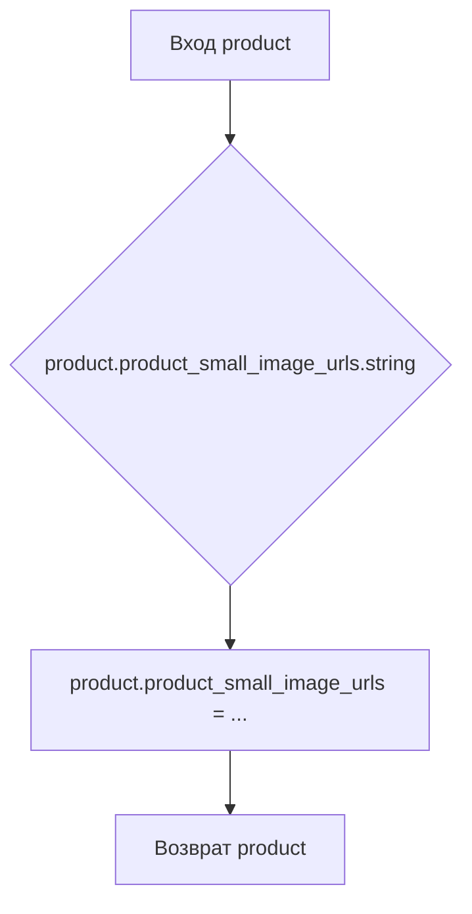

```MD
# Анализ кода из файла hypotez/src/suppliers/aliexpress/api/helpers/products.py

## <input code>

```python
## \file hypotez/src/suppliers/aliexpress/api/helpers/products.py
# -*- coding: utf-8 -*-
 # <- venv win
## ~~~~~~~~~~~~
""" module: src.suppliers.aliexpress.api.helpers """
def parse_product(product):
    product.product_small_image_urls = product.product_small_image_urls.string
    return product

def parse_products(products):
    new_products = []

    for product in products:
        new_products.append(parse_product(product))

    return new_products
```

## <algorithm>

**Блок-схема для parse_product:**



**Блок-схема для parse_products:**

```mermaid
graph TD
    A[Вход products] --> B[new_products = []];
    B --> C(for product in products);
    C --> D[parse_product(product)];
    D --> E[new_products.append(...)];
    E --> F(Продолжить итерацию);
    F --> G{Конец цикла?};
    G -- Да --> H[Возврат new_products];
    G -- Нет --> C;
```

**Пример:**

Пусть `products` содержит список объектов `product`, где `product.product_small_image_urls`  представляет собой объект, у которого есть метод `string` (например, BeautifulSoup's Tag).  `parse_product` изменяет значение `product_small_image_urls` на строковое представление.  `parse_products` применяет `parse_product` к каждому элементу списка, создавая новый список `new_products` с измененными значениями.

## <mermaid>

```mermaid
graph LR
    subgraph Алиэкспресс API Helpers
        A[parse_product] --> B(product);
        B --> C{product.product_small_image_urls.string};
        C --> D[product.product_small_image_urls = string];
        D --> E[Возврат product];

        F[parse_products] --> G(products);
        G --> H(for product in products);
        H --> I[parse_product(product)];
        I --> J[new_products.append];
        J --> K[new_products];
        K --> L[Возврат new_products];
    end
```

## <explanation>

**Импорты:**
Нет импортов в данном коде. Комментарии `# -*- coding: utf-8 -*-` и ``  связаны с кодировкой и исполняемым файлом Python.

**Классы:**
Нет классов.  Код использует функции, работающие с объектами, представленными в списке. Предполагается, что эти объекты имеют атрибут `product_small_image_urls` и метод `.string`.

**Функции:**

* **`parse_product(product)`:**
    * **Аргументы:** `product` - объект, предположительно, содержащий данные о продукте.
    * **Возвращаемое значение:** `product` - объект с изменённым значением `product_small_image_urls`.
    * **Описание:** Извлекает строковое представление из атрибута `product_small_image_urls` и сохраняет его в этом же атрибуте объекта.
    * **Пример:** Если `product.product_small_image_urls`  равен  `BeautifulSoup object`, то код преобразует его в строку.

* **`parse_products(products)`:**
    * **Аргументы:** `products` - список объектов `product`.
    * **Возвращаемое значение:** `new_products` - новый список объектов `product` со строковыми значениями `product_small_image_urls`.
    * **Описание:** Применяет `parse_product` к каждому элементу списка `products` и добавляет результат в новый список `new_products`.
    * **Пример:** Если `products` содержит список из трех объектов product, то функция вернет новый список из трех объектов, где `product_small_image_urls` будут строками.


**Переменные:**
`product`, `products`, `new_products` - переменные, представляющие объекты и списки объектов.

**Возможные ошибки и улучшения:**

* **Обработка исключений:** Код не обрабатывает ситуации, когда `product.product_small_image_urls` не является объектом, у которого есть метод `string`.  Добавление обработки исключений (например, `try...except`)  улучшит надежность кода.
* **Типизация:**  Использование типов данных (например, `typing.List`, `typing.Dict`) сделало бы код более понятным и помогло бы статическим анализаторам.
* **Чтение документации:**  Проверка документации `BeautifulSoup` может помочь в понимании использования метода `string`.

**Взаимосвязи с другими частями проекта:**

Этот код, скорее всего, используется в рамках обработки данных о продуктах из API АлиЭкспресс.  Он необходим для подготовки данных для дальнейшей обработки (например, сохранения в базу данных, отображения на веб-странице).  Он зависит от внешних данных (объекты `product`) и, вероятно, используется в других частях проекта, отвечающих за обработку и использование данных о продуктах Алиэкспресс.