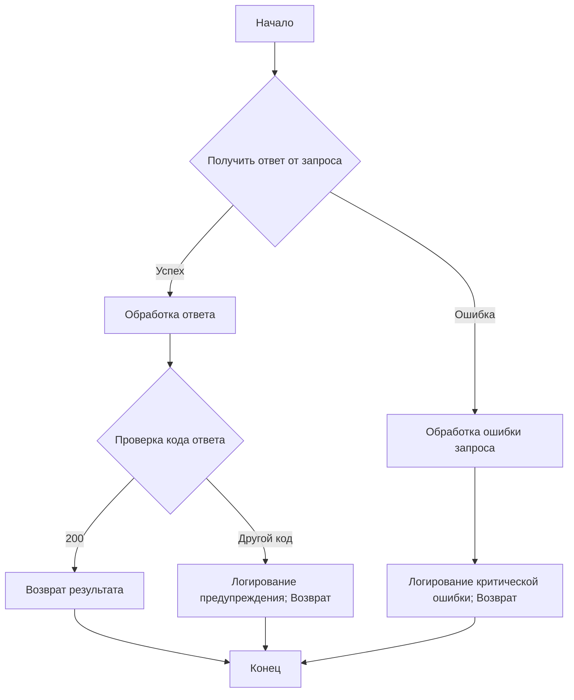

```MD
# Анализ кода файла `hypotez/src/suppliers/aliexpress/api/helpers/requests.py`

## <input code>

```python
## \file hypotez/src/suppliers/aliexpress/api/helpers/requests.py
# -*- coding: utf-8 -*-\
#! venv/Scripts/python.exe # <- venv win
## ~~~~~~~~~~~~~\
""" module: src.suppliers.aliexpress.api.helpers """
from types import SimpleNamespace
from time import sleep
from src.logger import logger
from src.utils.printer import pprint
import json

from ..errors import ApiRequestException, ApiRequestResponseException


def api_request(request, response_name, attemps:int = 1):
    try:
        response = request.getResponse()
    except Exception as error:           
        if hasattr(error, 'message'):
            #raise ApiRequestException(error.message) from error
            #logger.critical(error.message,pprint(error))
        #raise ApiRequestException(error) from error
        #logger.critical(error.message,pprint(error))
            ...    
            return 

    try:
        response = response[response_name]['resp_result']
        response = json.dumps(response)
        response = json.loads(response, object_hook=lambda d: SimpleNamespace(**d))
    except Exception as error:
        #raise ApiRequestResponseException(error) from error
        logger.critical(error.message, pprint(error), exc_info=False)
        return 
    try:
        if response.resp_code == 200:
            return response.result
        else:
            #raise ApiRequestResponseException(f'Response code {response.resp_code} - {response.resp_msg}')
            logger.warning(f'Response code {response.resp_code} - {response.resp_msg}',exc_info=False)
            return 
    except Exception as ex:
        logger.error(None, ex, exc_info=False)
        return 
```

## <algorithm>

**Блок-схема:**



**Примеры:**

* **Блок B (Получить ответ):**  `request.getResponse()` возвращает ответ, например, `{'resp_result': {'result': 'значение', 'resp_code': 200, 'resp_msg': 'OK'}}`.
* **Блок C (Обработка ответа):**  Извлечение `resp_result` из ответа и его преобразование в объект SimpleNamespace.
* **Блок E (Проверка кода):** Проверка `response.resp_code`. Если 200, то берется `response.result`, иначе логгируется предупреждение.


## <mermaid>

```mermaid
graph LR
    subgraph Модуль
        A[api_request] --> B(request);
        B --> C{getResponse()};
        C -- Успех --> D[Обработка ответа];
        C -- Ошибка --> E[Обработка ошибки запроса];
        D --> F{Проверка кода};
        F -- 200 --> G[Возврат результата];
        F -- Не 200 --> H[Логирование предупреждения; Возврат];
        E --> I[Логирование критической ошибки; Возврат];
        G --> J[Конец];
        H --> J;
        I --> J;
        subgraph Зависимости
            B --> K[src.logger];
            B --> L[src.utils.printer];
            B --> M[json];
            B --> N[..errors];
        end
    end
```

## <explanation>

**Импорты:**

* `from types import SimpleNamespace`: Импортирует класс `SimpleNamespace` для создания объектов, похожих на словари, но с доступом по атрибутам (например, `response.resp_code`).
* `from time import sleep`: Импортирует функцию `sleep` для пауз в программе (в данном случае не используется).
* `from src.logger import logger`: Импортирует логгер из модуля `logger` в пакете `src`. Это позволяет регистрировать сообщения об ошибках и других событиях.
* `from src.utils.printer import pprint`: Импортирует функцию `pprint` для красивой печати объектов.
* `import json`: Импортирует модуль `json` для работы с JSON-данными.
* `from ..errors import ApiRequestException, ApiRequestResponseException`: Импортирует классы исключений из подпапки `errors` в текущем пакете.

**Классы:**

* Нет собственных классов в данном файле.  Но используются классы из модулей `ApiRequestException` и `ApiRequestResponseException`.  Они, вероятно, определены в `src.suppliers.aliexpress.api.helpers.errors.py` и отвечают за обработку ошибок, связанных с API-запросами.


**Функции:**

* `api_request(request, response_name, attemps: int = 1)`: Эта функция предназначена для выполнения API-запроса, обработки ответа и возврата результата.
    * `request`: Объект, предоставляющий метод `getResponse()` для отправки запроса.
    * `response_name`: Строка, указывающая имя поля в ответе, содержащего результат.
    * `attemps`: Количество попыток запроса (по умолчанию 1).
    * Возвращает `response.result` при успешном ответе со статусом 200 или `None` при ошибке.  Обратите внимание, что код явно игнорирует исключения внутри блока `try...except`, что может быть проблемой.

**Переменные:**

* `response`: Содержит ответ от API-запроса.
* `response_name`: Имя поля с результатом в ответе.
* `attemps`: Количество попыток выполнения запроса.


**Возможные ошибки и улучшения:**

* **Обработка исключений:**  В блоках `try...except` игнорируются некоторые исключения, что может привести к неожиданному поведению. Важно обрабатывать все потенциальные ошибки и регистрировать их с помощью логгера.  Необходимо более тщательно обрабатывать `ApiRequestException` и `ApiRequestResponseException`.
* **Подробная информация об ошибках:** Логгирование ошибок должно содержать более подробную информацию, например, стек вызовов (`exc_info=True`) для лучшего отладки.
* **Управление состояниями:**  Функция не обрабатывает случаи временных ошибок (`500`, `502` и т.д.) и не реализует логику повторных попыток.
* **Типизация:**  Использование типов данных (например, `response: dict`) может помочь в понимании ожидаемых данных и предотвратить ошибки.


**Взаимосвязи с другими частями проекта:**

Функция `api_request` зависит от существования `request`-объекта, который, вероятно,  получается из `src.suppliers.aliexpress.api.client` или других модулей, отвечающих за взаимодействие с API.   Модуль `logger` и `pprint` также являются внешними зависимостями, находящимися в `src.logger` и `src.utils.printer` соответственно.  `ApiRequestException` и `ApiRequestResponseException` требуют определения в `src.suppliers.aliexpress.api.helpers.errors.py`.