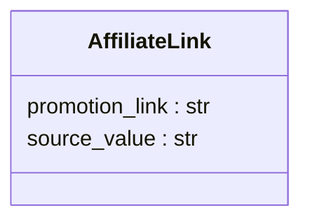

```MD
# <input code>

```python
## \file hypotez/src/suppliers/aliexpress/api/models/affiliate_link.py
# -*- coding: utf-8 -*-
 # <- venv win
## ~~~~~~~~~~~~~\n""" module: src.suppliers.aliexpress.api.models """
class AffiliateLink:
    promotion_link: str
    source_value: str
```

# <algorithm>

Этот код определяет класс `AffiliateLink` с двумя атрибутами: `promotion_link` и `source_value`.  Алгоритм работы заключается в описании структуры данных для хранения информации об аффилиатной ссылке.  Поскольку это просто определение класса, конкретной "работы" в виде алгоритма нет.

**Пример данных:**

```
affiliate_link = AffiliateLink()
affiliate_link.promotion_link = "https://example.com/product?aff=123"
affiliate_link.source_value = "aliexpress_organic"
```

# <mermaid>



В этой диаграмме описывается класс `AffiliateLink` и его два атрибута.  Связь с другими частями проекта пока не представлена, так как нет вызовов других функций или классов.

# <explanation>

**Импорты:**

Нет импортов. Файл определяет только внутренний класс для структуры данных.

**Классы:**

* **`AffiliateLink`**:  Этот класс предназначен для описания структуры данных, которая будет хранить информацию об аффилиатной ссылке. Он содержит два атрибута:
    * **`promotion_link`**:  Строковое значение, представляющее промо-ссылку.
    * **`source_value`**: Строковое значение, указывающее источник (например, `aliexpress_organic`, `aliexpress_paid`).

**Функции:**

Нет функций. Этот файл определяет только класс, который может быть использован другими частями кода.

**Переменные:**

Нет объявлений переменных вне контекста класса.  Атрибуты класса `promotion_link` и `source_value` неявно являются переменными, но не объявлены вне контекста класса.

**Возможные ошибки или области для улучшений:**

* **Нет валидации данных:**  Код не содержит проверки типов или валидации данных для атрибутов `promotion_link` и `source_value`. Применение проверок (например, проверка на корректность URL для `promotion_link`) улучшило бы надежность данных.  Можно добавить проверки валидности при создании экземпляра класса.
* **Нет методов:**  Класс не содержит методов для работы с данными. Это может быть добавлено в будущем для, например, изменения значений атрибутов, вывода данных в строковом формате или других операций.

**Взаимосвязи с другими частями проекта:**

Этот класс, вероятно, будет использоваться в других частях проекта, где требуется хранить и/или обрабатывать информацию об аффилиатных ссылках, например, в модулях для обработки данных из API AliExpress.  Связь будет заключаться в создании экземпляров этого класса и использовании его атрибутов.