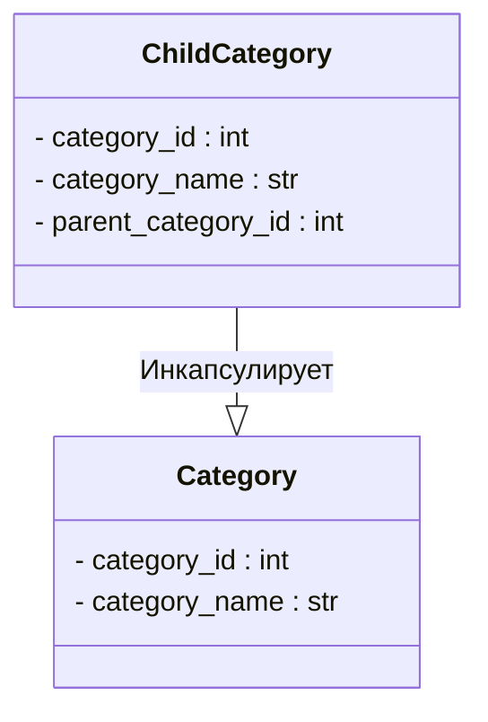

# <input code>

```python
## \file hypotez/src/suppliers/aliexpress/api/models/category.py
# -*- coding: utf-8 -*-
 # <- venv win
## ~~~~~~~~~~~~
""" module: src.suppliers.aliexpress.api.models """
class Category:
    category_id: int
    category_name: str


class ChildCategory(Category):
    parent_category_id: int
```

# <algorithm>

Этот код определяет две модели данных (классы) для категорий на AliExpress.

**Шаг 1:** Определение базового класса `Category`.
* `Category`:  хранит идентификатор категории (`category_id`) и имя категории (`category_name`). Пример: `Category(category_id=1, category_name="Электроника")`.

**Шаг 2:** Определение наследника `ChildCategory`.
* `ChildCategory`: наследуется от `Category`, добавляя атрибут `parent_category_id`.  Этот атрибут указывает на родительскую категорию. Пример: `ChildCategory(category_id=2, category_name="Телевизоры", parent_category_id=1)`.


# <mermaid>



# <explanation>

**Импорты:**
Нет импортов в данном коде. Все определения находятся в текущем модуле.

**Классы:**

* **`Category`:** Представляет общую категорию.  Он хранит `category_id` (идентификатор категории) и `category_name` (название категории).  Это базовый класс, описывающий общие характеристики всех категорий.
* **`ChildCategory`:**  Представляет дочернюю категорию. Наследуется от `Category`, добавляя поле `parent_category_id`, которое указывает на идентификатор родительской категории. Это полезно для структурирования иерархии категорий.

**Функции:**
Нет функций в данном коде.

**Переменные:**
Нет переменных в коде, кроме тех, которые являются атрибутами классов. `category_id`, `category_name`, `parent_category_id` - это атрибуты, описывающие данные о категории.


**Возможные ошибки или области для улучшений:**

* **Типы данных:** Хотя используется типизация (например, `category_id: int`), нет проверки корректности данных. В реальном приложении необходимо добавить проверки (например, что `category_id` не отрицательное число).
* **Иерархия категорий:**  Код описывает лишь иерархию, но не предоставляет механизм для работы с этой иерархией (например, получение всех дочерних категорий для определенной родительской категории).
* **Взаимодействие с другими компонентами:** Код не демонстрирует взаимодействие с другими частями проекта. Для получения информации о категориях из БД или их использования в API потребуется взаимодействие с другими модулями (например, БД, контроллерами).

**Цепочка взаимосвязей:**

Код `category.py` в папке `hypotez/src/suppliers/aliexpress/api/models`  вероятно, будет использоваться другими частями проекта, такими как:

* **Контроллеры API:** для получения данных о категориях из базы данных и их обработки.
* **Сервисы (или репозитории):** для взаимодействия с базой данных, поиска категорий по идентификатору или родительской категории.
* **Представления:** для отображения данных о категориях пользователю.

В целом, код определяет базовые структуры данных для категорий, которые могут быть использованы для дальнейшей работы с данными о категориях AliExpress.  Для полноценного функционала необходимо добавить логику взаимодействия с данными (базой данных, API, другими модулями).