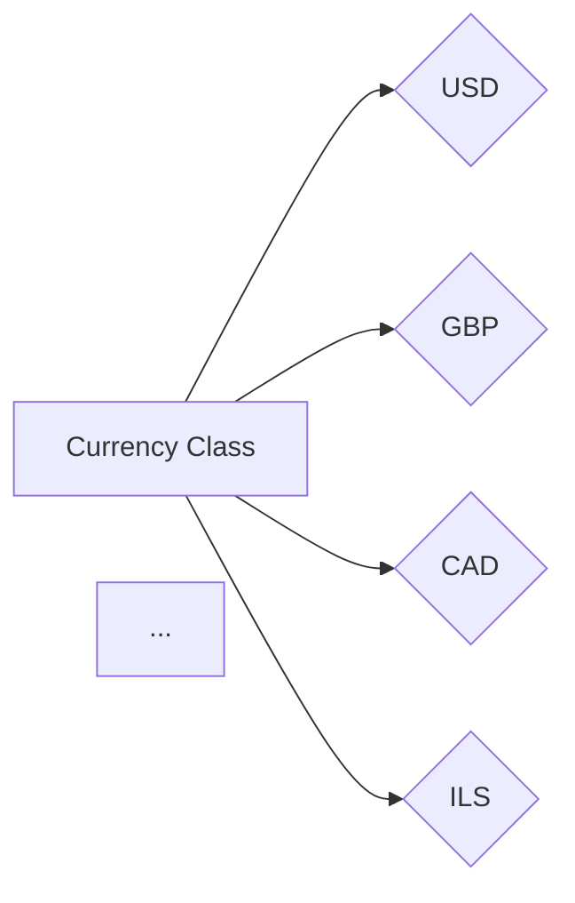
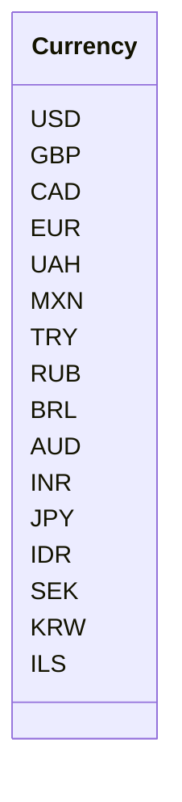

# <input code>

```python
## \file hypotez/src/suppliers/aliexpress/api/models/currencies.py
# -*- coding: utf-8 -*-
 # <- venv win
## ~~~~~~~~~~~~~
""" module: src.suppliers.aliexpress.api.models """
class Currency:
    USD = 'USD'
    GBP = 'GBP'
    CAD = 'CAD'
    EUR = 'EUR'
    UAH = 'UAH'
    MXN = 'MXN'
    TRY = 'TRY'
    RUB = 'RUB'
    BRL = 'BRL'
    AUD = 'AUD'
    INR = 'INR'
    JPY = 'JPY'
    IDR = 'IDR'
    SEK = 'SEK'
    KRW = 'KRW'
    ILS = 'ILS'
```

# <algorithm>

Этот код определяет класс `Currency`, содержащий константы, представляющие различные валюты.  Алгоритм прост: он объявляет класс и внутри него определяет строковые константы для каждой валюты.  Передачи данных нет, так как это просто объявление констант.



# <mermaid>



# <explanation>

**Импорты:**

Файл `currencies.py` не содержит импортов. Это обычный модуль Python, который не зависит от других модулей для своего выполнения. Строки `# -*- coding: utf-8 -*-\n # <- venv win` относятся к настройкам кодировки и интерпретатора Python.

**Классы:**

- `Currency`: Этот класс определяет набор констант, которые представляют различные валюты.  Сами константы (USD, GBP, и т.д.)  являются строковыми литералами.  Это позволяет использовать эти значения в коде, связанном с обработкой валют, без необходимости создавать экземпляры класса или обращаться к атрибутам экземпляра.  Это типичная реализация набора именованных констант в Python.


**Функции:**

Нет функций.  Код содержит только объявление класса с атрибутами-константами.

**Переменные:**

Нет переменных в классическом понимании.  `USD`, `GBP`, и т.д. – это атрибуты класса `Currency` и представляют собой константы.


**Возможные ошибки или области для улучшений:**

- **Использование Enum:** Для представления набора дискретных значений (как валюты) предпочтительнее использовать `enum`. Это сделало бы код более читаемым и защищенным от ошибок:
```python
from enum import Enum

class Currency(Enum):
    USD = 'USD'
    GBP = 'GBP'
    # ...
```

- **Docstrings:**  Добавление docstrings к классу `Currency` улучшило бы документирование.

**Взаимосвязи с другими частями проекта:**

Этот файл `currencies.py` скорее всего используется другими частями проекта, которые работают с валютами (например, при конвертации валют, отображении валют в пользовательском интерфейсе и т.д.).  Связь с другими частями проекта осуществляется через использование этих констант в соответствующих модулях.  Без конкретного контекста проекта сложно определить точный вид взаимодействия.  Наиболее вероятным использованием таких констант является обработка данных валюты в других модулях, например, в `aliexpress` или `api` подмодулях.
```
hypotez/src/suppliers/aliexpress/api/models/currencies.py  
    ↓
hypotez/src/suppliers/aliexpress/api/services/order_processing.py
    ↓
... (другие модули, где используются валюты)