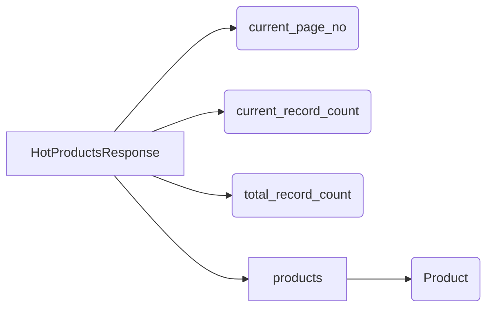

1. **<input code>**

```python
## \file hypotez/src/suppliers/aliexpress/api/models/hotproducts.py
# -*- coding: utf-8 -*-
#! venv/Scripts/python.exe # <- venv win
## ~~~~~~~~~~~~~
""" module: src.suppliers.aliexpress.api.models """
from .product import Product
from typing import List


class HotProductsResponse:
    current_page_no: int
    current_record_count: int
    total_record_count: int
    products: List[Product]
```

2. **<algorithm>**

Этот код определяет класс `HotProductsResponse`, который, судя по имени, предназначен для хранения данных о результатах запроса к API AliExpress, относящимся к "горячим товарам".  Алгоритм работы сводится к определению структуры данных, которая будет содержать информацию о странице, количестве товаров на ней, общем количестве товаров и списке самих продуктов.  Поскольку код представляет собой лишь определение класса,  никаких вычислений или сложных операций здесь нет.  

**Пример:**

Представьте, что API вернуло данные о 10 товарах на первой странице, и общее число товаров - 100. Тогда экземпляр класса `HotProductsResponse` будет содержать:

* `current_page_no`: 1
* `current_record_count`: 10
* `total_record_count`: 100
* `products`: Список из 10 объектов `Product`.


3. **<mermaid>**



**Объяснение диаграммы:**

Диаграмма показывает структуру класса `HotProductsResponse`.  `HotProductsResponse` содержит четыре атрибута: `current_page_no`, `current_record_count`, `total_record_count` и `products`.  Список `products` содержит объекты `Product`.


4. **<explanation>**

* **Импорты:**
    * `from .product import Product`: Импортирует класс `Product` из файла `product.py` в том же каталоге (`./product.py`). Это указывает на предполагаемую структуру проекта, где `product.py` определяет структуру данных для отдельных товаров.  Важная деталь: импорт происходит из подкаталога `./`, что подразумевает, что `product.py` находится в том же каталоге, что и `hotproducts.py`.

    * `from typing import List`: Импортирует тип данных `List` из модуля `typing`.  Это используется для типизации атрибута `products` в классе `HotProductsResponse`, что делает код более читабельным и поддерживаемым.

* **Классы:**
    * `HotProductsResponse`: Этот класс описывает структуру данных для хранения результатов ответа API AliExpress, относящихся к "горячим товарам".  Он содержит атрибуты:
        * `current_page_no`: Целое число, представляющее номер текущей страницы.
        * `current_record_count`: Целое число, представляющее количество товаров на текущей странице.
        * `total_record_count`: Целое число, представляющее общее количество товаров.
        * `products`: Список объектов `Product`, содержащих информацию о каждом товаре на текущей странице.

* **Функции:** Нет функций в этом коде, только определение класса.

* **Переменные:**  В коде нет глобальных переменных, только атрибуты класса.

* **Возможные ошибки или улучшения:**
    * Не определена логика получения данных из API.  В данном коде отсутствует логика, которая бы извлекала данные из API и заполняла атрибуты класса.
    * Нет валидации данных.  При получении данных из API желательно добавить проверку корректности полученной информации. Например, проверить, что `current_page_no`, `current_record_count` и `total_record_count` являются допустимыми целыми числами.

* **Взаимосвязи с другими частями проекта:**

    Этот код, скорее всего, является частью API-клиента для работы с AliExpress.   Другие части проекта могут включать в себя:
    * Файлы с функциями, извлекающими данные из API на основе этого класса.
    * Логику обработки `Product`-объектов.
    * Функции для отображения или использования данных, полученных из `HotProductsResponse`.

В целом, код хорошо структурирован и соответствует принципам ООП.  Он описывает необходимую структуру данных, но не содержит реализации логики работы с API.